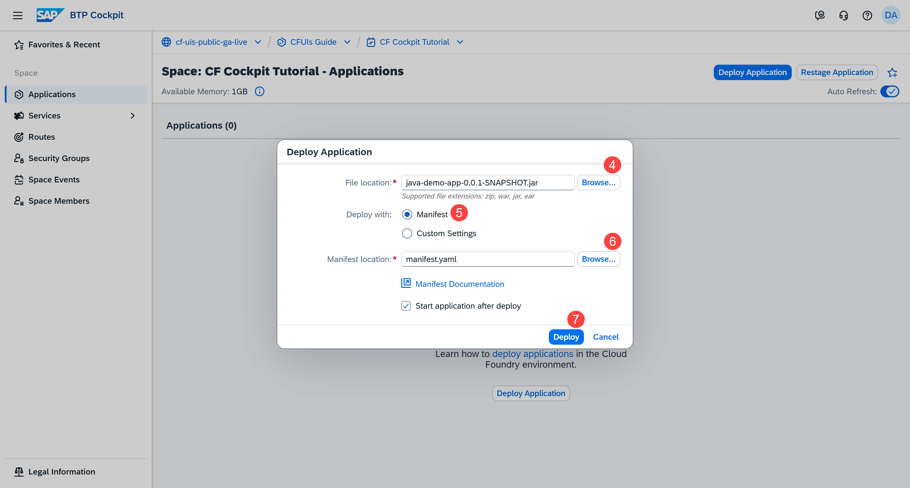
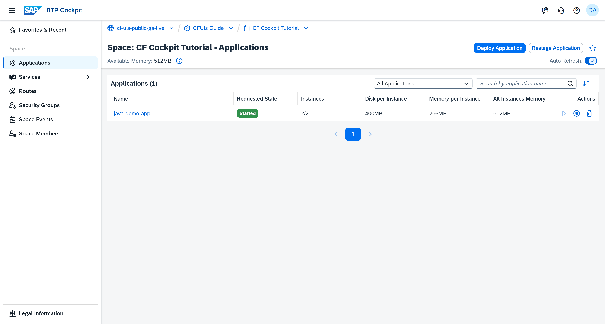
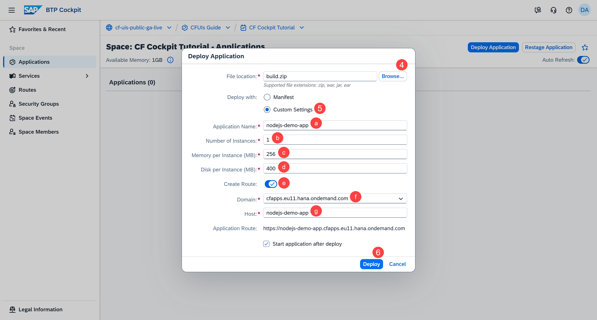
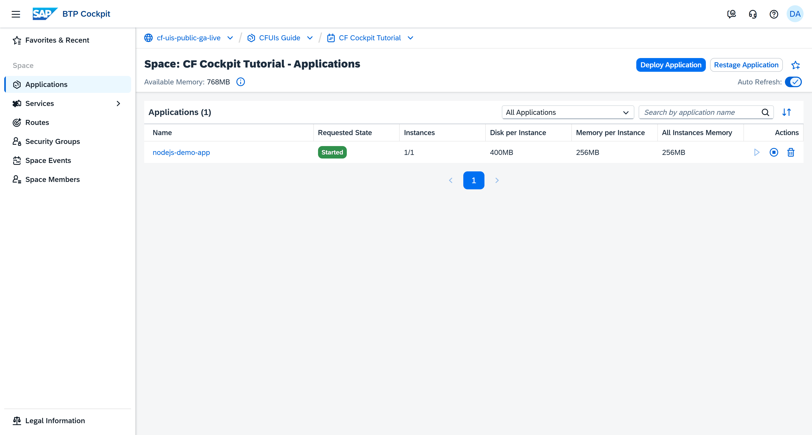
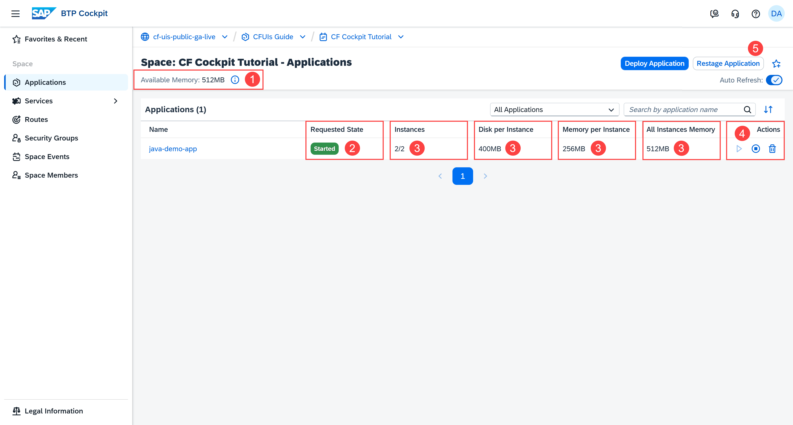
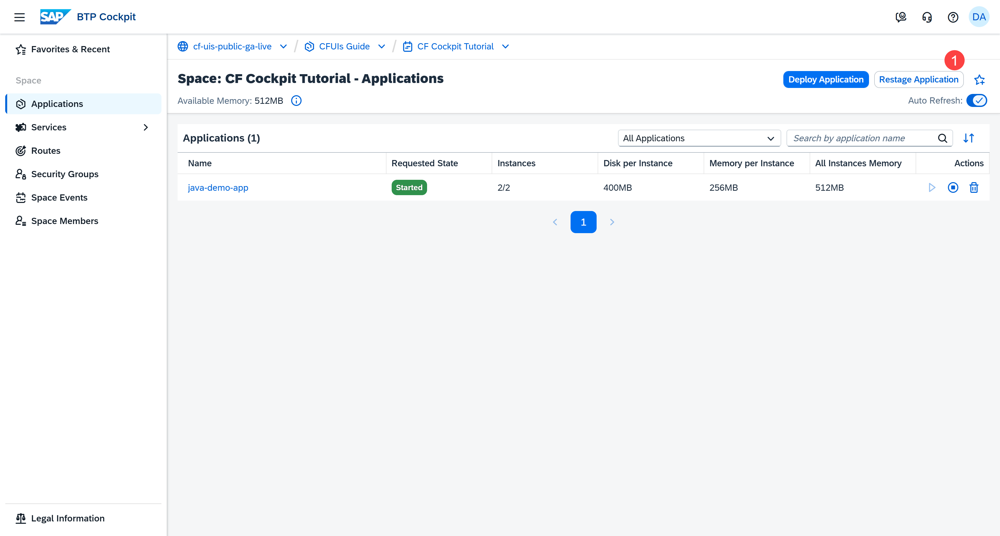
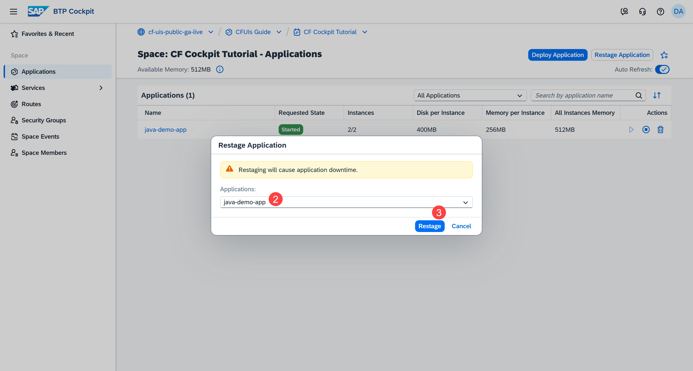

 
## You will learn

- What an application is
- What an application package is and what to include in it
- How to deploy an application with a manifest file or custom settings
- How to understand the Applications page
- What does restaging of your application mean and how to do it
- Our recommendations

## Prerequisites

**Note**: This tutorial is part of a learning journey. <!-- See . -->
- Make sure **you've fulfilled all prerequisites** in [Getting Started with Cloud Foundry Environment and SAP BTP Cockpit](https://developers.sap.com/tutorials/btp-cockpit-cf-getting-started-with-cf-env-and-cockpit.html).
- You have the **Space Developer** role.
- You have **enough available memory in the space**. You can check the available memory on the Applications page.

### What is an application?

An application is a runnable program that delivers a specific functionality to serve a business need. For example, web applications, API services, or backend processes. Each application is a deployable unit that brings your code to life in the cloud. You build, configure, and deploy applications to the Cloud Foundry environment, where they run on scalable, managed infrastructure.

You manage your applications through the SAP BTP cockpit interface. There, you can monitor their status, configure settings, bind services, and scale resources.

### Prepare your application package for deployment

#### What is an application package?

The application package contains your compiled code, dependencies, configuration files, and deployment instructions. A well-structured package ensures consistent deployments and reduces runtime errors.

You should carefully manage your package because it affects deployment speed, resource usage, and performance. Large packages increase upload times and storage costs, while missing dependencies cause deployment failures.

#### What to include in the application package?

- Application source code or compiled artifact

- Any configuration files, such as package.json, requirements.txt, including all listed dependencies.

    **Note**: Exclude the folders **node_modules** or **venv**. Cloud Foundry installs them automatically.

These are the most commonly used programming languages:

| Programming Language | File Format | What to Include |
|---------------------|-------------|-----------------|
| Go | ZIP or binary | Go binaries with required files |
| Java (Spring, Java EE) | JAR or WAR | Standard JAR/WAR, typically built with Maven/Gradle |
| Node.js | ZIP | All source code and package.json |
| Python | ZIP | All source code and requirements.txt |
| Plain HTML/JS/CSS | ZIP | All source code |

#### Which file extensions are supported?

The SAP BTP cockpit interface lets you deploy applications to the Cloud Foundry environment as application archives. The currently supported file extensions are: ZIP, WAR, JAR, EAR.

### Deployment options in the SAP BTP cockpit and CF CLI

Here's a comparison between the cockpit and the CLI:

<!-- Double-check this information -->

| Deployment Option | Supported by SAP BTP Cockpit | Supported by CF CLI |
|--------|-------------------|-------------------|
| Single application with system buildpacks* | ✓ | ✓ |
| Docker | ✓ | ✓ |
| Cloud-native buildpacks (CNB) | ✓ | ✓ |
| Task | ✗ | ✓ |
| Worker | ✗ | ✓ |
| TAR | ✗ | ✓ |
| MTAR | ✗ | ✓ |

*This option is covered in the current tutorial.

### Deploy an application

[OPTION BEGIN [Using a Manifest File]]

A manifest file is a configuration file that provides key details about how an application should be deployed to Cloud Foundry. It defines information such as the application’s name, buildpack, memory and disk allocations, environment variables, etc. This ensures consistent deployment across environments and keeps configuration in one file.

One of the properties you can specify in the manifest file is the buildpack. Buildpacks are a key component in Cloud Foundry. They provide the framework and runtime support for your applications.

Unless you specify a buildpack in your manifest file, Cloud Foundry automatically detects the appropriate one during deployment. Cloud Foundry uses the buildpack to compile and package your application into a runnable artifact called a droplet. This droplet includes your application code, libraries, and any other dependencies. This process is called application staging.

Next comes the application startup. Cloud Foundry allocates resources (such as memory and disk) and starts your application in a container using the created droplet.

For reference, see [App manifest attribute reference | Cloud Foundry Documentation](https://docs.cloudfoundry.org/devguide/deploy-apps/manifest-attributes.html).

Now, let's deploy a sample Java app with a manifest file:

1. Go to **Cloud Foundry > Spaces** in the left navigation menu.

    <!-- border; size:540px --> 

2. Go to a space. This opens the **Applications** page.

3. Choose **Deploy Application**.

    <!-- border; size:540px --> 

4. Choose the location of the file which contains your application.

    <!-- border; size:540px --> 

5. Use the **Deploy with Manifest** option.

6. Choose the location of your manifest.yml file.

7. Choose **Deploy**.

The Java application is deployed.

<!-- border; size:540px --> 

[OPTION END]

[OPTION BEGIN [Using Custom Settings]]

You can manually configure app settings such as application name, number of instances, memory per instance (MB), disk per instance (MB), and a route. This approach is beneficial for quick and easy manual deployments without specifying a manifest.yml.

Buildpacks are a key component in Cloud Foundry. They provide the framework and runtime support for your applications. When deploying an application with custom settings, Cloud Foundry automatically detects the appropriate buildpack. 

Cloud Foundry uses the buildpack to compile and package your application into a runnable artifact called a droplet. This droplet includes your application code, libraries, and any other dependencies. This process is called application staging.

Next comes the application startup. Cloud Foundry allocates resources (such as memory and disk) and starts your application in a container using the created droplet.

Now, let's deploy a sample Node.js app with custom settings:

1. Go to **Cloud Foundry > Spaces** in the left navigation menu.

    <!-- border; size:540px --> 

2. Go to a space. This opens the **Applications** page.

3. Choose **Deploy Application**.

    <!-- border; size:540px --> 

4. Choose the location of the file which contains your application.

5. Select the **Deploy with Custom Settings** option and enter the following details:

    <!-- border; size:540px --> 

    a. Enter a name for your application.

    b. Enter how many instances you want your app to have.

    c. Enter the amount of memory available to each instance of your application.

    d. Enter the amount of disk space available to each instance of your application.

    e. If you would like to create a route for your application, leave **Create Route** switched on. You can switch it off, in which case steps "f" and "g" are skipped. A route defines the URL through which end users can access your application.

    f. Select a **Domain** for your application from the dropdown.
    
    g. Enter a different **Host** name if you want it to be different from your application name.

    When you enter an application name, the **Host** field is automatically filled with the same name. You can make changes to it or leave it as is. After deciding on a domain and a host, you can see a preview of your final **Application Route** at the bottom of the form.

6. Choose **Deploy**.

The Node.js application is deployed.

<!-- border; size:540px --> 

[OPTION END]

### Understand the Applications page

A correctly deployed and healthy application should have a **Started** requested state and all instances should be running.

**Note**: If an application is displayed as **Started** according to the **Requested State** column, it doesn't automatically mean that the application is running. This is the desired state, but there might be an issue with an application instance. For any warning alerts, check the **Instances** column. When the auto refresh is turned on, the information on the page updates automatically every 10 seconds. This ensures you always see the most current status of your deployed applications and available memory.

1. Check the **Available Memory** for all spaces. This information lets you know if you have enough memory to deploy new applications. Remember that only started applications use space memory.

2. Check the requested state.

3. Check the number of instances, the memory and disk allocated to each instance of your application, and the total amount of memory for all instances. In this example, there are 2 app instances with memory of 256MB each, which corresponds to total memory of 512MB.

4. You can also stop, start, or delete the application, when needed.

5. You can restage the application. To learn more about it, check out the next step of this tutorial.

<!-- border; size:540px --> 

To get more detailed information about your application, navigate to the **Application Overview** page by clicking the name of the application and check out the next tutorial **Managing Deployed Applications**.

### Restage an application

Restaging your application stops it, restages it by compiling a new droplet without updating your app source, and starts it again. Restage your app if you have changed the environment in a way that affects your staging process, such as setting an environment variable that the buildpack consumes.

**Caution**: Restaging causes application downtime.

To restage an application, do the following:

1. Choose **Restage Application**.

    <!-- border; size:540px --> 

2. Select an application from the dropdown.

    <!-- border; size:540px --> 

3. Choose **Restage**.

<!-- If we find some recommendations for performing zero downtime/rolling updates, we could include them here. -->

### Recommendations

#### Keep your space organized

For better performance, we recommend that you deploy no more than 200 applications in a space.

#### Use persistent storage

Each application instance runs in a temporary container. This means that any files written to the local file system are lost when the instance stops or restarts — for example, during restaging, scaling, or platform maintenance. To retain data across restarts or across multiple app instances, always use persistent storage services.

In SAP BTP cockpit, some of the options are SAP ASE service and SAP HANA service. For more information, see [Service Catalog | SAP Discovery Center](https://discovery-center.cloud.sap/servicessearch/Database%20and%20Data%20Management).

#### Plan for high availability

To ensure that your application remains available even if one instance fails, add at least two app instances. Running multiple instances allows requests to be rerouted automatically to healthy instances.

#### Use the blue-green deployment technique

Blue-green deployment reduces app downtime and risk by running two identical production environments: Blue and Green.

**Example:**

1. Deploy an application named Blue with the URL `https://my-app.cert.cfapps.eu11.hana.ondemand.com`. Cloud Foundry sends all traffic to Blue through this URL.

3. Now make a change to the app Blue and deploy the new version under a new name - Green, with the following temporary URL `https://temp-app.cert.cfapps.eu11.hana.ondemand.com` to validate that your updated app works as expected.

4. Now that both apps are up and running, map `https://my-app.cert.cfapps.eu11.hana.ondemand.com` to Green (you will learn how to do this in the tutorial **Managing Routes**).

5. Within a few seconds, Cloud Foundry begins load balancing traffic for `https://my-app.cert.cfapps.eu11.hana.ondemand.com` between Blue and Green.

6. After you verify that Green is running as expected on `https://my-app.cert.cfapps.eu11.hana.ondemand.com`, unmap the route from Blue.

7. Now all traffic for `https://my-app.cert.cfapps.eu11.hana.ondemand.com` is sent to Green.

8. You can now remove the temporary route `https://temp-app.cert.cfapps.eu11.hana.ondemand.com`.
