## You will learn

- Where to find detailed information about your application
- How to understand the Application Overview page
- How to start, stop, or restart your application
- How to manage routes and access your live application
- How to scale your application
- How to troubleshoot application issues

## Prerequisites

**Note**: This tutorial is part of a learning journey. <!-- See . -->
- Make sure **you've fulfilled all prerequisites** in [Getting Started with Cloud Foundry Environment and SAP BTP Cockpit](https://developers.sap.com/tutorials/btp-cockpit-cf-getting-started-with-cf-env-and-cockpit.html).
- You have either the **Space Developer** or **Space Supporter** role.
- You have **enough available memory in the space**. You can check the available memory on the Applications page.

### Navigate to the Application Overview page

1. Go to **Cloud Foundry > Spaces** in the left navigation menu.

    <!-- border; size:540px --> 

2. Go to a space. This opens the **Applications** page.

3. On the **Applications** page, click the name of your deployed application. This opens the **Application Overview** page.

    <!-- border; size:540px --> 

### Understand the structure of the Application Overview page

The **Application Overview** page provides key information about your application such as the current requested state, instances, routes, and recent logs and events. This page also lets you update the stack of your application. To scale your application, you can increase or decrease the number of instances as needed, or configure its memory and disk.

| Section                        | Description                                                                                                                                                                                                 |
|--------------------------------|-------------------------------------------------------------------------------------------------------------------------------------------------------------------------------------------------------------|
| **General Information** (A)       | The <b>Application Details</b> section shows the application name, lifecycle, buildpack, last updated timestamp, whether SSH is enabled or disabled, and the current stack. You can also change the stack from here. The <b>Mapped Routes</b> section lets you map or unmap routes. |
| **Instances Information** (B)     | In the <b>Instances Configuration</b> section, you can scale your application by choosing <b>Change Configuration</b> and adjusting the number of app instances, and their memory and disk. Here you can also scale your application by binding it to the Application Autoscaler service. Once it’s bound, you can access the Application Autoscaler dashboard from this section. Alternatively, you can adjust the number of app instances from the <b>App Instances</b> section. |
| **Recent Application Logs and Events** (C) | Shows the most recent application logs and events. It also allows you to access the dashboards of SAP Application Logging service or SAP Cloud Logging service, if your application is bound to these services. |

<!-- border; size:540px --> 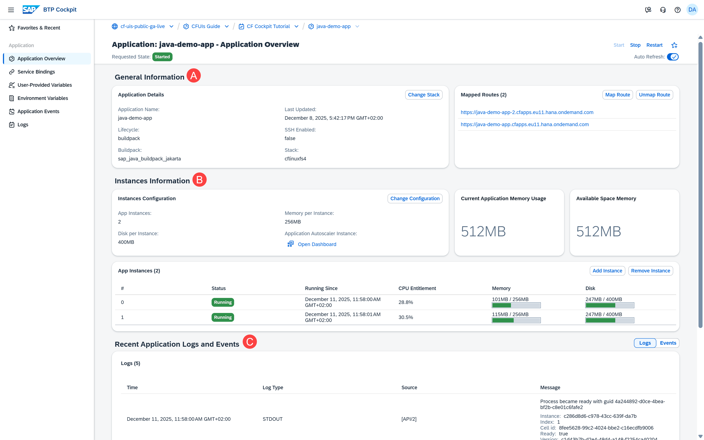

### Manage the state of the application

You can use the buttons in the upper right corner of the **Application Overview** page to:

1. **Start** the application. This starts all instances and makes them available to users.

2. **Stop** all running instances of the application.

3. **Restart** the application. This stops all instances of the application and starts them again.

<!-- border; size:540px --> 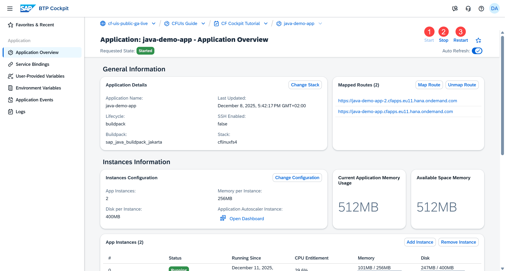

**Note**: You can restage or delete applications from the **Applications** page.

### Manage routes and access your application

The route defines the URL through which your application is exposed to the Internet. 

In the **Mapped Routes** section, you can see all routes mapped to your application.

<!-- border; size:540px --> 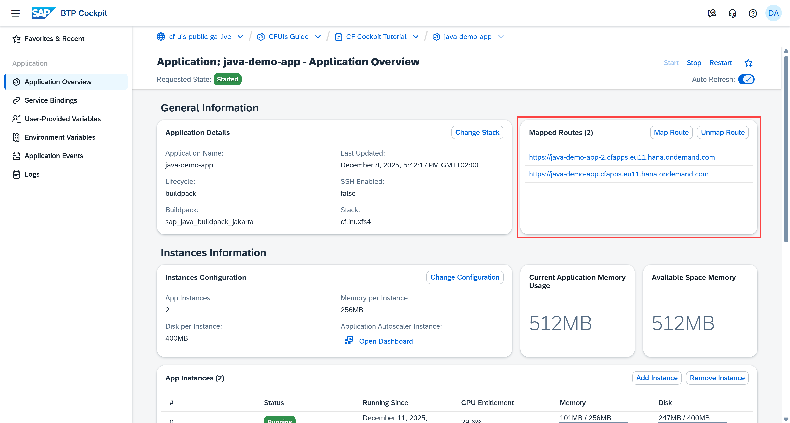

You can open the production URL to check if your content loads correctly. In the case of our sample application, you'll go to its home screen:

<!-- border; size:540px --> 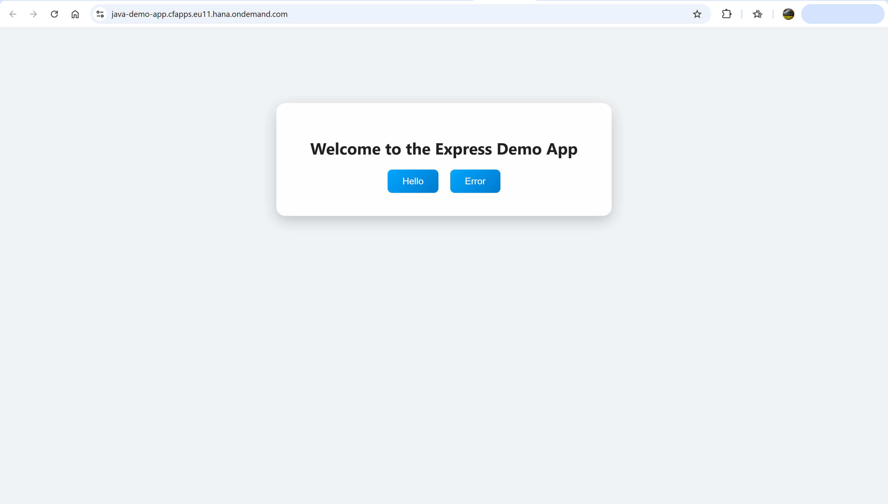

From **Mapped Routes**, you can map or unmap routes. To map a route:

1. Choose **Map Route**.

    <!-- border; size:540px --> 

2. Select as many routes as you want from the list.

    <!-- border; size:540px --> 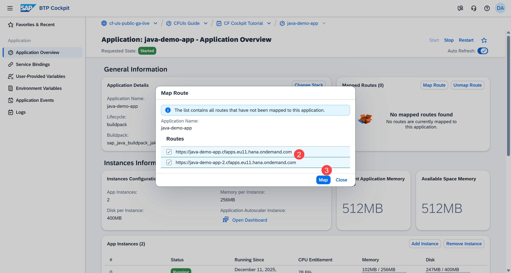

3. Choose **Map**.

Unmapping routes uses the same logic.

### Scale your application

Your application can run across multiple instances, each one representing the same version of the app. Multiple instances help you balance load in case there is a spike in user traffic.

Each instance has memory and disk allocated to it. Scaling your application means adjusting the number of app instances, or updating the allocated memory and disk.

#### Change configuration

One way to scale your application is to:

1. In the **Instances Configuration** section, choose **Change Configuration**.

    <!-- border; size:540px --> 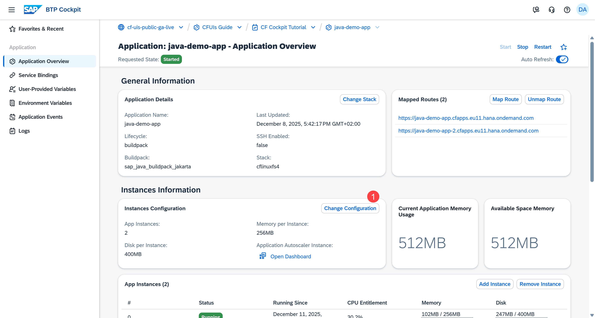

2. Add a third app instance.

    <!-- border; size:540px --> 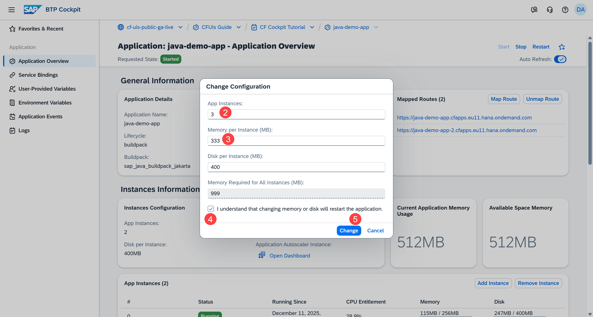

3. Increase the memory per instance from 256MB to 333MB.

    As you can see, the **Memory Required for All Instances (MB)** is updated automatically each time you adjust the values in **App Instances** and **Memory per Instance (MB)**.

    **Note**: To check how much memory you can further allocate, refer to the cards **Current Application Memory Usage** and **Available Space Memory**:

    <!-- border; size:540px --> 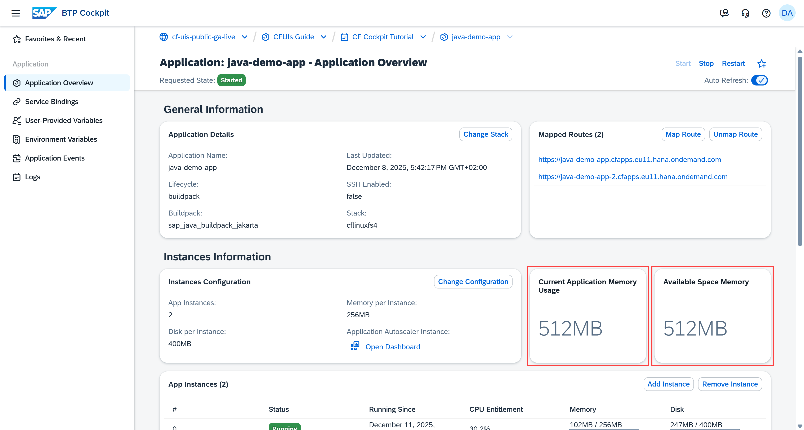

4. Select the checkbox to acknowledge that changing memory or disk triggers a restart of the application.

    **Note**: Remember that restarting an application causes downtime.

5. Choose **Change**.

After the application is restarted, you can check the updated configuration:

<!-- border; size:540px --> 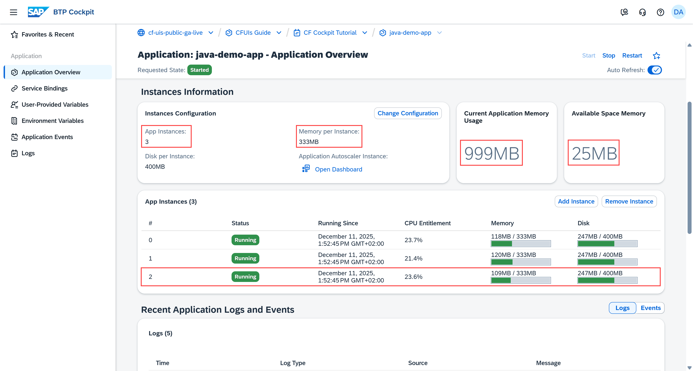

#### Add or remove app instances

Another way to scale your application is to increase or decrease the number of your app instances from the **App Instances** section. For example:

1. Choose **Add Instance**.

    <!-- border; size:540px --> 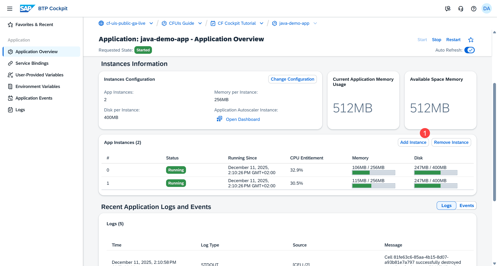

2. Check the added instance in the **App Instances** table.

    <!-- border; size:540px --> 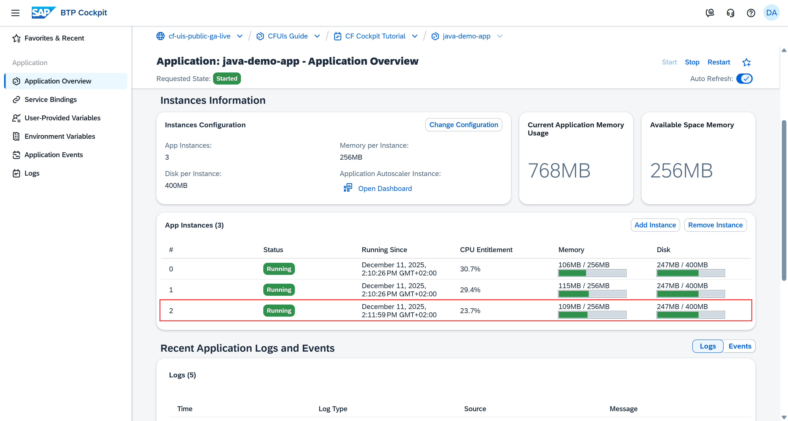

#### Automate the scaling process

To automate the scaling process, choose **Bind Application Autoscaler** to bind your application to the Application Autoscaler service:

<!-- border; size:540px --> 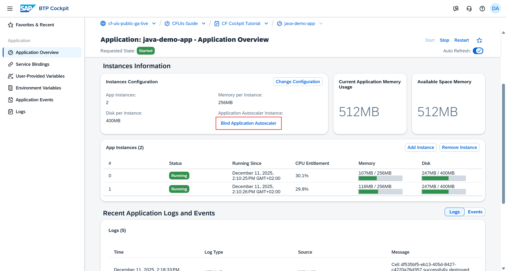

Then follow the steps to complete the binding.

**Note**: If your application is already bound to the Application Autoscaler service, there will be a link to its dashboard.

<!-- border; size:540px --> 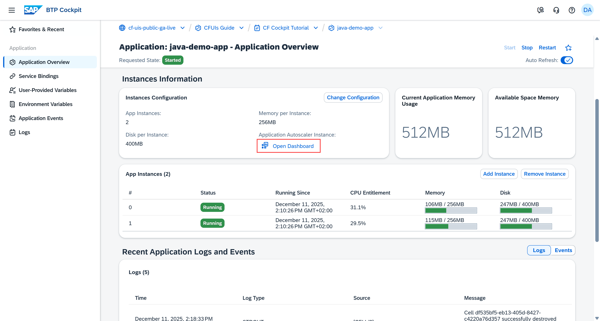

### Troubleshoot issues your application might have

The **Recent Application Logs and Events** section shows the latest logs generated by your application and the most recent actions performed on it. You can use these logs and events to monitor activity, analyze the application’s state, and troubleshoot any issues that occur.

#### Using application logs

By default, the latest logs are displayed. If your application is bound to SAP Application Logging service or SAP Cloud Logging service, you can choose **Open Application Logging Dashboard** or **Open Cloud Logging Dashboard** to go to their service dashboards. 

<!-- border; size:540px --> 

If you want to check again how you can bind your application to services, check out the tutorial **Understanding Service Bindings**.

#### Using application events

To switch to the application events, choose **Events**:

<!-- border; size:540px --> 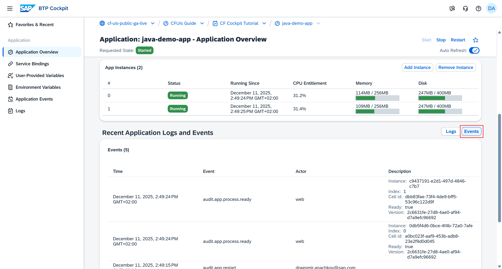

