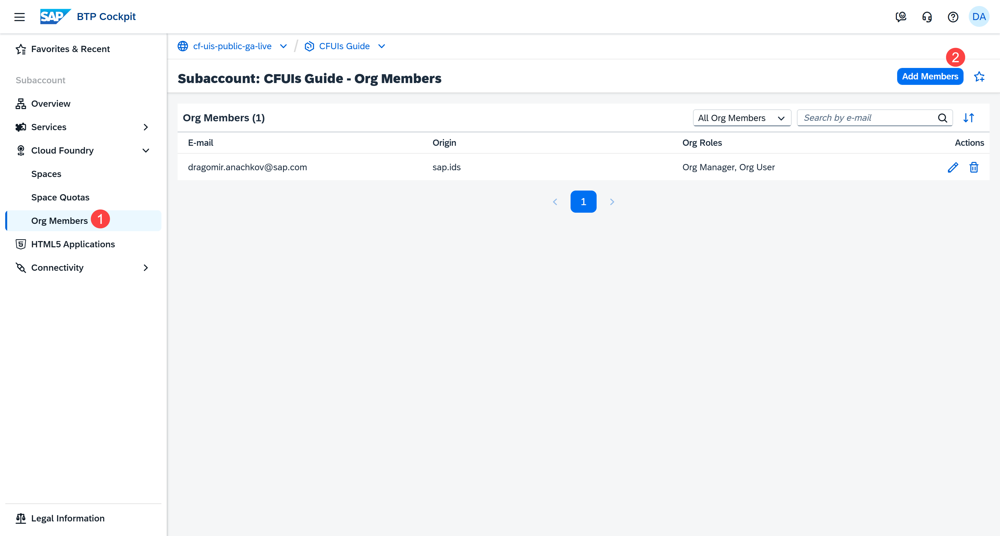
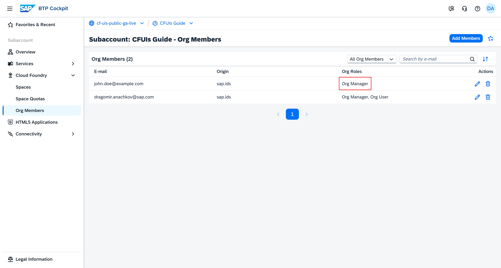
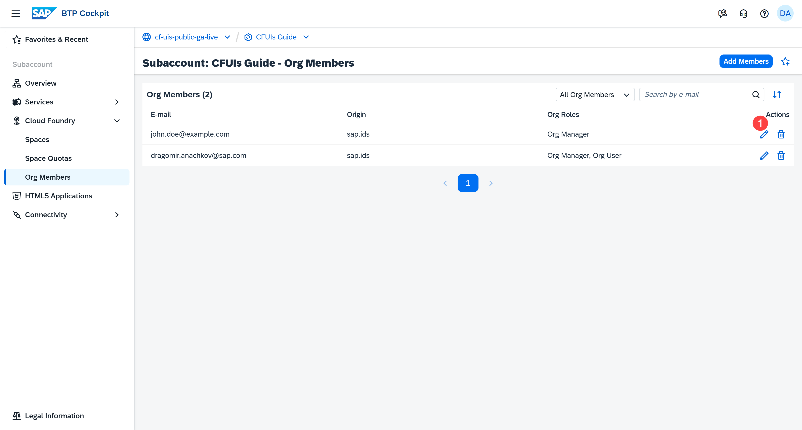
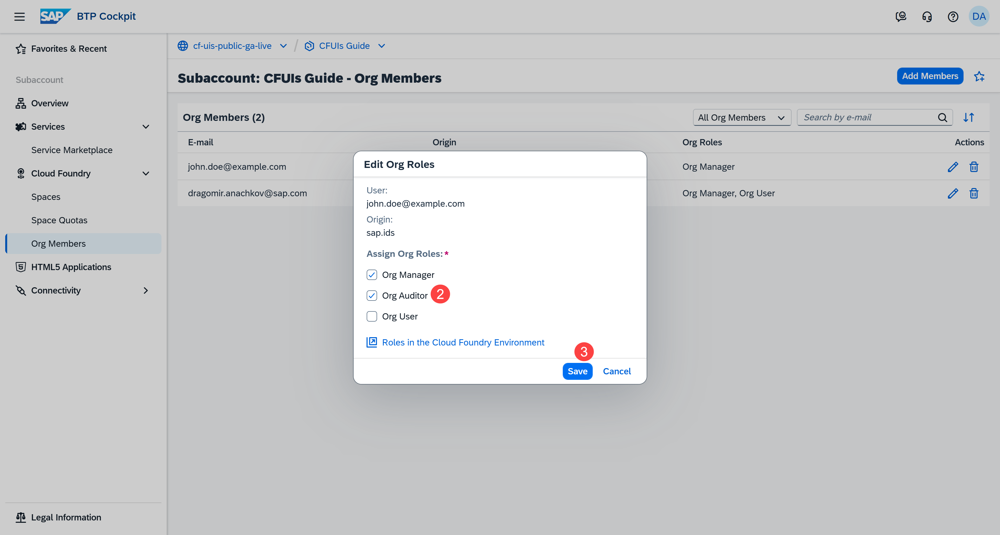
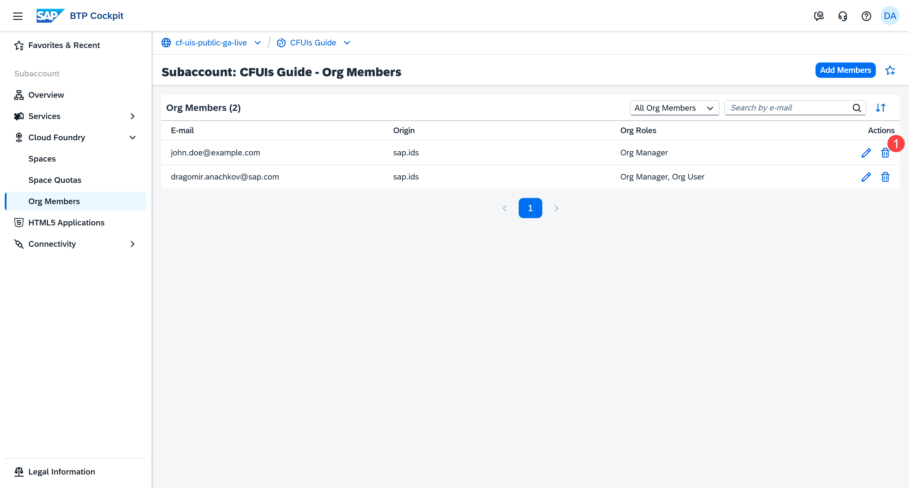
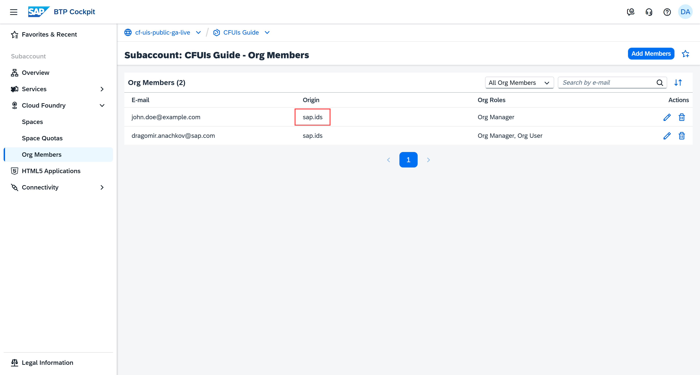

## You will learn

- What an org member is
- How to add org members
- How to edit the roles of an org member
- How to delete an org member
- What a custom IdP is and how to add an org member with it
- About the connection between org and space roles
- Our recommendations

## Prerequisites

**Note**: This tutorial is part of a learning journey. <!-- See . -->
- Make sure **you've fulfilled all prerequisites** in [Getting Started with Cloud Foundry Environment and SAP BTP Cockpit](https://developers.sap.com/tutorials/btp-cockpit-cf-getting-started-with-cf-env-and-cockpit.html).
- You have the **Org Manager** role in the organization (org) used for this tutorial.

### What is an org member?

An org member is a user who has access to an organization (org). Org members are assigned roles that determine what actions they can perform across the org.

As an org member, you can view the org's spaces and resources. However, your specific permissions depend on the role assigned to you within that org.

Here's the list of all org roles and their permissions currently available in the SAP BTP cockpit:

| Role        | Role Description                                                                 |
|-------------|----------------------------------------------------------------------------------|
| **Org Manager** | Manages the org by adding users, and creating spaces and quotas. When you create an org, you get the **Org Manager** role in that org by default. |
| **Org Auditor** | Gives read-only access to information about other org members and org quota usage.   |
| **Org User**    | Gives read-only access to the list of other org members.|

### Add an org member
 
Your org can be managed by multiple users. To make that happen, you can grant them the **Org Manager** role. This can help you maintain the org more effectively.

1. Go to **Cloud Foundry > Org Members** in the left navigation menu.

2. Choose **Add Members**.

    <!-- border; size:540px --> 

3. Enter the e-mail adddress of the user.

    <!-- border; size:540px --> 

    **Note**: You can add multiple org members at the same time by listing their e-mail addresses with a comma.

4. Select the org role you want to assign.

    In this case, select the **Org Manager** role.

5. Choose **Add**.

The user now has the **Org Manager** role.

<!-- border; size:540px --> 

### Edit an org member

As an **Org Manager**, you can assign org roles to other users for specific tasks. For example, you can give someone the **Org Auditor** role for read-only access to the org. You can also remove org roles when users no longer need to perform the corresponding actions.

1. Choose the **Edit** button in the **Actions** column.

    <!-- border; size:540px --> 

2. Edit the org roles.

    In this case, John Doe has the task to monitor resources without making changes. Therefore, you need to give him read-only access to the org. The **Org Auditor** role serves this purpose.
    
    <!-- border; size:540px --> 
    
3. Choose **Save**.

### Delete an org member

**Note:** This example shows you how to delete an org member for demonstration purposes. Make sure you have an org member because you need it in the next tutorials.

As an **Org Manager**, you can remove the access to the org of a user who is no longer part of your development team.

1. Choose the **Delete** button in the **Actions** column.

    <!-- border; size:540px --> 

2. Choose **Delete** to confirm the action.

    <!-- border; size:540px --> 

**Note**: This action removes the member from the org and any spaces in that org.

### What is a custom identity provider (IdP)? How to add org members with it?

Users in an SAP BTP subaccount are either managed by the default identity provider (sap.ids) or by a custom identity provider. In the SAP BTP cockpit, the identity provider is displayed as **Origin**.

**Note:** You can have two org members with the same e-mail address if they use different identity providers.

#### Using the default identity provider

The SAP ID service serves as the default identity provider for users on SAP BTP. Trust between your subaccount and SAP ID service is preconfigured by default, so you can start using it right away.

The org member added in this tutorial is stored in the default identity provider. That's why **sap.ids** is shown in the **Origin** column.

<!-- border; size:540px --> 

#### Using a custom identity provider

While SAP BTP provides you with your first users from the default identity provider, your company most probably has its own identity provider.

If you've established trust with a custom identity provider, the **Add Members** dialog gives you the additional option to select an identity provider from a dropdown menu:

<!-- border; size:540px --> 

For more information, see [Establish Trust and Federation of Custom Identity Providers for Platform Users | SAP Help Portal](https://help.sap.com/docs/authorization-and-trust-management-service/authorization-and-trust-management/establish-trust-and-federation-of-custom-identity-providers-for-platform-users-feature-set-b).

**Note**: When you edit or delete org members, the change applies only to the org member with the corresponding identity provider.

For example, suppose you have two org members with the e-mail address `john.doe@example.com`. One org member uses the default `sap.ids` identity provider, and the other uses your custom identity provider - `ae4w2ks65-platform`. If you edit the roles of the org member with `sap.ids`, only that org member's permissions change.

### Understand the connection between org and space roles

Space roles add another layer of permissions on top of org roles. Even if you have org-level permissions, you still need the appropriate space-level roles to perform actions within a specific space.

**Example**: Having org permissions doesn't automatically let you deploy applications. To deploy applications, you need a specific space-level role called **Space Developer**.

You can learn how to add and use the space-level roles in the next tutorial **Managing Space Members**.

### Recommendations

Using org member roles effectively in Cloud Foundry ensures an environment that's more secure and easier to maintain.

#### Assign only the required roles

Give each user only the permissions they need to perform their tasks. This makes it easier to control permissions and data within the org.

**Example**: Keep the number of Org Managers small. This role has broad privileges, so it should be reserved for users who are responsible for overseeing the org and managing spaces.

#### Clean up access regularly

Maintain a clean org by removing users who are no longer part of the team or project. This prevents unnecessary access to resources, and ensures that roles and permissions reflect the current state of your team.