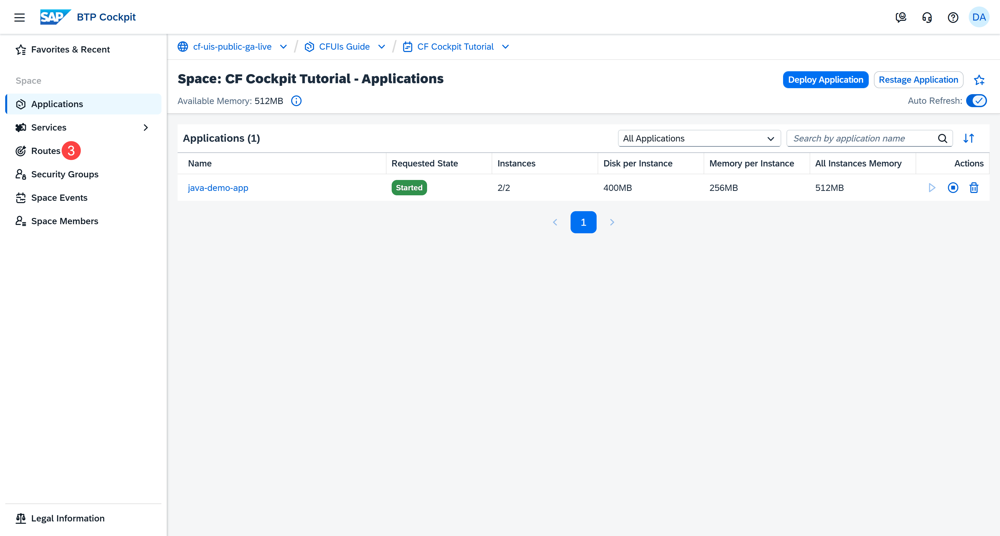
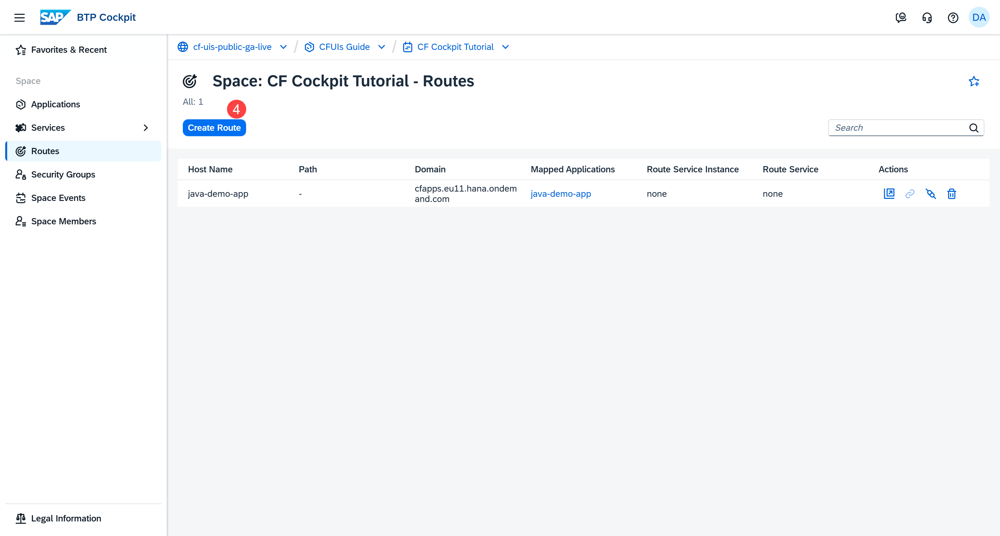
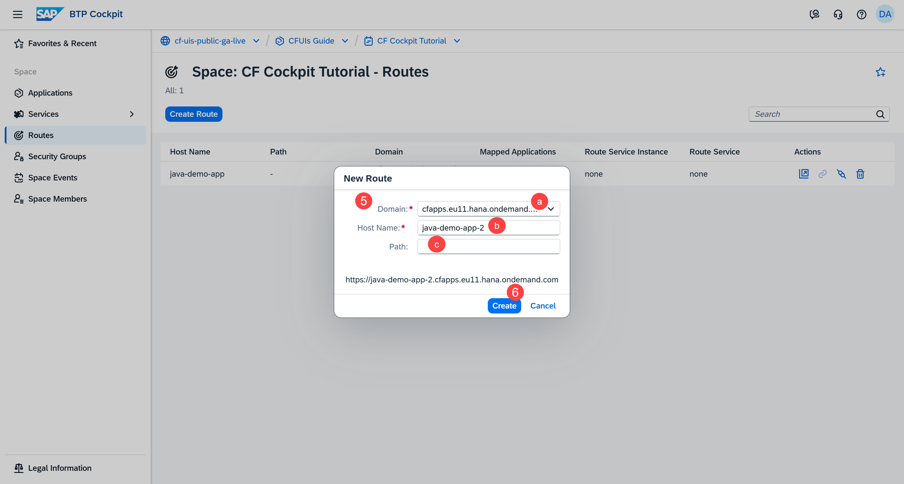
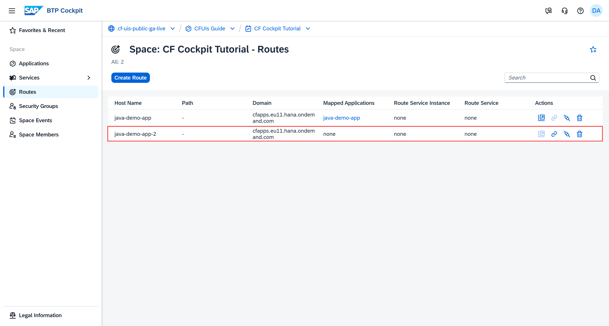
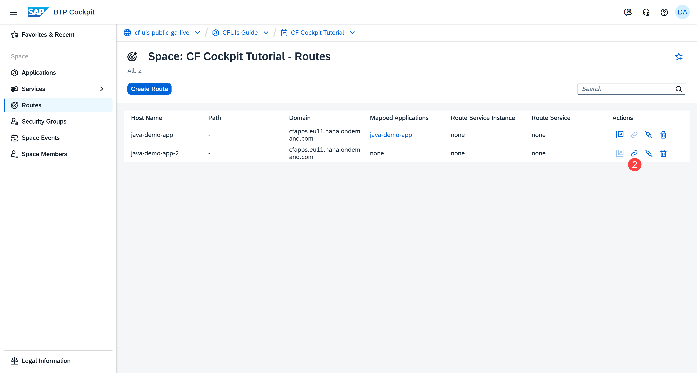
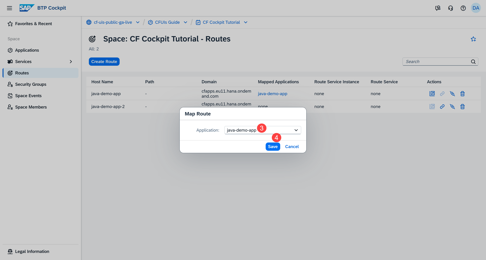
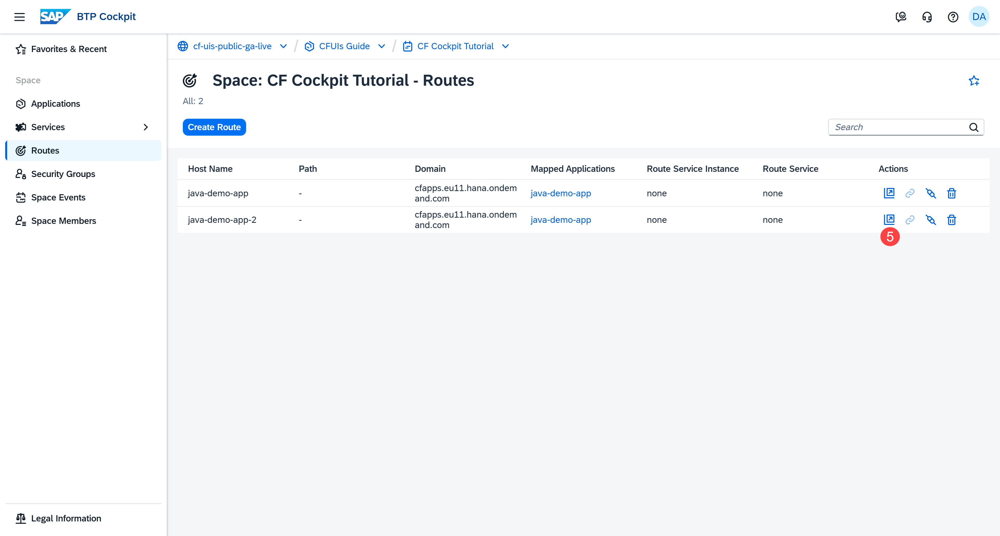

## You will learn

- What a route is
- How to create a route
- How to map a route to an application
<!--- How to unmap a route -->
- Our recommendations

## Prerequisites

**Note**: This tutorial is part of a learning journey. <!-- See . -->
- Make sure **you've fulfilled all prerequisites** in [Getting Started with Cloud Foundry Environment and SAP BTP Cockpit](https://developers.sap.com/tutorials/btp-cockpit-cf-getting-started-with-cf-env-and-cockpit.html).
- You have either the **Space Developer** or **Space Supporter** role.

### What is a route?

A route defines the URL through which end users can access your application. Routes belong to a space and are therefore managed at the space level. Although routes are managed within a space, their URLs are unique across all organizations (orgs).

Here's what the route of our sample application looks like:
`https://java-demo-app.cfapps.eu11.hana.ondemand.com`

Each route consists of a domain, a host name (or subdomain), and an optional path:

- **Domain**: In Cloud Foundry, the term "domain" refers to a DNS record. There are private and shared domains. Shared domains are available to users in all ogs. To access a private domain, you need specific permissions. In our example, the domain is `cfapps.eu11.hana.ondemand.com`. 

- **Host Name**: The host name is your desired subdomain. In the URL, it's added before the selected domain. In our example, the host name is `java-demo-app`. 

- **Path**: In addition to the domain and subdomain, you can also add a path. The path becomes part of the URL as follows:

    `https://<hostname>.<domain>/<path>`

    The path acts as the identifier that tells the routing system which content to display when users visit that particular URL. For example, a path like `/dashboard` takes users to the dashboard page, while `/settings/profile` directs them to their profile settings.

**Note**: Routes can have the same domain as long as their host names are different, or their paths are different. You can use this setup to group related apps under one domain (for example, microservices), or share a domain in dev/test environments.

### Create a route

Creating a route means configuring the URL that directs traffic to your application. If a route with a URL exists, you can’t create a route with the same URL. The number of routes you can create in a space depends on your subaccount entitlements and quotas, or on the space quota assigned to that space.

1. Go to **Cloud Foundry > Spaces** in the left navigation menu.

    <!-- border; size:540px --> 

2. Go to a space. This opens the **Applications** page.

3. Go to **Routes** in the left navigation menu.

    <!-- border; size:540px --> 

4. Choose **Create Route**.

    <!-- border; size:540px --> 

5. In the dialog, enter the following parameters:

    a. **Domain**: From the dropdown, choose either a shared domain (for example, the default `cfapps.<region>.hana.ondemand.com`) or a private domain that you've previously created using the CF CLI. For more information on private domains, see [Cloud Foundry Documentation](https://docs.cloudfoundry.org/devguide/deploy-apps/routes-domains.html#private-domains).

    b. **Host Name**: The host name can contain up to 63 characters.

    c. **Path** (Optional): You can optionally specify a path.

    You can see the preview of your route at the bottom of the dialog.
    
    <!-- border; size:540px --> 

6. Choose **Create**.

You can now see your newly created route.

<!-- border; size:540px --> 

### Map the route to your application

Creating a route alone isn’t enough. Mapping it to your application ensures that incoming requests reach the app and it becomes accessible to users.

There are several options to map routes to applications. You can:

- Map one route to one application

- Map one route to multiple applications. Multiple versions of your app can be mapped to a single route for load balancing purposes. 

- Map multiple routes to one application. For example, different country-specific domains pointing to the same app - `*.fr`, `*.de`, `*.it`, and so on.

Now map the newly created route to the application: 

1. On the **Routes** page, find the route in the list of created routes.

    Alternatively, you can map routes from the **Application Overview** page as well.

2. Choose the **Map Route** button from the **Actions** column.

    <!-- border; size:540px --> 

3. Select an application from the dropdown to map the route to.

    <!-- border; size:540px --> 

4. Choose **Save**.

You can now choose the **Launch Route** button in the **Actions** column to access your app.

<!-- border; size:540px --> 

Alternatively, you can also access your app from the **Application Overview** page by clicking the relevant app URL in the **Mapped Routes** section:

<!-- border; size:540px --> 

**Note**: The **Mapped Routes** section on the **Application Overview** page is the only place in the SAP BTP cockpit where you can unmap routes. 

### Recommendations

#### Use custom domains for production

The default domains are mainly used for testing purposes. When it comes to production-ready applications, a custom domain with its own DNS entry is recommended. For more information, see [What Is Custom Domain? | SAP Help Portal](https://help.sap.com/docs/custom-domain/custom-domain-manager/what-is-custom-domain).

