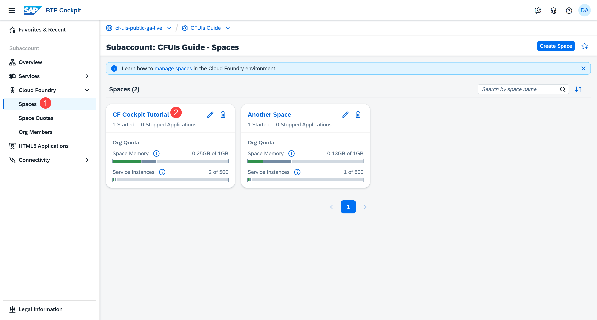
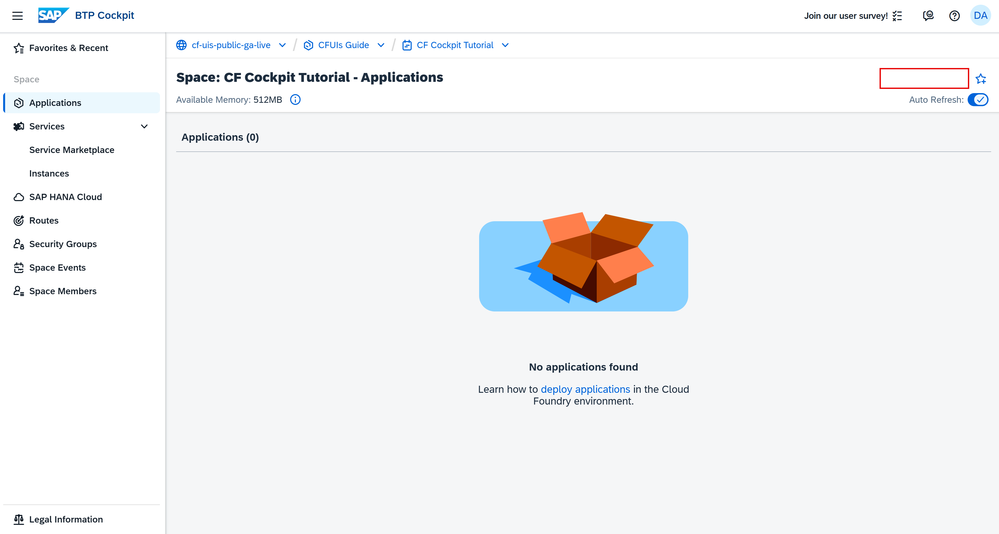
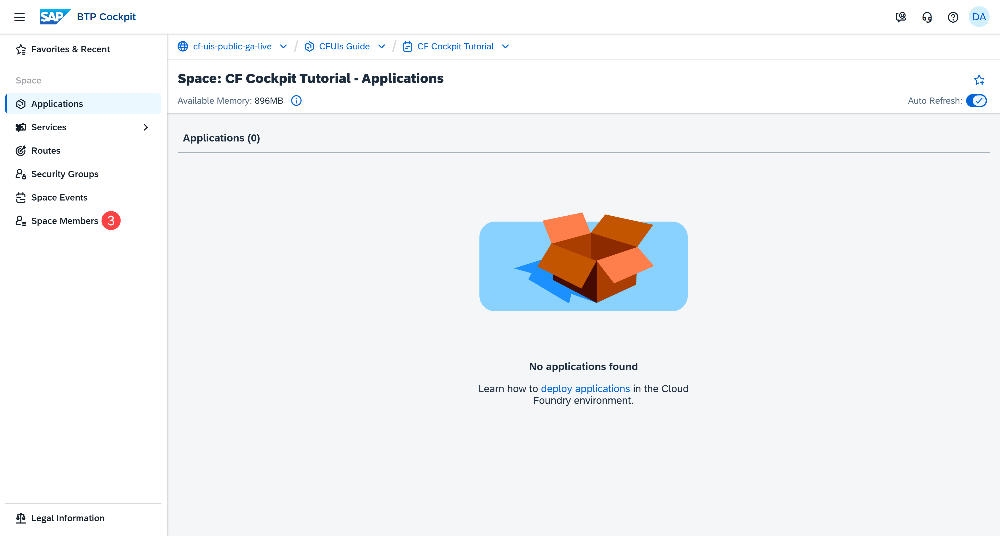
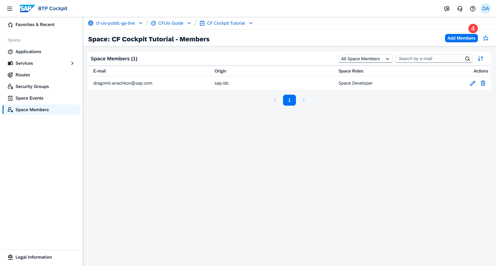
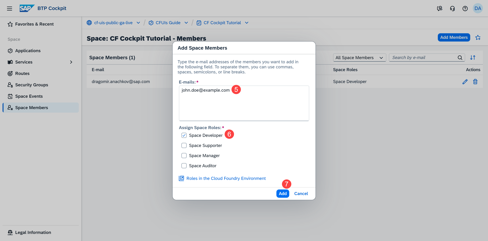
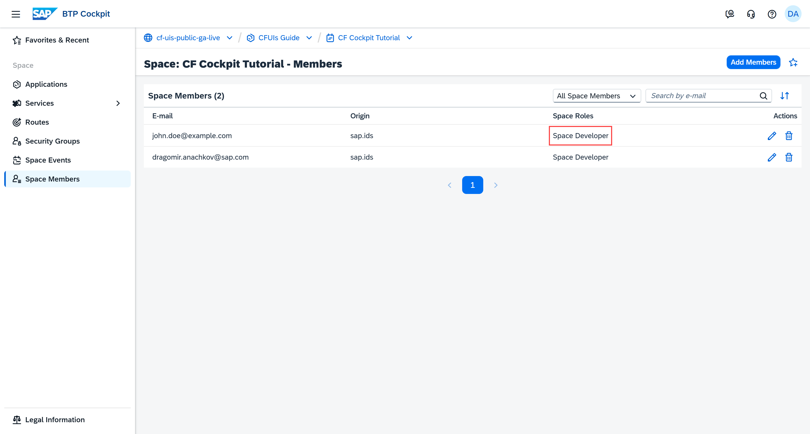
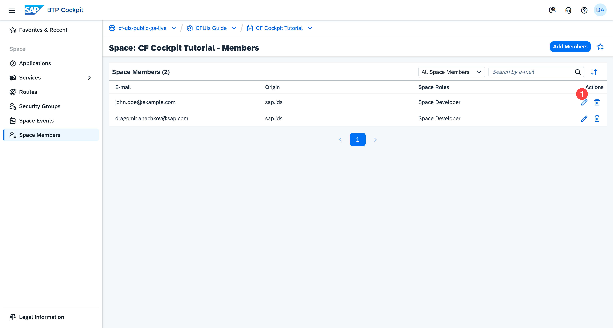
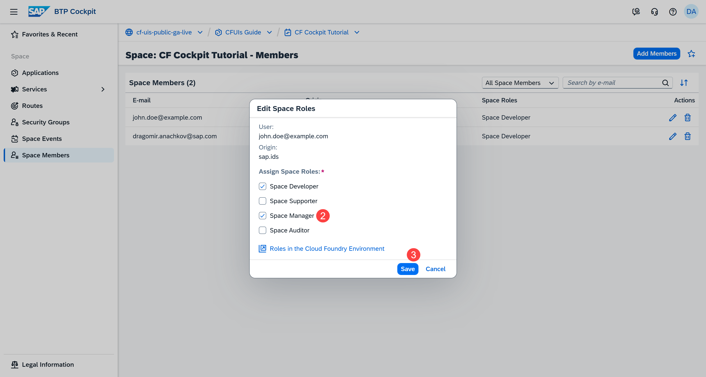
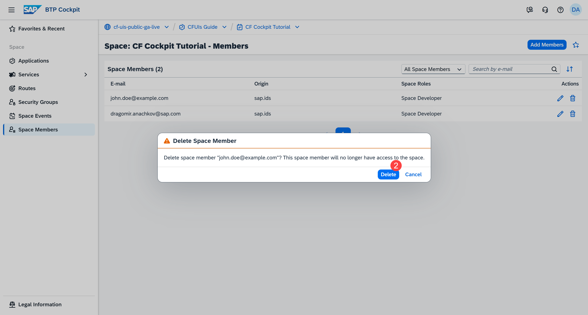
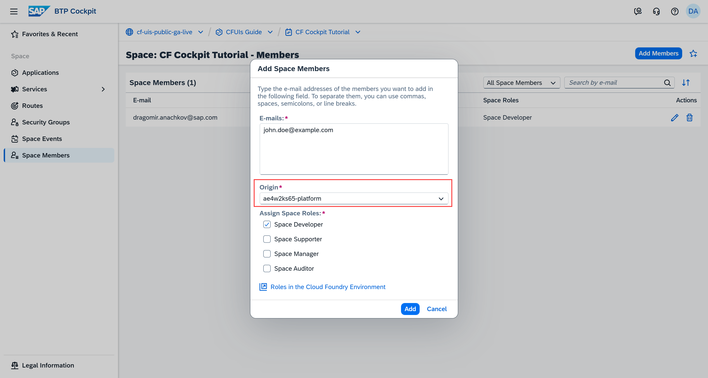

## You will learn

- What a space member is
- How to add space members
- How to edit the roles of a space member
- How to delete a space member
- How to add space members with custom identity provider
- Our recommendations

## Prerequisites

**Note**: This tutorial is part of a learning journey. <!-- See . -->
- Make sure **you've fulfilled all prerequisites** in [Getting Started with Cloud Foundry Environment and SAP BTP Cockpit](https://developers.sap.com/tutorials/btp-cockpit-cf-getting-started-with-cf-env-and-cockpit.html).
- You have either the **Org Manager** or the **Space Manager** role.

### What is a space member?

Space member is a user who is granted space-scoped roles and permissions. The purpose of space roles is to maintain security and support collaboration.

There are currently four space roles that you can assign to users. These roles determine which features users can view and access, and which actions they can peform in the corresponding space.

Here's the list of all space roles and their permissions in the SAP BTP cockpit:

| Role             | Description                                                                                                                                                                                                 |
|------------------|-------------------------------------------------------------------------------------------------------------------------------------------------------------------------------------------------------------|
| Space Manager    | Manages a space within an org by adding space members (only if they already have the Org User role) and managing their space roles.                                                                                                                                                                     |
| Space Developer  | Deploys and manages applications, and binds them to services within a space. |
| Space Auditor    | Provides read-only access to a space.                                                                                                                                                                        |
| Space Supporter  | Checks application events and logs, and manages applications and service bindings in a space. |

### Add a space member

In this tutorial, there is a software developer named John Doe. He has the task to deploy applications in your space, and he needs the **Space Developer** role to do that.

1. Go to **Cloud Foundry > Spaces** in the left navigation menu.

    <!-- border; size:540px --> 

2. Go to the space where you want to make John a **Space Developer**.

    **Note**: If you don't have any space roles assigned, you have read-only access to the space. For example, you can't deploy applications without the **Space Developer** role, which is why you don't see the **Deploy Application** button:

    <!-- border; size:540px --> 

3. Go to **Space Members** in the left navigation menu.

    <!-- border; size:540px --> 

4. Choose **Add Members**.

    <!-- border; size:540px -->  

5. Enter John's e-mail adddress.

    <!-- border; size:540px --> 

    **Note**: You can add multiple space members at the same time by listing their e-mail addresses with a comma.

6. Select the space role you want to assign. In this case, select the **Space Developer** role.

7. Choose **Add**.

John now has the **Space Developer** role.

<!-- border; size:540px --> 

**Note**: When you have the **Org Manager** role and you add new space members in an org they aren't part of yet, they automatically receive the **Org User** role. This is in addition to the space roles you've assigned.

### Edit a space member

You can change the space roles of users to reflect a shift in their responsibilities. You can also remove space roles when users no longer need to perform the corresponding actions.

1. Choose the **Edit** button in the **Actions** column.

    <!-- border; size:540px -->  

2. Update the space roles.

    In this case, let's assume John's expertise makes him the right person to manage this space and give him the **Space Manager** role.

    <!-- border; size:540px --> 

3. Choose **Save**.

### Delete a space member

**Note:** This example shows you how to delete a space member for demonstration purposes. Make sure you have a space member because you need it in the next tutorials.

You can remove access to the space of a user who is no longer part of your development team.

1. Choose the **Delete** button in the **Actions** column.

    <!-- border; size:540px --> 

2. Choose **Delete** to confirm the action.

    <!-- border; size:540px --> 

**Note**: This action removes the member from the current space while retaining their org roles and space roles in other spaces.

### Add a space member with a custom identity provider (IdP)

You can learn what a custom identity provider is in our previous tutorial **Managing Org Members**.

If you've established trust with a custom identity provider, the **Add Space Members** dialog gives you the additional option to select an identity provider from a dropdown menu:

<!-- border; size:540px --> 

For more information, see [Establish Trust and Federation of Custom Identity Providers for Platform Users | SAP Help Portal](https://help.sap.com/docs/authorization-and-trust-management-service/authorization-and-trust-management/establish-trust-and-federation-of-custom-identity-providers-for-platform-users-feature-set-b).

**Note**: When you edit or delete space members, the change applies only to the space member stored in the corresponding identity provider.

For example, suppose you have two space members with the e-mail address `john.doe@example.com`. One space member uses the default `sap.ids` identity provider, and the other uses your custom identity provider - `ae4w2ks65-platform`. If you edit the roles of the space member with `sap.ids`, only that space member's permissions change.

### Recommendations

#### Assign only the required roles

Give each user only the permissions they need to perform their tasks. This ensures better security and transparency within the space.

**Example**: Assign the **Space Developer** thoughtfully. Give it only to software developers who will actively deploy or manage applications in your space.

#### Clean up access regularly

Maintain a clean space by removing users who are no longer part of the team or project. This prevents unnecessary access to resources, and ensures that roles and permissions reflect the current state of your team.