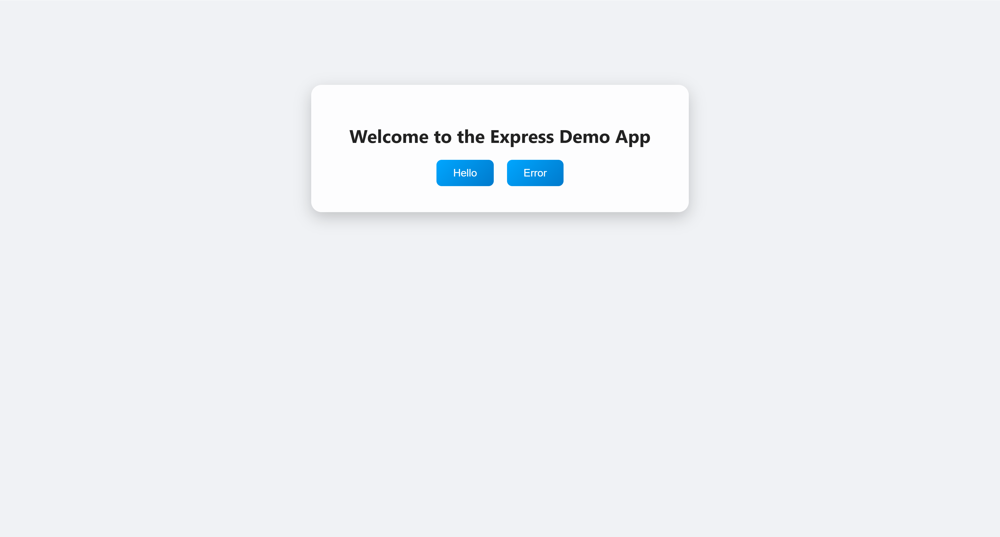
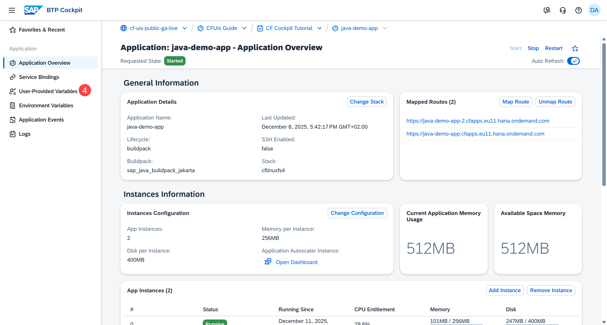
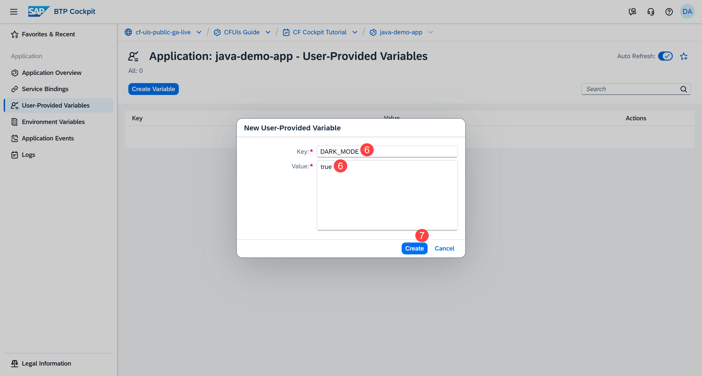
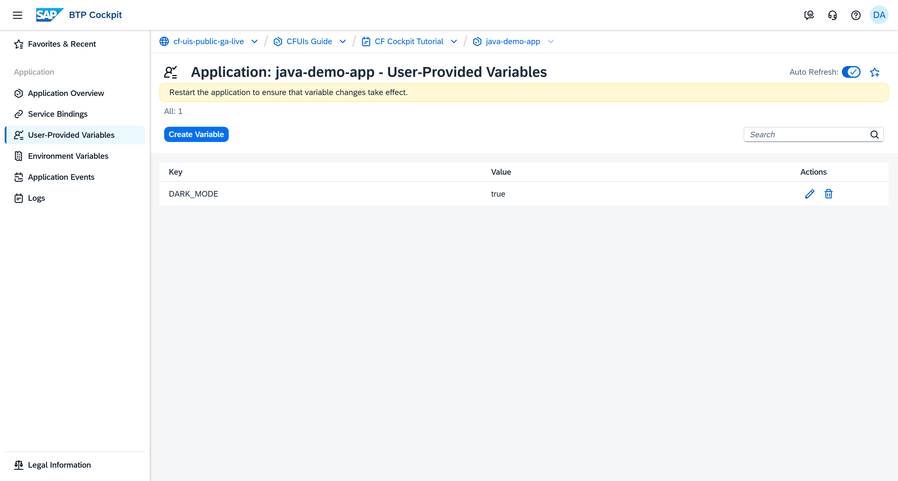
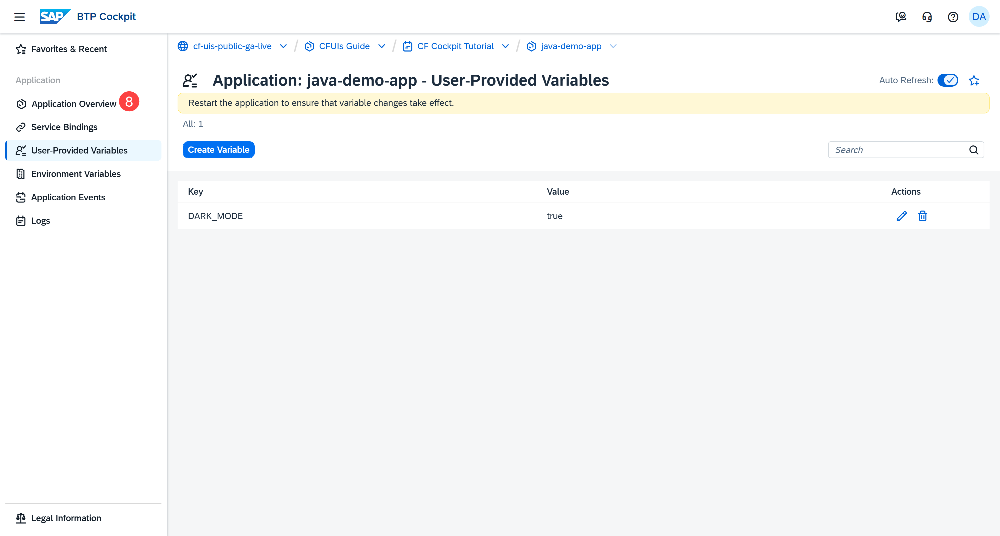
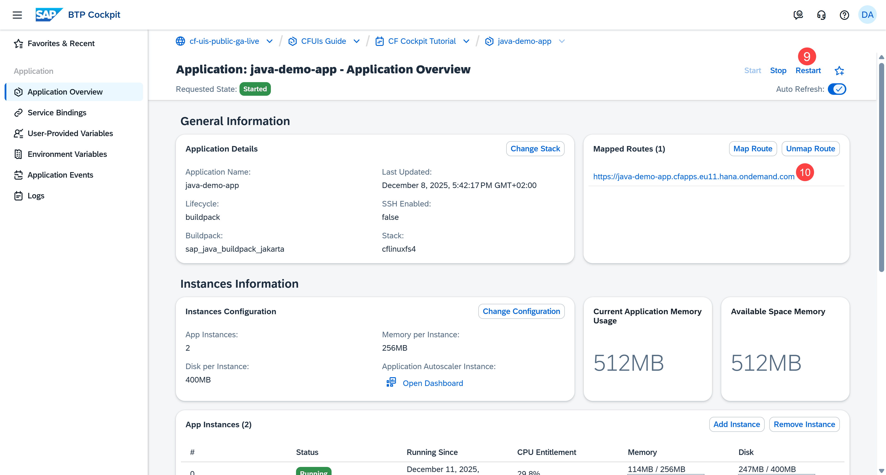
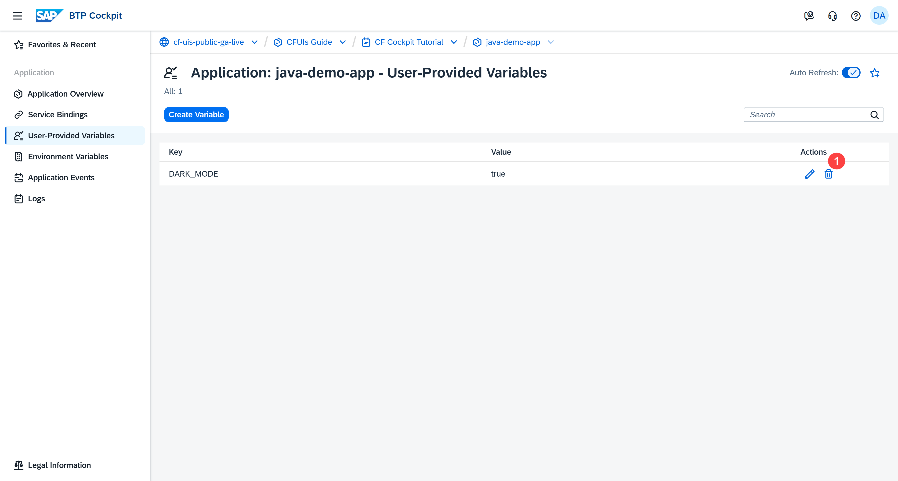
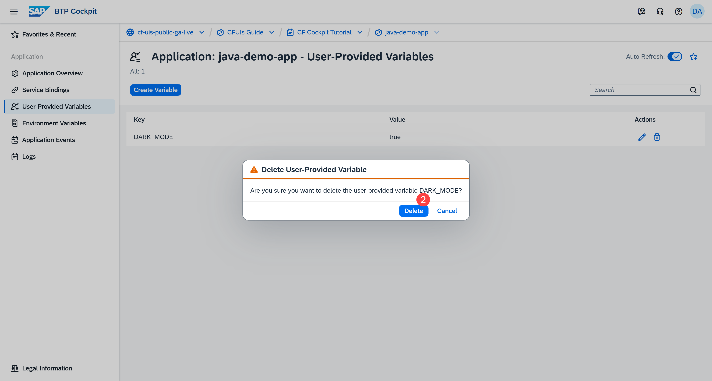

## You will learn

- What a user-provided environment variable is
- How to create a user-provided environment variable
- How to delete a user-provided environment variable

## Prerequisites

**Note**: This tutorial is part of a learning journey. <!-- See [](Add link to the group). -->
- Make sure **you've fulfilled all prerequisites** in [Getting Started with Cloud Foundry Environment and SAP BTP Cockpit](https://developers.sap.com/tutorials/btp-cockpit-cf-getting-started-with-cf-env-and-cockpit.html).
- You have either the **Space Developer** or **Space Supporter** role.

### What is a user-provided environment variable?

User-provided variables are your custom environment variables, created as key-value pairs. You define them manually to pass data such as:

- API tokens
- Feature flags
- Configuration values
- External URLs

**Caution:** Avoid using user-provided environment variables for security-sensitive information like credentials. They might unintentionally appear in cf CLI output and Cloud Controller logs.

#### Example

Our sample applications are implemented to expect the variable `DARK_MODE`. This variable allows you to customize the UI theme of an app. Here's a snippet from the source code of the sample Node.js app:

```
const DARK_MODE = process.env.DARK_MODE === 'true';
```

### Create a user-provided environment variable

Let's create an environment variable that switches the theme of the sample app from the default to a dark theme. This is how our sample app looks like by default:

<!-- border; size:540px --> 

1. Go to the **Cloud Foundry > Spaces** in the left navigation menu.

    <!-- border; size:540px --> 

2. Go to a space. This opens the **Applications** page.

3. Click the name of the application which you want to customize with your own variable.

    <!-- border; size:540px --> 

4. Go to **User-Provided Variables** in the left navigation menu.

    <!-- border; size:540px --> 

5. Choose **Create Variable**.

    <!-- border; size:540px --> 

6. Provide a **Key** and a **Value**. These values are case-sensitive.

    <!-- border; size:540px --> 

7. Choose **Create**.

    The user-provided variable is now created.

    <!-- border; size:540px --> 

    To apply the change, you need to restart your application.

8. Go to the **Overview** page of your application.

    <!-- border; size:540px --> 

9. Choose **Restart**.

    <!-- border; size:540px --> 

10. Click the URL of the application.

    As you can see, the interface of the app has switched to the dark theme.

    <!-- border; size:540px --> 

### Delete a user-provided environment variable

When you no longer need the variable and the customization it brings, delete it:

1. On the **User-Provided Variables** page, choose the **Delete** button in the **Actions** column.

    <!-- border; size:540px --> 

2. Choose **Delete** to confirm the action.

    <!-- border; size:540px --> 

After you delete the variable, restart the application as described in steps 8-10 of **Create a user-provided environment variable** or restage it. Otherwise, the change won't take effect.