## You will learn

- What space events, application events, and application logs are and how they compare
- Where to find them in the cockpit
- The terminology used on the Space Events, Application Events, and Logs pages
- How to use them to troubleshoot application issues

## Prerequisites

**Note**: This tutorial is part of a learning journey. <!-- See . -->
- Make sure **you've fulfilled all prerequisites** in [Getting Started with Cloud Foundry Environment and SAP BTP Cockpit](https://developers.sap.com/tutorials/btp-cockpit-cf-getting-started-with-cf-env-and-cockpit.html).
- You have one of the following roles in the space where the application is deployed: **Space Developer**, **Space Auditor**, **Space Supporter**.

### What space events, app events, and app logs are and how they compare

To monitor and troubleshoot your applications, it’s important to understand how space events, application events, and application logs differ and what information each provides.

| | Space Events | Application Events | Application Logs |
|---------|--------------|------------|----------|
| **Location** | Space level | Application level | Application level |
| **Scope** | Space-wide. Can affect multiple applications, services, and routes. | Application-specific | Application-specific |
| **Purpose** | Monitor actions taken by the user or the system against a space (e.g. adding a space member) | Monitor actions taken by the user or the system against an application | Display app-specific logs generated by the application and Cloud Foundry |
| **Use cases** | Monitor space-level activities and resource changes | Debug your application and analyze its state | Identify and troubleshoot app-specific problems |

### Find the space events, app events, and app logs in SAP BTP cockpit

[OPTION BEGIN [Space Events]]

1. Go to the **Cloud Foundry > Spaces** in the left navigation menu.

    <!-- border; size:540px --> 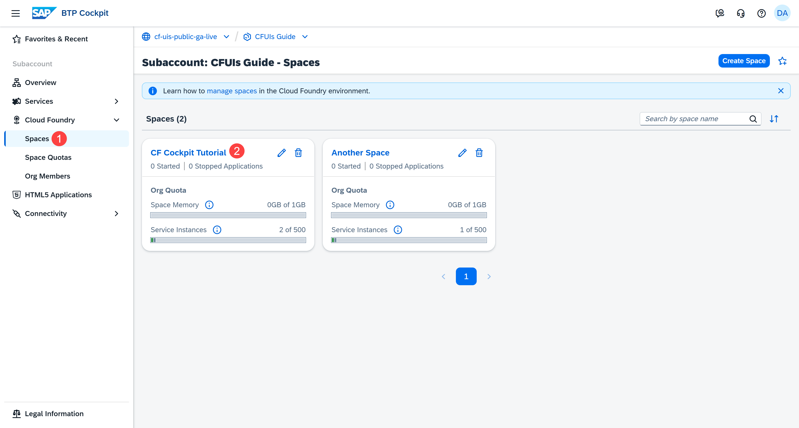

2. Go to a space. This opens the **Applications** page.

3. Go to **Space Events** in the left navigation menu.

    <!-- border; size:540px --> 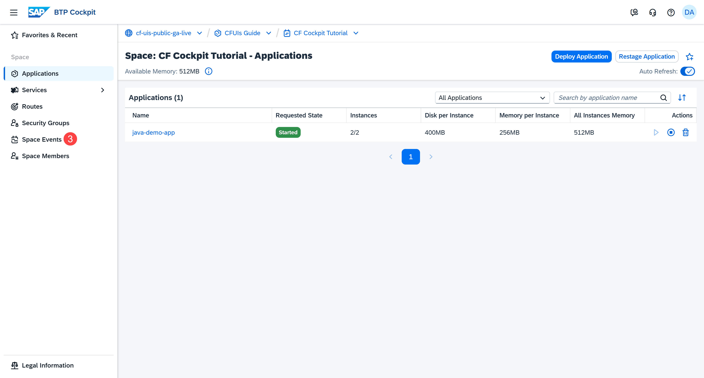

4. Check the space events.

    <!-- border; size:540px --> 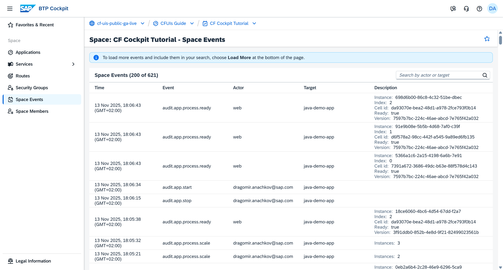

[OPTION END]

[OPTION BEGIN [Application Events]]

1. Go to the **Cloud Foundry > Spaces** in the left navigation menu.

    <!-- border; size:540px --> 

2. Go to a space. This opens the **Applications** page.

3. Click the name of the application whose application events you want to check and analyze.

    <!-- border; size:540px --> 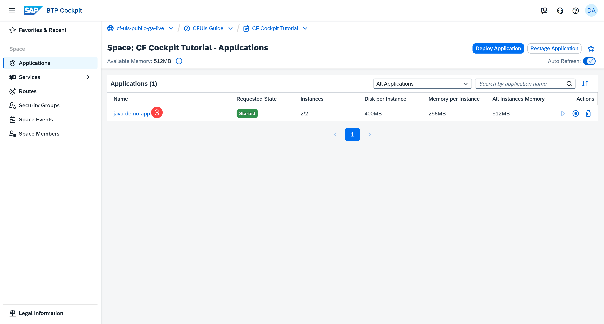

4. Now that you're on the **Application Overview** page, choose **Events** to get access to the most recent application events. For more details, go to **Application Events** in the left navigation menu.

    <!-- border; size:540px --> 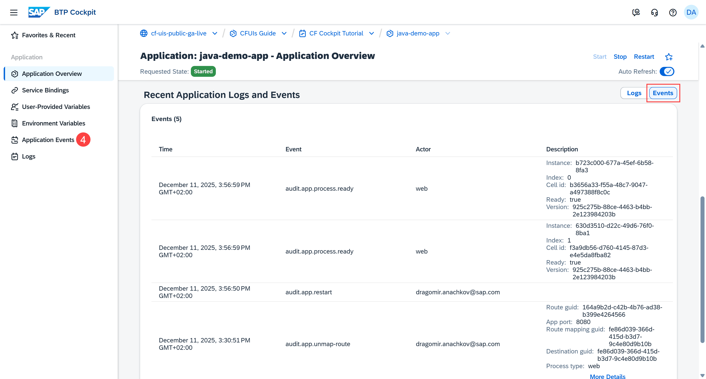

5. Check the application events.

    <!-- border; size:540px --> 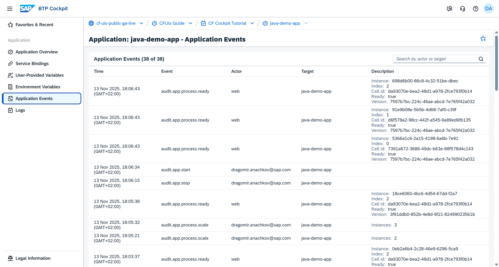

[OPTION END]

[OPTION BEGIN [Application Logs]]

1. Go to the **Cloud Foundry > Spaces** in the left navigation menu.

    <!-- border; size:540px --> 

2. Go to a space. This opens the **Applications** page.

3. Click the name of the application whose application logs you want to check and analyze.

    <!-- border; size:540px --> 

4. Go to **Logs** in the left navigation menu.

    <!-- border; size:540px --> 

5. Check the application logs.

    <!-- border; size:540px --> 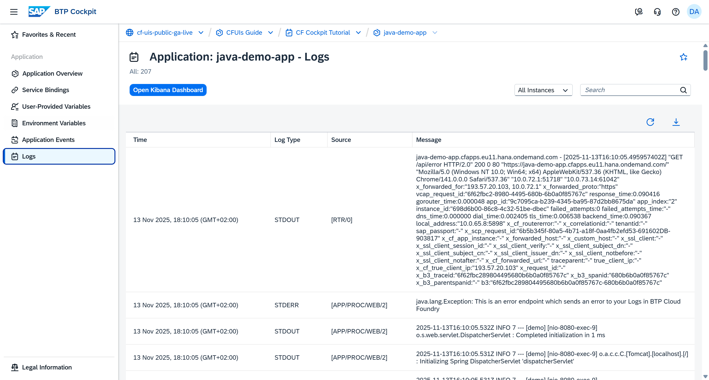

[OPTION END]

### Get familiar with the terminology

<!-- Map the table rows with the corresponding column titles in the screenshots -->

[OPTION BEGIN [Space Events]]

| Component | Purpose |
|--------------|------|
| Time (1)       | Shows the timestamp at which an event occurred. |
| Event (2)       | Shows the type of the event. The space-related events use the `audit.space.*` naming pattern, the application-related - the `audit.app.*` pattern, the route-related - the `audit.route.*` pattern, and so on. |
| Actor (3)       | Shows who triggered the event. It can be either the user or Cloud Foundry. |
| Target (4)      | Shows where the event was triggered. |
| Description (5)  | Provides technical details about the event. |

<!-- border; size:540px --> 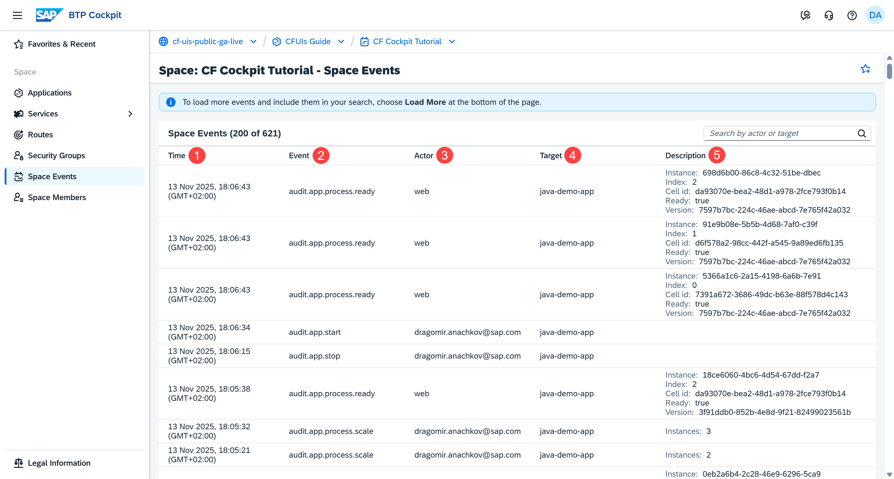

**Example:** If you trigger the creation of a new route, the `audit.route.create` space event is logged. You are the **Actor**, while the route is the **Target**.

By default, the page loads the most recent 200 events. To include more events to the list, choose **Load More** at the bottom of the page:

<!-- border; size:540px --> 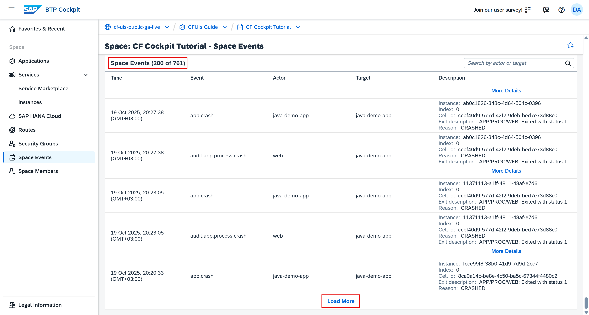

To find the exact event you're looking for, use the search field. Keep in mind that you can only search for already loaded events.

<!-- border; size:540px --> 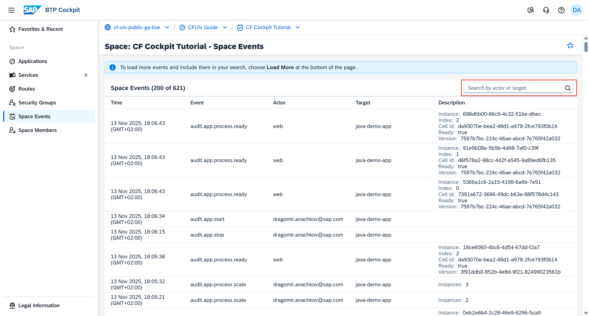

[OPTION END]

[OPTION BEGIN [Application Events]]

| Component | Purpose |
|--------------|------|
| Time (1)        | Shows the timestamp at which an event occurred. |
| Event (2)       | Shows the type of the event. The application events use the `audit.app.*` naming pattern. |
| Actor (3)       | Shows who triggered the event. It can be either the user or Cloud Foundry. |
| Target (4)      | Shows where the event was triggered. Provides the name of the application. |
| Description (5)  | Provides technical details about the event. |

<!-- border; size:540px --> 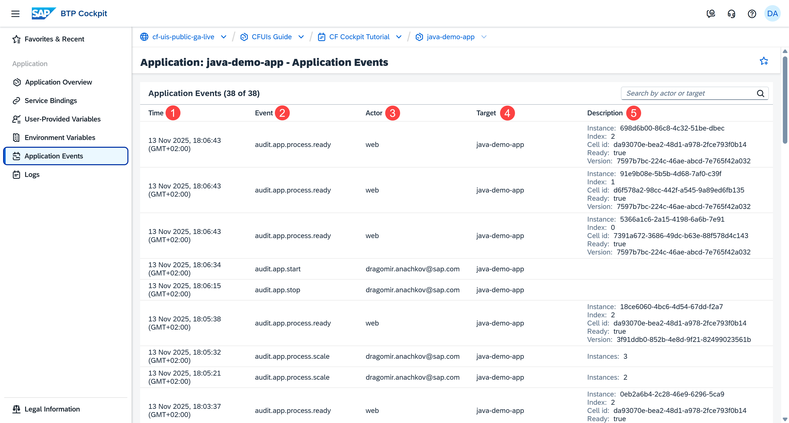

By default, the page loads the most recent 200 events. To include more events to the list, choose **Load More** at the bottom of the page:

<!-- border; size:540px --> 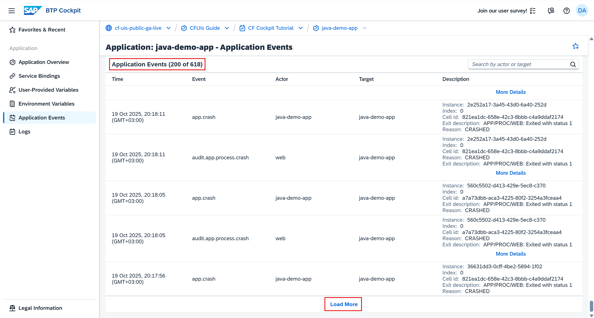

To find the exact event you're looking for, use the search field. Keep in mind that you can only search for already loaded events.

<!-- border; size:540px --> 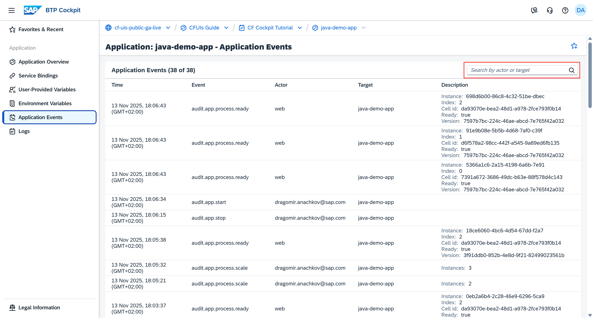

[OPTION END]

[OPTION BEGIN [Application Logs]]

| Component | Purpose                                                                 |
|--------------|----------------------------------------------------------------------|
| Time (1)        | Shows the timestamp at which the log is generated.                   |
| Log Type (2)    | Shows the type of the log according to Cloud Foundry: **STDOUT** (shows all output data) or **STDERR** (shows error messages only). |
| Source (3)      | Shows the Cloud Foundry component code and the instance number. For example, **[APP/1]** indicates that application instance one has generated the log. |
| Message (4)     | Allows you to view the log message. Specific messages provide you with additional information when you choose **More Details**. |

<!-- border; size:540px --> 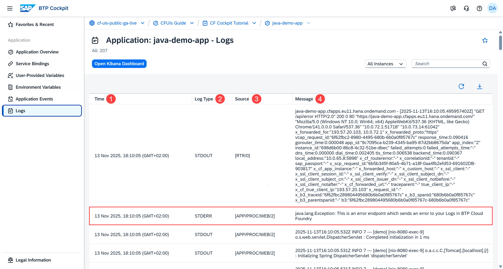

[OPTION END]

### Use space events, app events, and app logs to troubleshoot issues

[OPTION BEGIN [Space Events]]

The **Space Events** page acts like a timeline. For example, you can see who created the space and when it happened:

<!-- border; size:540px --> 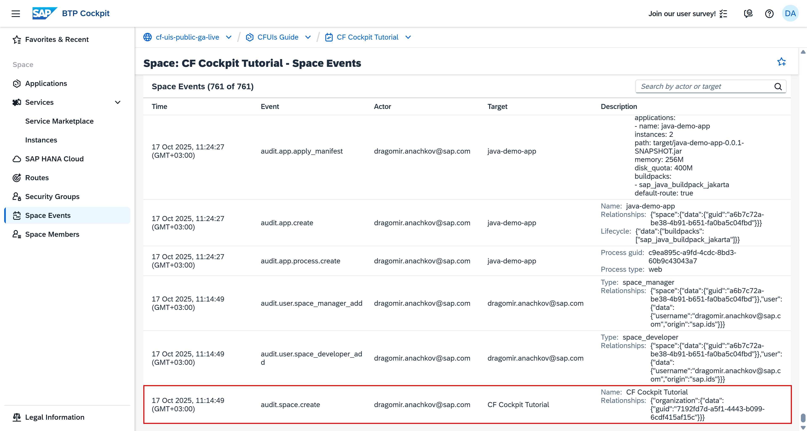

You also get access to changes made to all applications deployed in the space.
    
You can use this information to track all changes made to the space. It helps you contact the person responsible for each change.

[OPTION END]

[OPTION BEGIN [Application Events]]

Similar to the **Space Events** page, the **Application Events** page acts like a timeline. For example, you can see who last updated the app and when it happened. In this particular case, you can see that a developer has added a third app instance:

<!-- border; size:540px --> 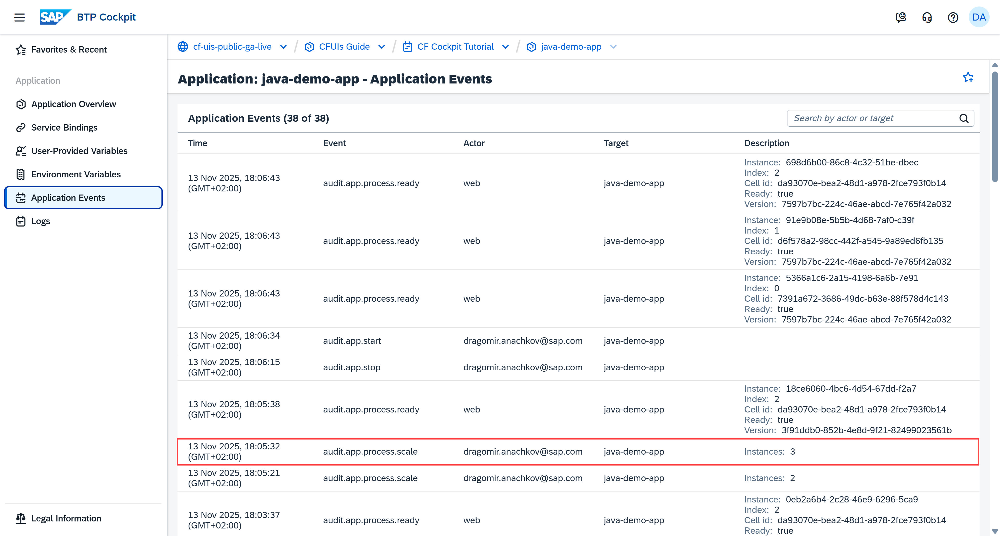

You can use this information to track all changes made to the app. It also helps you contact the person responsible for each change.

[OPTION END]

[OPTION BEGIN [Application Logs]]

When it comes to application logs, here's an example of an error on the **Logs** page. Our deployed sample app is implemented to generate the following error:

<!-- border; size:540px --> 

[OPTION END]