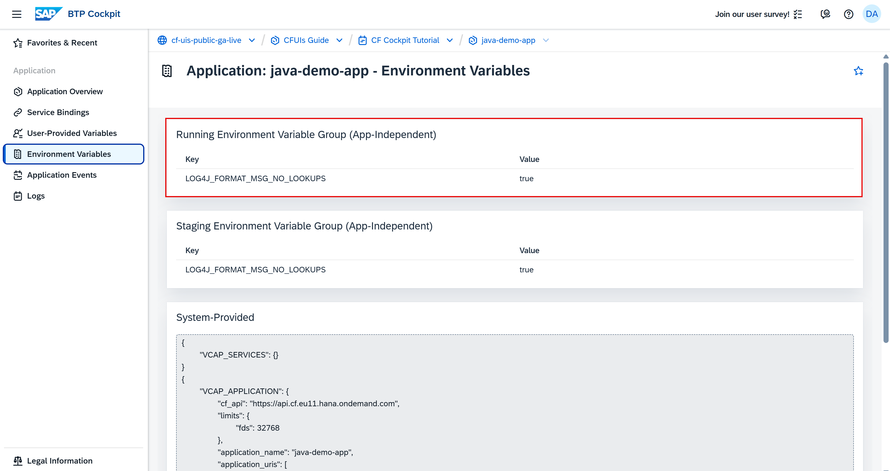
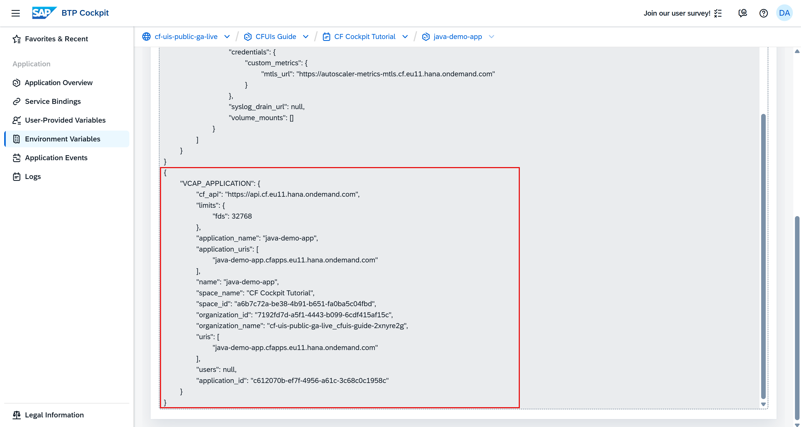
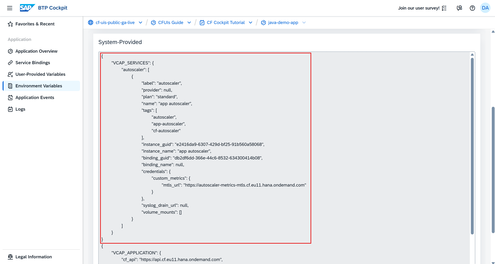

## You will learn

- What environment variables are
- About the running and staging environment variable groups
- About the system-provided environment variables with examples from the cockpit

## Prerequisites

**Note**: This tutorial is part of a learning journey. <!-- See . -->
- Make sure **you've fulfilled all prerequisites** in [Getting Started with Cloud Foundry Environment and SAP BTP Cockpit](https://developers.sap.com/tutorials/btp-cockpit-cf-getting-started-with-cf-env-and-cockpit.html).
- You have either the **Space Developer** or **Space Supporter** role.

### What are environment variables?

In the context of applications on SAP BTP, environment variables are key-value pairs that store configuration settings. They help you manage and customize app behavior without altering the code.

You can use them to define settings like database connections, API keys, or feature flags. By using environment variables, you ensure that your app remains flexible and adaptable to different environments, such as development, testing, and production.

### Environment variable groups

Environment variables are organized into two main groups:

#### Staging environment variable group

This group contains variables specific to your staging environment. These environment variables are available only during the staging phase when Cloud Foundry:

- Detects the buildpack

- Downloads dependencies

- Builds or compiles the app by running commands like `npm install` and `mvn package`

- Creates the droplet. A droplet is a runnable package that contains your complete application. When you deploy an application, Cloud Foundry automatically detects the appropriate buildpack and uses it to compile and package your application into this droplet.

Think of staging environment variables as the ones needed by build tools, compilers, or dependency managers.

<!-- border; size:540px --> 

#### Running environment variable group

This group contains variables for your production or runtime environment. These are the standard environment variables used after the app has started. They are:

- Injected into the app container and used during app execution (for example, for configuration, secrets, database connection)

- Used directly by the application code

<!-- border; size:540px --> 

**Note**: When your application runs, the system combines variables from the appropriate environment group.

### System-provided variables

The platform automatically injects system-provided environment variables into your Cloud Foundry apps during staging and runtime. In SAP BTP cockpit, they are split into `VCAP_APPLICATION` and `VCAP_SERVICES`.

#### VCAP_APPLICATION

This environment variable contains the associated attributes for a deployed app, such as app name, IDs, space, org, URIs, disk and memory limits.

<!-- border; size:540px --> 

#### VCAP_SERVICES

For bound services, Cloud Foundry adds connection details to the VCAP_SERVICES environment variable, such as service name, credentials (URIs, usernames, passwords), tags, and other metadata.

<!-- border; size:540px --> 

### User-provided variables

User-provided variables are your own custom environment variables that you create as key-value pairs.

To learn how to create a user-provided environment variable in the SAP BTP cockpit, check out the next tutorial **Managing User-Provided Environment Variables**.