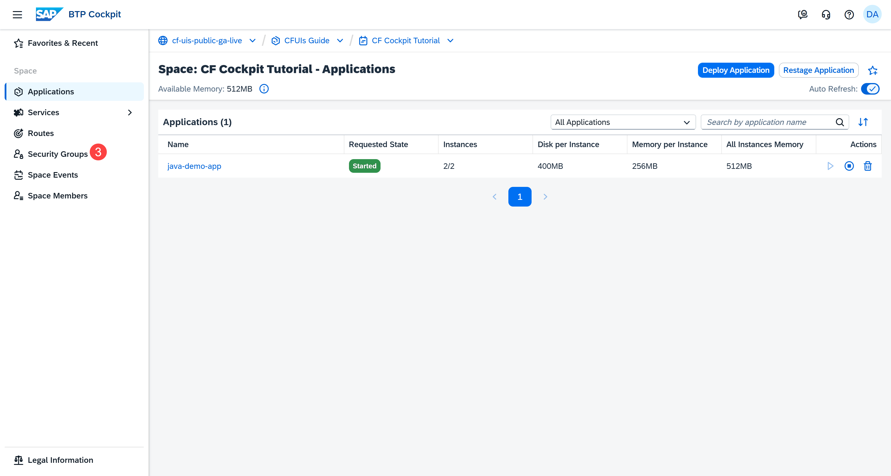
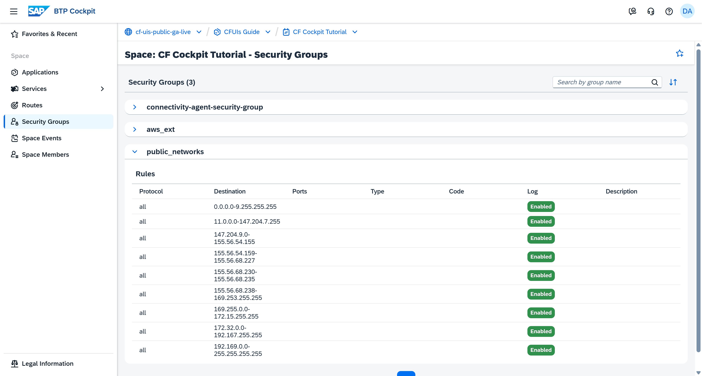

## You will learn

- What a security group is
- Where to find the Security Groups page
- What types of security groups there are
- Who can create and edit security groups
- What you can use security groups for

## Prerequisites

**Note**: This tutorial is part of a learning journey. <!-- See . -->
- Make sure **you've fulfilled all prerequisites** in [Getting Started with Cloud Foundry Environment and SAP BTP Cockpit](https://developers.sap.com/tutorials/btp-cockpit-cf-getting-started-with-cf-env-and-cockpit.html).
- You have one of the following roles in the space where the application is deployed: **Org Manager**, **Space Manager**, **Space Developer**, **Space Auditor**, **Space Supporter**.

### What is a security group?

In the Cloud Foundry environment, a security group is a set of rules that control network traffic for applications. These rules specify which protocols, ports, and IP address ranges are allowed for outgoing connections from your apps. If your application tries to access an endpoint that isn’t allowed by its assigned security group, the request will be blocked.

**Note**: SAP can add traffic restrictions that aren't visible through the security groups. For example, these restrictions can include limitations for embargoed countries.

To view the security groups in SAP BTP cockpit:

1. Go to **Cloud Foundry > Spaces** in the left navigation menu.

    <!-- border; size:540px --> 

2. Go to a space.

3. Go to **Security Groups** in the left navigation menu.

    <!-- border; size:540px --> 

Security groups are created and managed by platform administrators. Standard roles, such as Org Manager, Space Manager, and Space Developer, don't have permissions to create or modify security groups. Some services automatically provide security groups when they are enabled.

<!-- border; size:540px --> 

### Types of security groups

Staging security groups are applied during app staging, while running security groups are applied when the app is running. The SAP BTP cockpit displays only the running security groups.