## You will learn

- What a service is
- How to consume services
- How to create a service instance at the application level in the cockpit
- How to bind a service instance to an application
- Where to find the credentials of the service binding
- How to delete a service binding

## Prerequisites

**Note**: This tutorial is part of a learning journey. <!-- See . -->
- Make sure **you've fulfilled all prerequisites** in [Getting Started with Cloud Foundry Environment and SAP BTP Cockpit](https://developers.sap.com/tutorials/btp-cockpit-cf-getting-started-with-cf-env-and-cockpit.html).
- You have either the **Space Developer** or **Space Supporter** role.

### What is a service?

Services enable, facilitate, or accelerate the development of business applications on SAP BTP by providing functionalities that apps typically don’t implement themselves, such as databases, or authentication.

In the Cloud Foundry environment, you can create service instances through the SAP BTP cockpit, and then bind these instances to your applications. This way the application consumes the functionality offered by the service.

#### Services offered by SAP

Services offered by SAP are available in the **Service Marketplace** in SAP BTP cockpit where you can create a service instance or subscription on-demand. Each service instance represents a single instantiation of a service running on SAP BTP. You create service instances using specific service plans.

**Examples:** Application Autoscaler, Application Logging Service

You can access and manage services through the following cockpit pages:

- **Service Marketplace**: provides an overview of all services available for consumption in your subaccount

- **Instances and Subscriptions**: displays lists of created service and environment instances, as well as subscriptions

For more information, see [View and Manage Services from the Service Marketplace | SAP Help Portal](https://help.sap.com/docs/service-manager/sap-service-manager/view-and-manage-services-from-service-marketplace).

#### User-provided services

The Cloud Foundry environment supports user-provided services, which are developed and maintained by the user. These services aren't available in the **Service Marketplace**. Once you create a user-provided service instance, it behaves the same way as the service instances in the marketplace.

### How to consume services?

For your application to consume services, you need to deliver service credentials to the app. You can do that by:

- Using service keys to generate credentials for direct communication with a service instance.

- Binding service instances to your application to automatically deliver credentials (covered in this tutorial)

#### What is a service key?

Service keys generate credentials for manually configuring consumers of services from the marketplace. After you configure them for your service, local clients, apps in other spaces, or entities outside your deployment can access your service with these keys.

#### What is a service binding?

Service binding connects a service instance to your application. Binding a service instance to your application triggers credentials to be provisioned for the service instance and delivered to the app runtime.

On the **Service Bindings** page, you bind an application to a service using the **Bind Service Instance** wizard. You can either:

- Bind an existing service instance.

- Create a new service instance and bind it.

### Create a service binding

[OPTION BEGIN [Bind Exsiting Service Instance]]

1. Go to **Cloud Foundry > Spaces** in the left navigation menu.

    <!-- border; size:540px --> 

2. Go to a space. This opens the **Applications** page.

3. Click the name of the application for which you want to create a service binding.

    <!-- border; size:540px --> 

4. Choose **Service Bindings**.

    <!-- border; size:540px --> 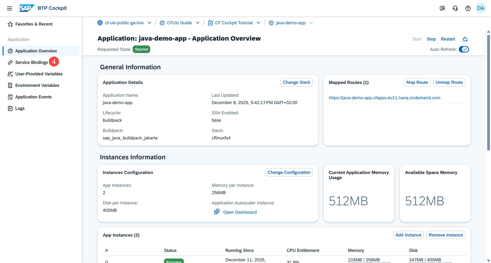

5. Choose **Bind Service Instance**. This action opens the **Bind Service Instance** wizard.

    <!-- border; size:540px --> 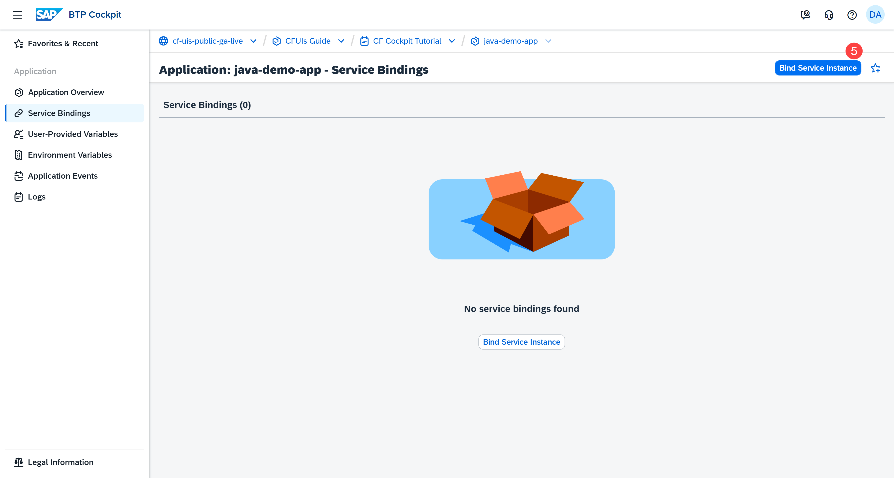

6. Find the service instance in the table and choose **Bind**.

    <!-- border; size:540px --> 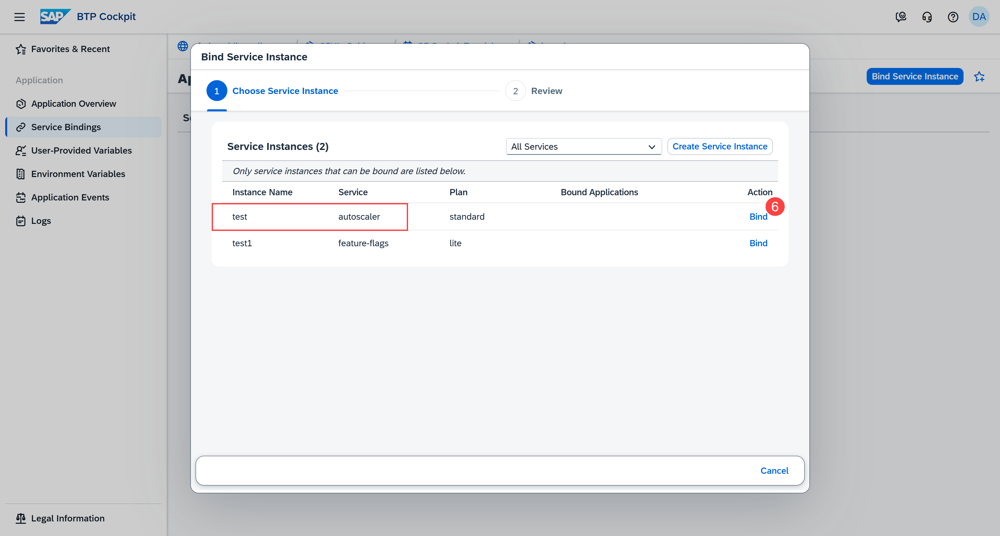

    If you can't find a suitable service instance, create and bind a new service instance as instructed in the **Create and Bind New Service Instance** option.

7. (Optional) Provide JSON parameters either manually (a) or by importing a JSON file (b).

    Some services support additional configuration parameters when you bind them to an application. These parameters are passed as a JSON object containing service-specific configuration (for example, Application Autoscaler rules). You can skip this step for this tutorial.

    <!-- border; size:540px --> 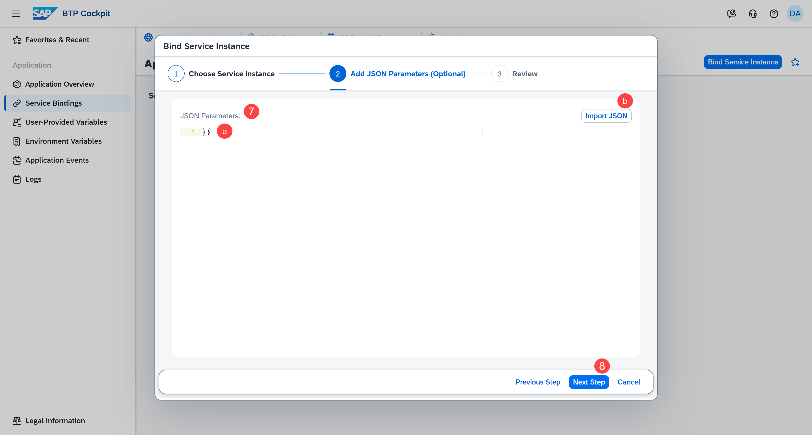

8. Choose **Next Step**.

9. Review all the details you've provided so far. You can always go back and make changes, if necessary.

    <!-- border; size:540px --> 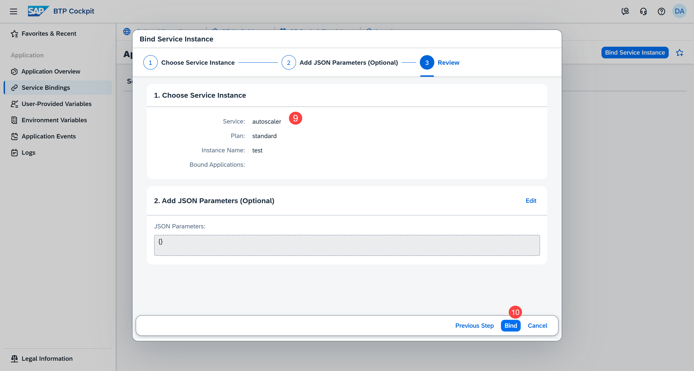

10. Choose **Bind**.

The service binding is created.

**Note**: To make sure the relevant environment variables take effect, restage your application after binding it. Restaging causes downtime so plan accordingly before you proceed.

<!-- border; size:540px --> 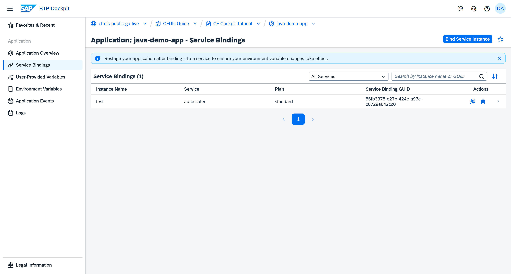

**Note**: When you deploy an application with a manifest, you can create a service binding by specifying it in the manifest file.

[OPTION END]

[OPTION BEGIN [Create and Bind New Service Instance]]

1. Go to **Cloud Foundry > Spaces** in the left navigation menu.

    <!-- border; size:540px --> 

2. Go to a space. This opens the **Applications** page.

3. Click the name of the application for which you want to create a service binding.

    <!-- border; size:540px --> 

4. Choose **Service Bindings**.

    <!-- border; size:540px --> 

5. Choose **Bind Service Instance**. This action starts the **Bind Service Instance** wizard.

    <!-- border; size:540px --> 

6. Choose **Create Service Instance**.

    <!-- border; size:540px --> 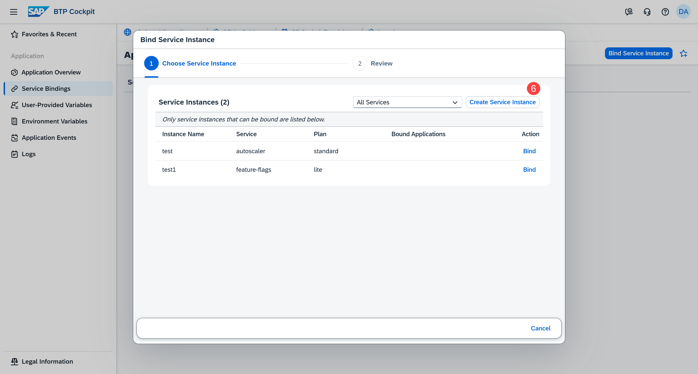

7. Select a **Service** from the available ones in the service marketplace, a **Plan**, and provide an **Instance Name**.

    <!-- border; size:540px --> 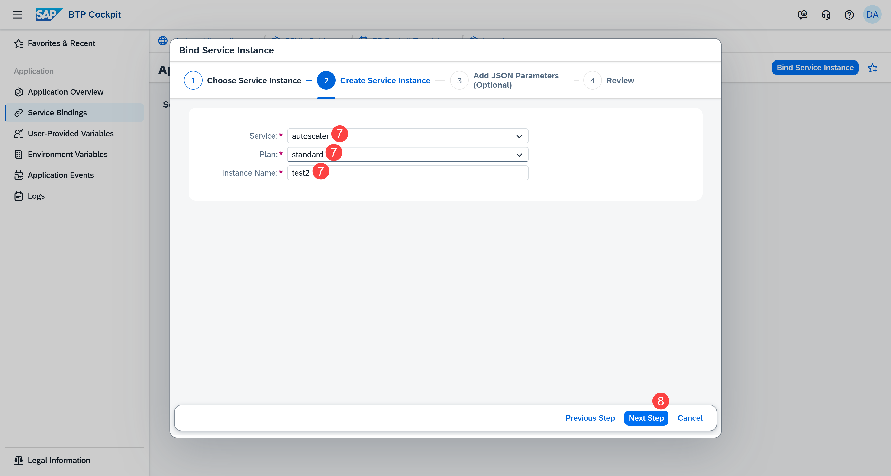

8. Choose **Next Step**.

9. (Optional) Provide JSON parameters either manually (a) or by importing a JSON file (b).

    Some services support additional configuration parameters when you bind them to an application. These parameters are passed as a JSON object containing service-specific configuration (for example, Application Autoscaler rules). You can skip this step for this tutorial.

    <!-- border; size:540px --> 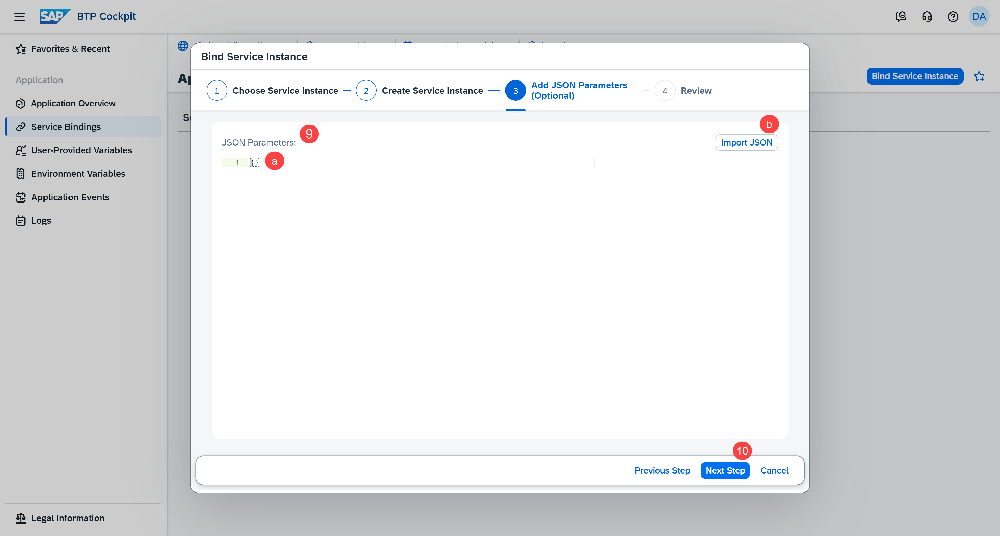

10. Choose **Next Step**.

11. Review all the details you've provided so far. You can always go back and make changes, if necessary.

    <!-- border; size:540px --> 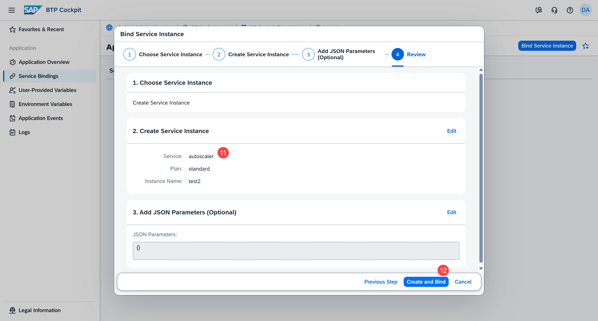

12. Choose **Create and Bind**.

The service binding is created.

**Note**: To make sure the relevant environment variables take effect, restage your application after binding it. Restaging causes downtime so plan accordingly before you proceed.

<!-- border; size:540px --> 

**Note**: When you deploy an application with a manifest, you can create a service binding by specifying it in the manifest file.

[OPTION END]

### View your service binding and check its credentials

Once a service is bound to an application, you can choose the **View Dashboard** button in the **Actions** column to open the corresponding service dashboard and view more details about the service.

<!-- border; size:540px --> 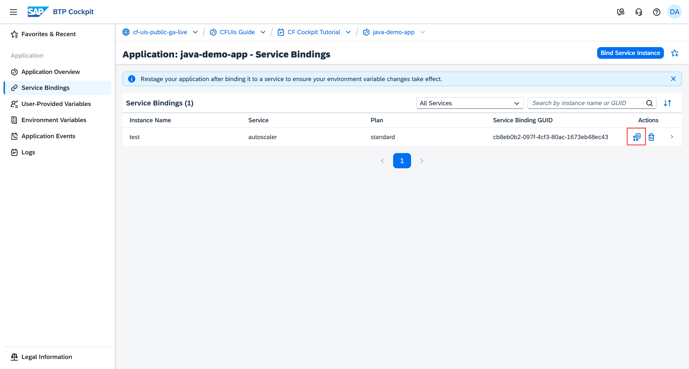

**Note**: Not all services have a dashboard.

To view the credentials of the service binding, select it from the list. The credentials appear on the right-hand side of the screen, below the **Service Binding Details**.

<!-- border; size:540px --> 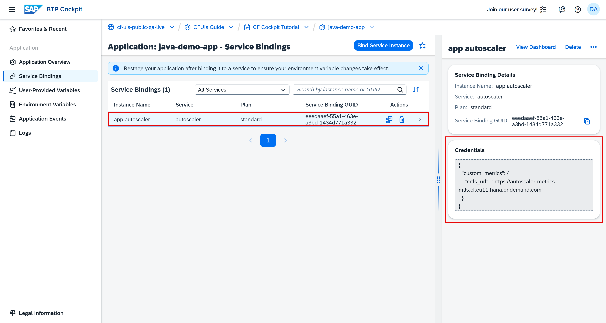

**Note**: Space Supporters don't have access to the service binding credentials.

### Delete a service binding

When you no longer need a connection between your application and a service, delete the binding between them.

On the **Service Bindings** page:

1. Choose the **Delete** button in the **Actions** column.

    <!-- border; size:540px --> 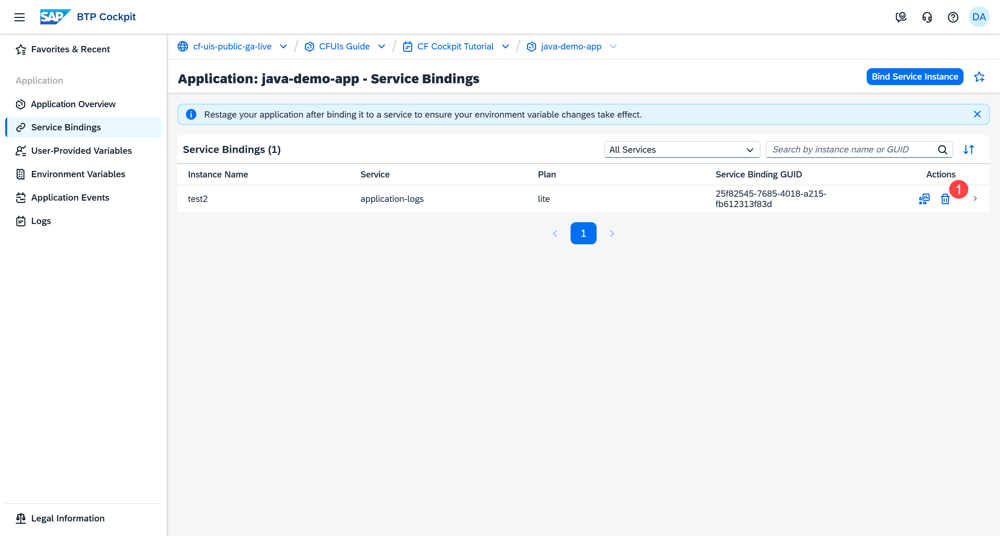

2. Choose **Delete** to confirm the action.

    <!-- border; size:540px --> 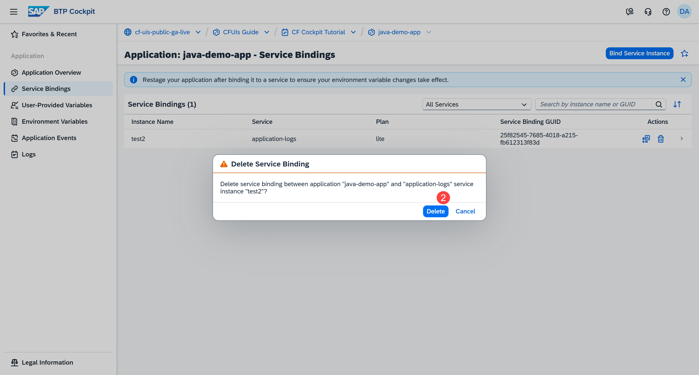

    **Note**: Only the binding between the application and service is deleted. Both the application and the service instance aren't deleted.

