## You will learn

- What a space quota is
- What the benefits are from having a space quota
- How to create a space quota
- How to assign a space quota to a space
- How to edit a space quota
- How to delete a space quota
- Our recommendations

## Prerequisites

**Note**: This tutorial is part of a learning journey. <!-- See . -->
- Make sure **you've fulfilled all prerequisites** in [Getting Started with Cloud Foundry Environment and SAP BTP Cockpit](https://developers.sap.com/tutorials/btp-cockpit-cf-getting-started-with-cf-env-and-cockpit.html).
- You have the **Org Manager** role in the organization (org) used for this tutorial.

### What is a space quota?

Each org has a quota that limits the resources it can use. For example, the maximum amount of memory, disk space, and number of service instances it can consume.

A space quota is a set of predefined limits that control how many resources a specific space can use. It lets you create custom limits and allocate them to an individual space.

Space quotas also define whether you can use paid services within a space.

<!-- border; size:540px --> 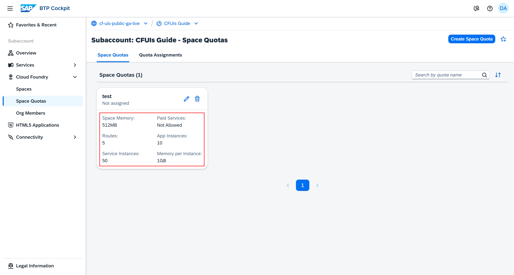

When working with space quotas, keep in mind that:

- Space quotas have unique names within an org. For example, "dev".

- You can create unlimited space quotas in an org, but you can assign only one space quota to a space at a time.

- You can assign a space quota to multiple spaces. The quota isn't divided among the spaces. Instead, the quota applies to each space individually.

- The org quota takes priority. If you assign a space quota that exceeds the org quota, the org quota limit is applied instead.

    **Example:** If you create a space quota with space memory of 2048MB and assign it to a space but the org quota has a total memory of 1024MB, then the space is going to use the org quota limit instead.

#### Benefits from having a space quota

A space quota helps you maintain stability and control in two key ways:

- It ensures that resource scaling stays within defined limits. For example, when the Application Autoscaler adds instances to scale up an application, the quota prevents unlimited scaling. This helps you keep expenses predictable.

- It lets you assign a separate space quota to each team or project. This ensures that no single space consumes the entire org quota.

### Create a space quota

1. Go to **Cloud Foundry > Space Quotas** in the left navigation menu.

2. Choose **Create Space Quota**.

    <!-- border; size:540px --> 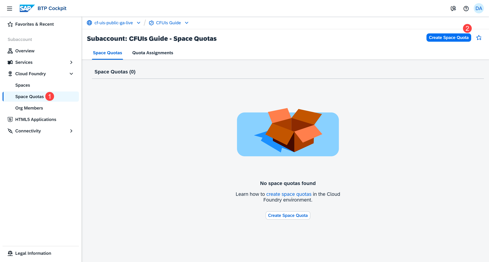

3. Enter a value in each mandatory field.

    <!-- border; size:540px --> 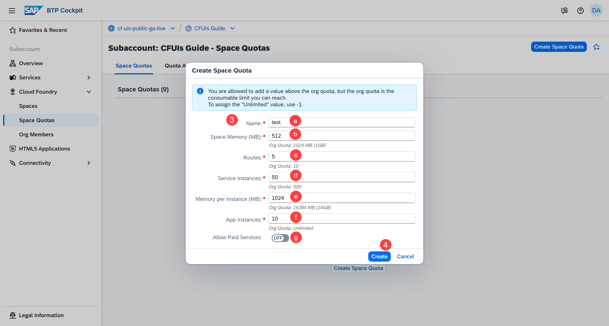

    a. **Name**: Name of the space quota

    b. **Space Memory (MB)**: Maximum amount of memory the apps in the space can use

    c. **Routes**: Maximum number of routes that can be created in the space. A route defines the URL through which end users can access your application.

    d. **Service Instances**: Maximum number of service instances that can be created in the space. A service instance contains the configuration and credentials that your application needs to connect to and use the corresponding service.

    e. **Memory per Instance (MB)**: Maximum amount of memory an application instance can have

    f. **App Instances**: Maximum number of application instances in the space

    g. (Optional) **Allow Paid Service**: Switch on if you'd like to allow the provisioning of instances of paid service plans.

    If you don't want to be specific, you can enter `-1` as a value. This means that you're not setting up a limit yourself, but you're instead using the org quota limit for the corresponding resource. For example, if the org quota allows you to create no more than 500 service instances, the same limit applies for the space quota you've created.

4. Choose **Create**.

You now have a space quota.

<!-- border; size:540px --> 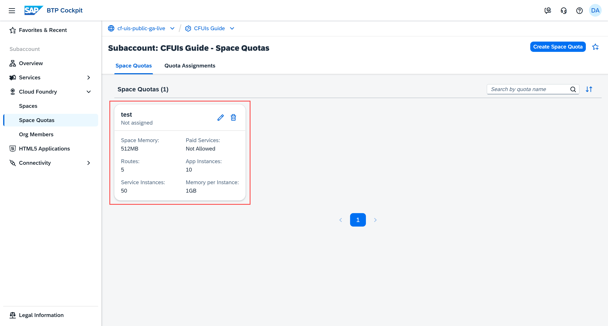
        
Next, you have to assign it to your space.

### Assign the space quota to a space

A space quota takes effect only after you assign it to a space. Once you do that, the limits you've set will be applied.

1. Choose **Quota Assignments**.

    <!-- border; size:540px --> 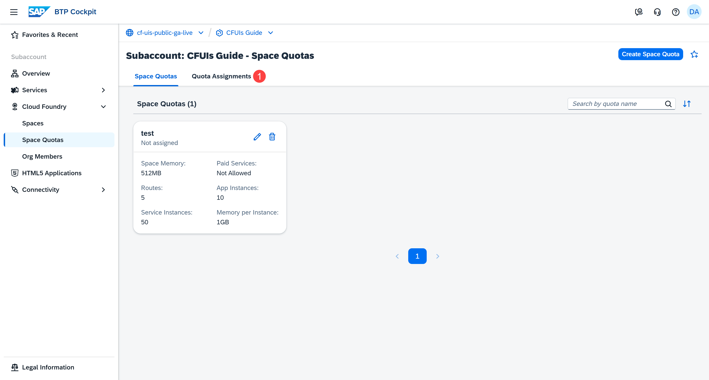

2. Choose the **Edit** button of the space whose quota assignment you want to edit. 

    <!-- border; size:540px --> 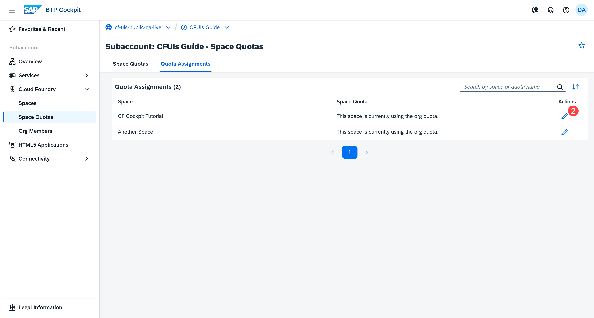

3. Select the **Space Quota** radio button.

    <!-- border; size:540px --> 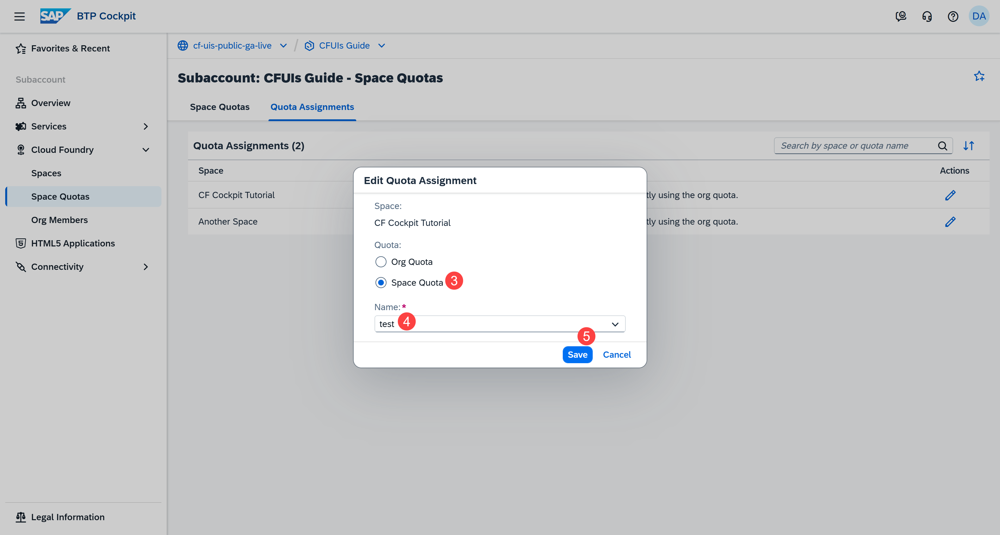

    This indicates that you no longer want the space to use the limits of the org quota, and instead you'd like the limits of a space quota to be applied.

4. Select a space quota from the dropdown.

5. **Save** the changes.

Space quota "test" is now assigned to space "CF Cockpit Tutorial".

<!-- border; size:540px --> 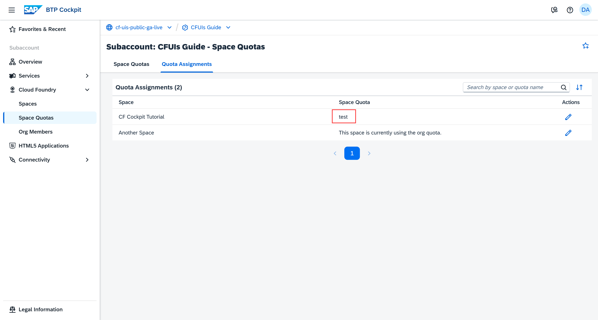

### Edit a space quota

When you decide to change the space quota limits, make sure you've taken into account the needs of your setup. For example, your applications might stop working, because there's not enough memory when you try to restart them.

1. On the **Space Quotas** page, choose the **Edit** button on the card.

    <!-- border; size:540px --> 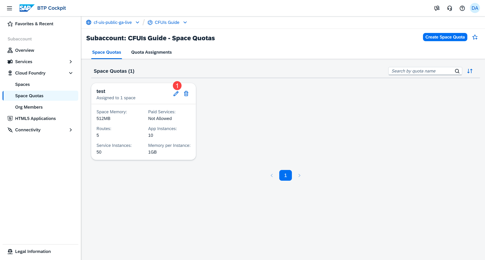

2. Let's change the memory per instance from 1024MB to 2048MB.

    <!-- border; size:540px --> 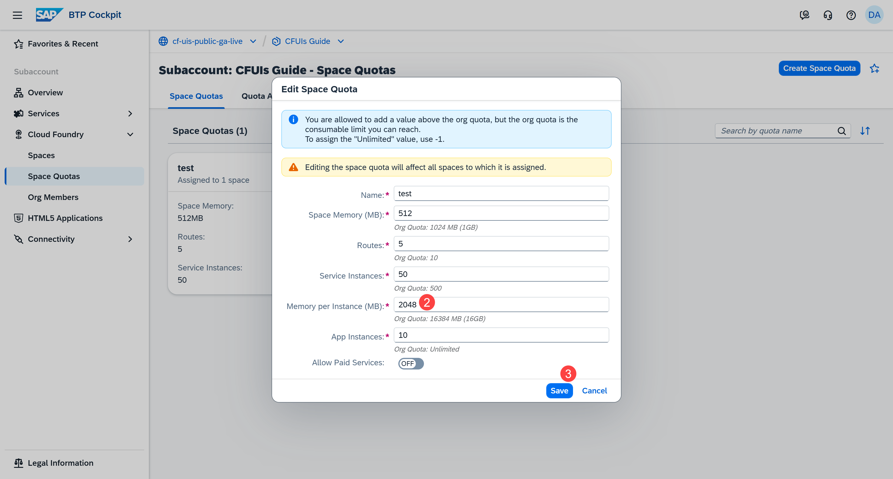

3. **Save** the change.

The space quota is now updated by having 2048MB memory per instance.

<!-- border; size:540px --> 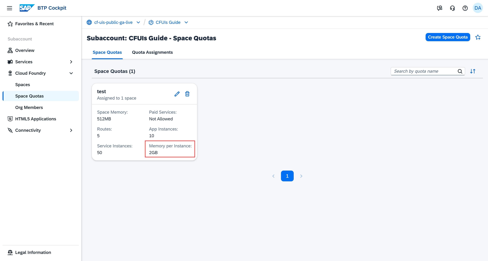

### Delete a space quota

**Note:** This example shows you how to delete a space quota for demonstration purposes. Make sure you have a space quota because you need it in the next tutorials.

Before you delete a space quota, make sure you no longer need it. Also, keep in mind that you can't delete a space quota if it's still assigned to a space:

<!-- border; size:540px --> 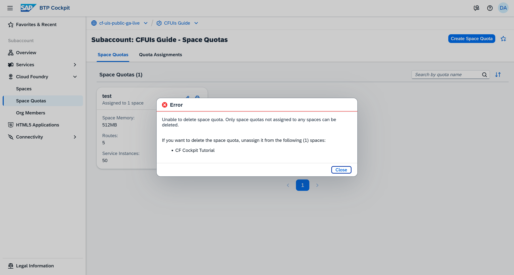

To delete a space quota, do the following:

1. If the space quota is still assigned to a space, choose **Quota Assignments**. 

    <!-- border; size:540px --> 

2. Choose the **Edit** button of the space whose quota assignment you want to edit. 

    <!-- border; size:540px --> 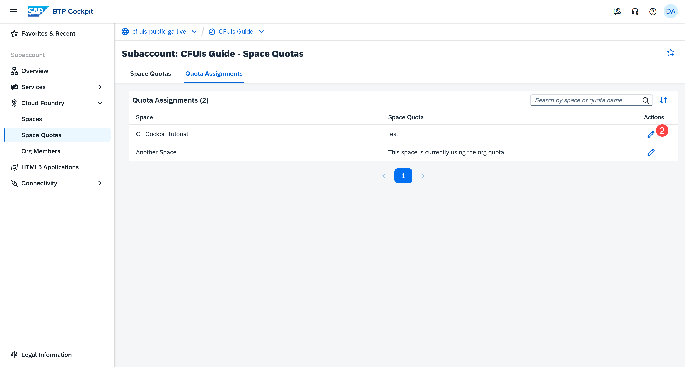

3. Make sure the space is using either another space quota or the org quota.

    <!-- border; size:540px --> 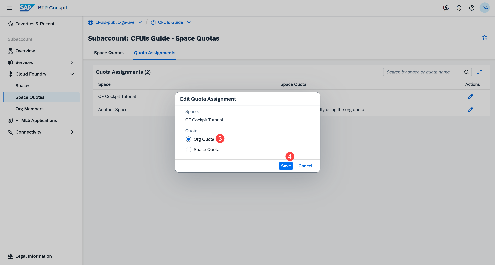

4. **Save** the change.

5. Choose **Space Quotas**.

    <!-- border; size:540px --> 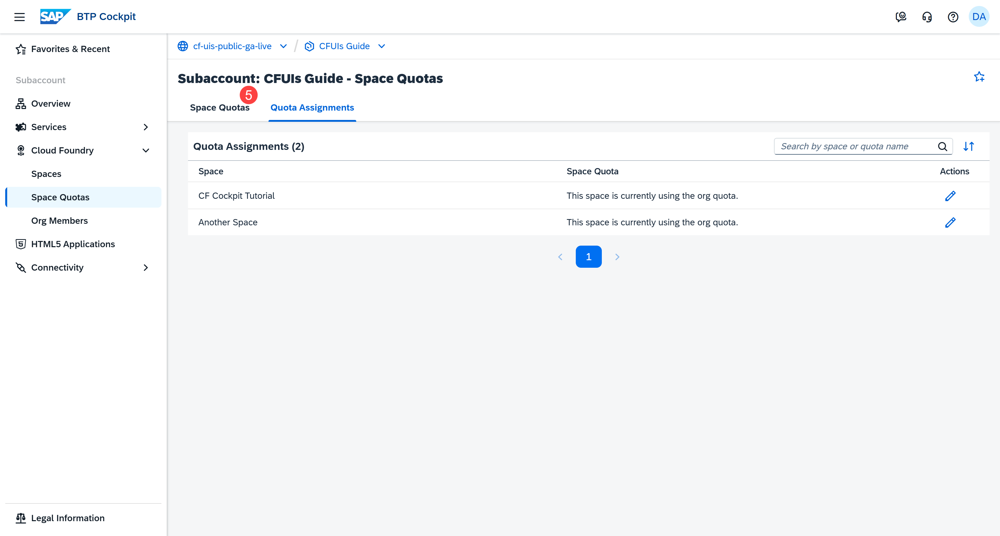

6. Choose the **Delete** button on the card.

    <!-- border; size:540px --> 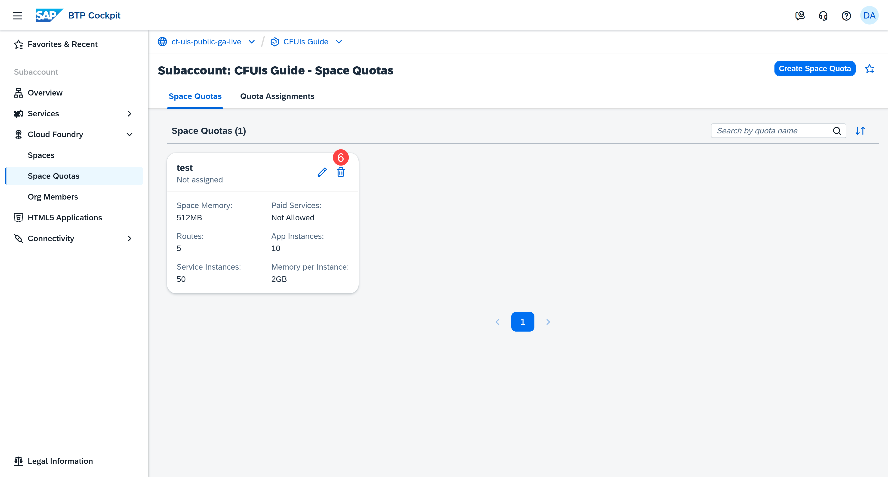

7. Choose **Delete** again to confirm the change.

    <!-- border; size:540px --> 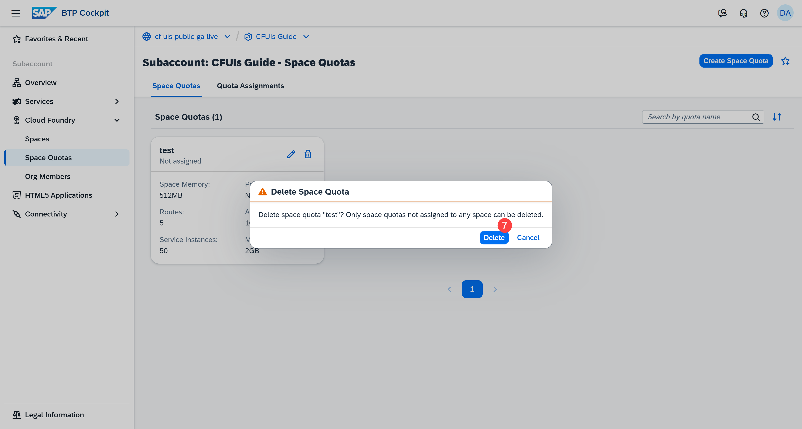

### Recommendations

#### Use space quotas to manage resource limits

**Example**: You've enabled the Application Autoscaler service for your application.

Cloud Foundry can automatically increase the number of app instances when there’s a spike in traffic. This is great for handling more users, but if there’s no space quota to control the total memory and number of instances allowed in a space, the Application Autoscaler could keep adding more and more instances with no upper limit. If the application suddenly starts receiving unexpected or high malicious traffic, it might scale up far beyond what’s intended, using up a lot of memory and resources, and possibly leading to high costs or even exhausting the available cloud resources.

#### Monitor your usage regularly

Regularly review and adjust your space quotas to match your team’s current needs. As applications grow or new services are added, resource requirements can change. Updating quotas ensures that your spaces have enough capacity to operate efficiently while still maintaining control over overall resource consumption and costs.