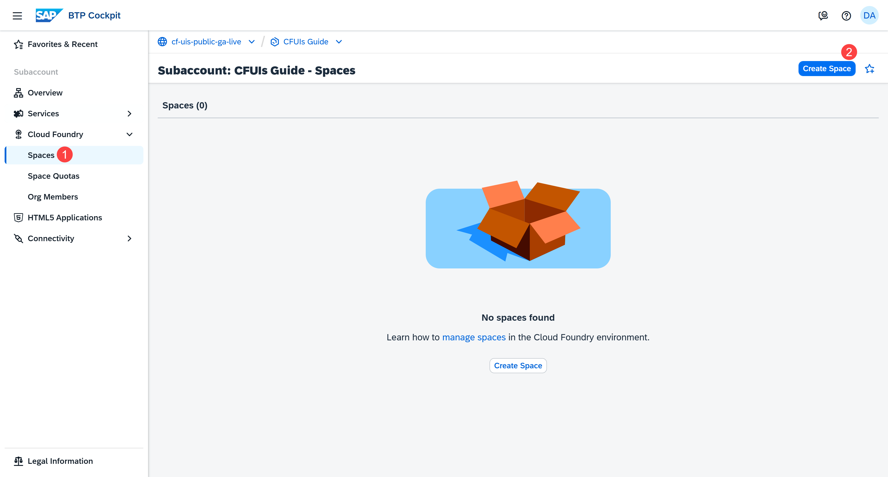
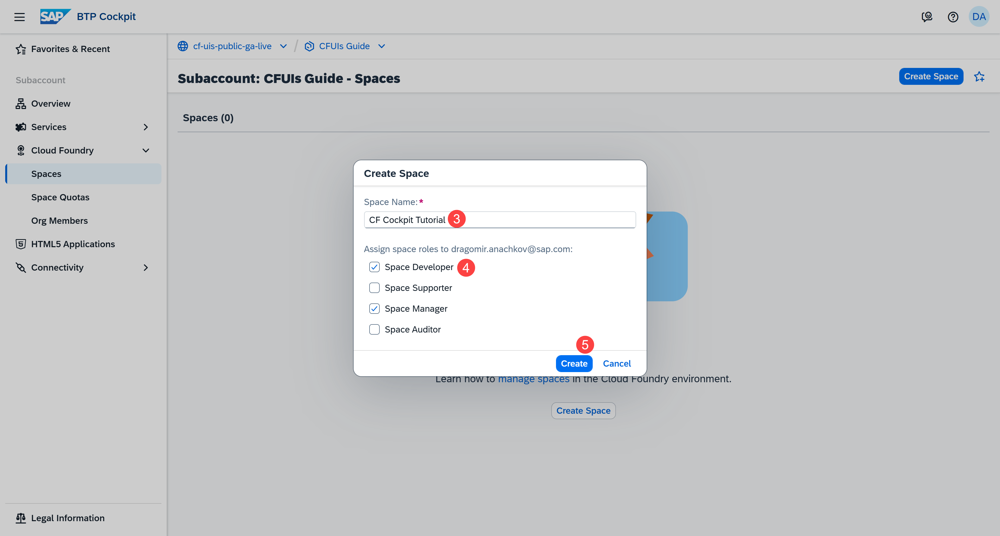
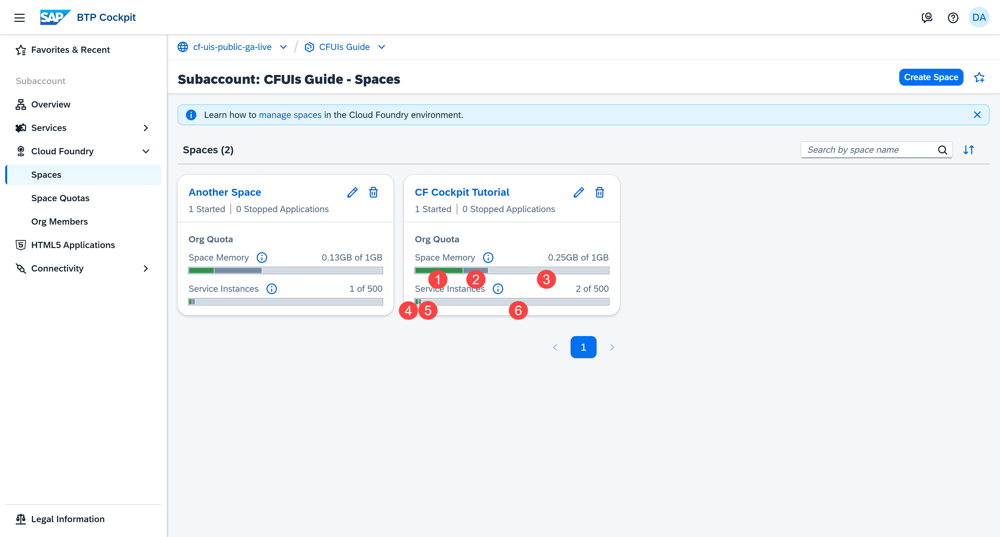
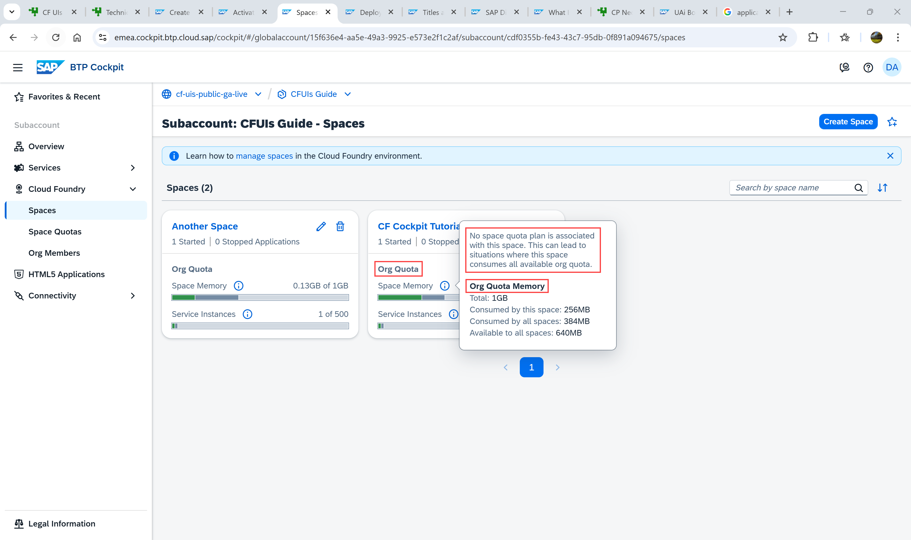
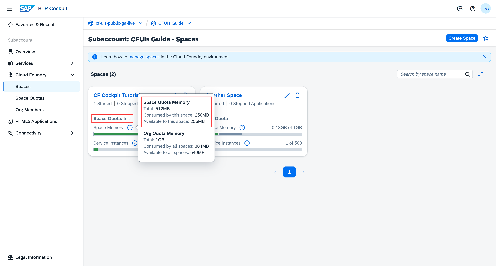
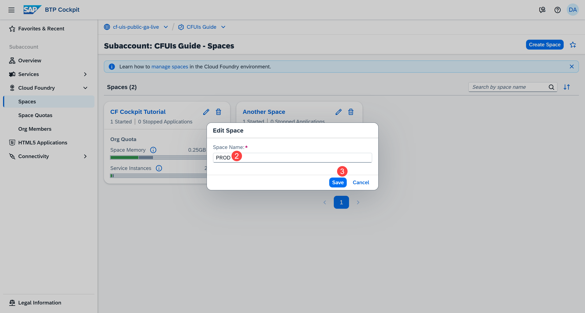
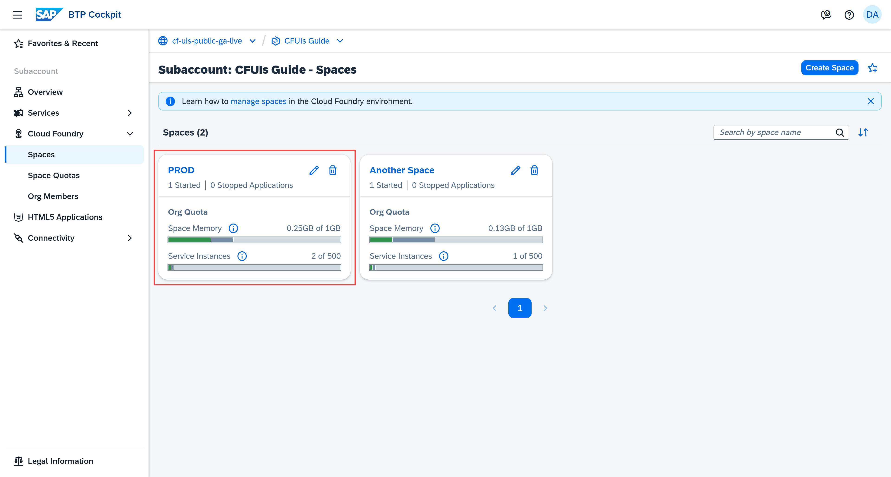
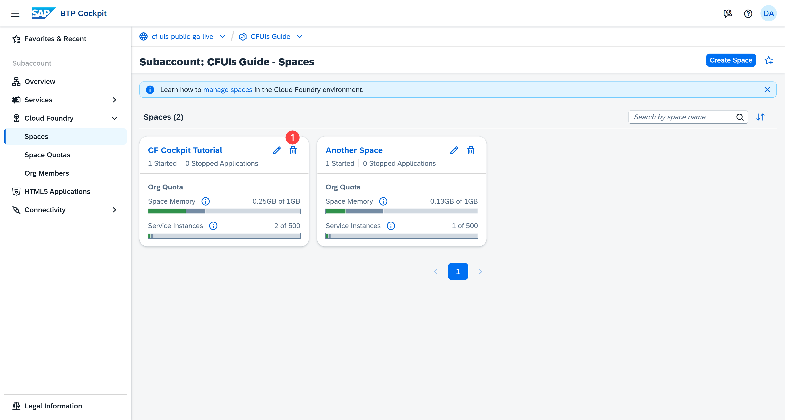
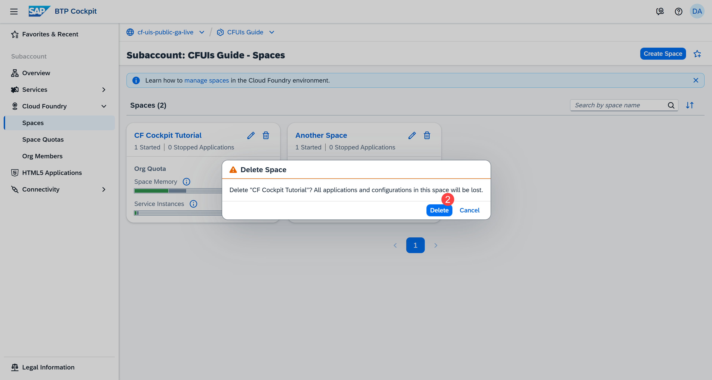

## You will learn

- What a space is
- How to create a space
- How to check the memory usage of a space
- How to edit a space
- How to delete a space
- Our recommendations

## Prerequisites

**Note**: This tutorial is part of a learning journey. <!-- See . -->
- Make sure **you've fulfilled all prerequisites** in [Getting Started with Cloud Foundry Environment and SAP BTP Cockpit](https://developers.sap.com/tutorials/btp-cockpit-cf-getting-started-with-cf-env-and-cockpit.html).
- You have the **Org Manager** role in the organization (org) used for this tutorial.

### What is a space?

A space is a shared area within a Cloud Foundry organization (org) where you can deploy, run, and manage applications, and bind them to services such as databases.

Each org can contain multiple spaces.

Spaces help teams separate workloads, manage permissions, and control the distribution of memory within the org using quotas.

For example, you can have separate spaces for development, testing, and production:

<!-- border; size:540px --> 

### Create a space

If you already have a space that you can use for testing purposes, feel free to proceed to the next step of this tutorial.

Otherwise, do the following:

1. Go to **Cloud Foundry > Spaces** in the left navigation menu.

2. Choose **Create Space** from the top right corner of that page.

    <!-- border; size:540px --> 

3. Enter a name for the space.

4. Select the space roles you want to assign to yourself.

    By default, the **Space Manager** and **Space Developer** roles are pre-selected. Later on, there is a separate tutorial that dives deeper into space roles.

    <!-- border; size:540px --> 

5. Choose **Create**.

You've now created a space where you can manage space quotas, space members, and deploy your application.

<!-- border; size:540px --> 

### View memory and service instance details

There is a progress bar showing:

(1) How much **Space Memory** is being used by the space (green)

(2) How much **Space Memory** is being used by all other spaces in the org (dark grey)

(3) How much space memory is left (light grey)

Another progress bar shows:

(4) How many **Service Instances** have been created in the space (green)

(5) How many **Service Instances** have been created in all other spaces (dark grey)

(6) How many more service instances you can create (light grey)

<!-- border; size:540px --> 

You can also see if the space is currently using the org quota or there's a space quota assigned to it. In this case, the space is using the org quota:

<!-- border; size:540px --> 

**Note:** When you create a new space, it doesn't have a space quota assigned to it. Brand new spaces use the org quota by default. To learn what a space quota is and how to assign it to a space, check out our next tutorial **Understanding Space Quotas**.

Once a space quota is assigned to a space, you get detailed information about the space quota memory usage:

<!-- border; size:540px --> 

### Edit a space

Editing a space gives you the option to update the space name only.

1. On the **Spaces** page, choose the **Edit** button on the card.

    <!-- border; size:540px --> 

2. Update the name of the space.

    <!-- border; size:540px --> 

3. Choose **Save**.

You can now see the updated name of your space.

<!-- border; size:540px --> 

### Delete a space

If you decide to delete a space, make sure the data in the space you’re going to delete is no longer needed.

1. On the **Spaces** page, choose the **Delete** button on the card.

    <!-- border; size:540px --> 

2. Choose **Delete**.

    <!-- border; size:540px --> 

### Recommendations

#### Structure your spaces based on your app lifecycle

Organize the different stages of an application's lifecycle (development, testing, production) into separate spaces - development, pre-production, production.

#### Keep your space organized

For better performance, we recommend that you deploy no more than 200 applications in a space.

#### Assign a space quota to your space

A space quota defines limits on how much resources a specific space can consume. This way, you can better control the usage of these resources across different projects or teams and prevent a single space from consuming all the available org quota.