# Secure a CAP Application with SAP Cloud Identity Services
<!-- description --> Secure the CAP bookshop application with the SAP Cloud Identity Services.

## Prerequisites
- You have a multi-environment subaccount on SAP BTP with Cloud Foundry enabled with a space.
    - Your user is a member of the Cloud Foundry org and space.
    - The Cloud Foundry Environment has at least 2 units assigned to the **MEMORY** plan. See [Configure Entitlements and Quotas for Subaccounts](https://help.sap.com/docs/btp/sap-business-technology-platform/configure-entitlements-and-quotas-for-subaccounts?version=Cloud).
    - You have a tenant of SAP Cloud Identity Services, either as a trial tenant or a productive tenant. See [Initial Setup](https://help.sap.com/docs/cloud-identity-services/cloud-identity-services/initial-setup). You can't use SAP ID Service for this scenario because you must be able to access the admin UI of SAP Cloud Identity Services to assign authorizations.
    - You have established trust between the multi-environment subaccount on SAP BTP and the tenant of SAP Cloud Identity Services. See [Establish Trust](https://help.sap.com/docs/btp/sap-business-technology-platform/establish-trust-and-federation-between-uaa-and-identity-authentication).
- You have [Set Up SAP Build Code in SAP BTP](https://developers.sap.com/tutorials/build-code-setup.html). Follow the instructions to set up your system to start creating business applications in **SAP Build Code**.
- You have an SAP HANA Cloud database running in your subaccount and you have the SAP HANA Cloud Administrator role collection.
    - SAP HANA Cloud with **hana** or **hana-free** plans and the **tools** plan.
    - SAP HANA Schemas & HDI Containers with the **hdi-shared** plan.
    - Your user has the **SAP HANA Cloud Administrator** role collection.
- The platform user to set up these services in your subaccount and to be a member of the Cloud Foundry org and space.
- The business (application) user, who has to be in the SAP Cloud Identity Services tenant, so that we can assign the authorizations for the test at the end.
- The SAP Cloud Identity Services admin who assigns the authorizations. This person could also be the platform user for BTP.

## You will learn
- How to use CAP in SAP Build Code.
- How to jumpstart a new project.
- How to deploy a CAP application secured by SAP Cloud Identity Services.

---

## Intro

The goal of this tutorial is to secure and deploy the CAP bookshop application, so only authenticated users with the required authorizations are able to see the book details within the application. Users without the necessary authorizations are able to log on to the application, but can see only the list of books.

Learn more about CAP in the [capire one-stop documentation](https://cap.cloud.sap/docs/get-started/).

In this tutorial, the bookshop application starts with the Authorization and Trust Management service to provide authentication. However, we want to use SAP Cloud Identity Services instead, with Identity Authentication for logging on and Authorization Management for permissions to access the application. Therefore, we change the authentication to Identity Authentication.

We then later add the Data Control Language (DCL) files for Authorization Management. These files define an authorization policy. 

Then, we deploy the bookshop application and try to access it with a business user. To see the admin part of the bookshop application, we assign the business user the admin authorization policy.

For more information about SAP Cloud Identity Services and CAP, see [CDS-based Authorization](https://cap.cloud.sap/docs/guides/security/authorization).

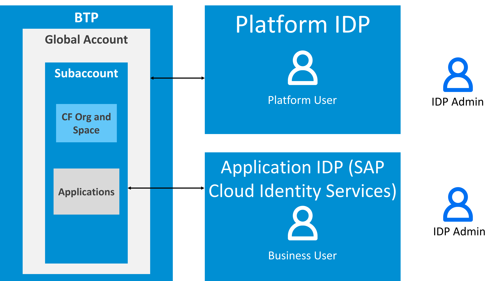

**User and Account Setup in BTP**

## Understanding the BTP User and Account Setup

There are at least three personas in setting up this tutorial.

|  Persona        | Identity Provider                 | Description
|  :------------- | :-------------                    | :------------- 
|  Platform User  | `Platform`                        | The platform user is the administrator of the BTP subaccount and possibly for the BTP global account. To set up this scenario you'll need a global account admin to assign quotas and entitlements to the subaccount. In addition to managing the platform, platform users also typically work as developers.
|  Business User  | `Application`                     | The business user consumes the applications subscribed to or deployed in the subaccount. In this tutorial, business users can use SAP Business Application Studio to create the development project, but you need the platform user to deploy that development project in the command line interface (CLI). The business user then accesses the bookshop application that the platform user deployed.
|  IDP Admin      | `Admin of the identity provider`  | In this scenario, the identity provider administrator manages the users in the tenant of SAP Cloud Identity Services. SAP BTP and its applications use these identity providers to authenticate the platform and business users respectively. We need the IDP admin in this tutorial to assign the authorization policy to the business user so they can see the products in the CAP bookshop application.

**Note**: You can use the same identity provider for both the platform and business users. Then both users are in the same identity provider and are only distinguished by the authorizations you assign them.

### Create a new project using SAP Build

This step includes creating an application in SAP Build Lobby.

1. In the SAP Build Lobby, click **Create > Create** to start the creation process.

    

2. Click the **Application** tile.

    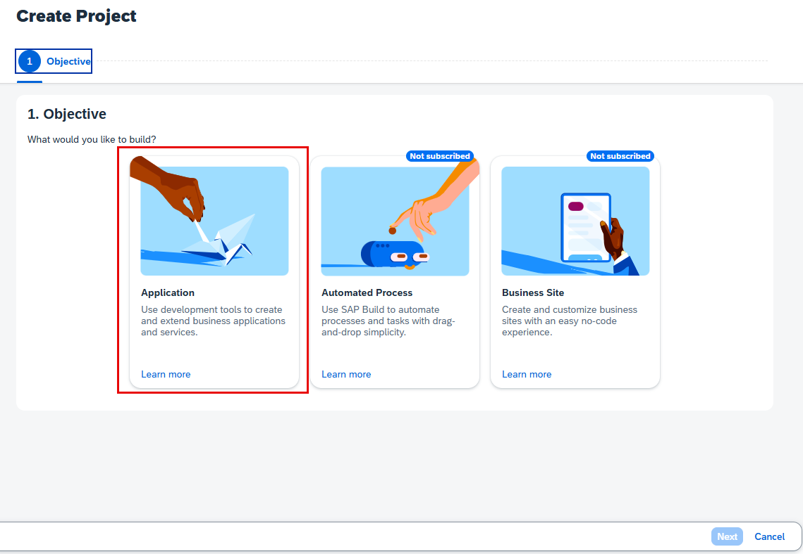

3. Select the **Full-Stack** category.

    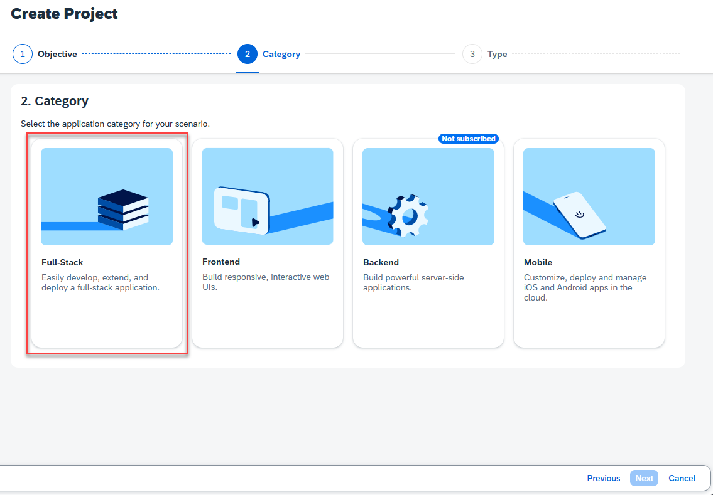

4. Select **Full-Stack Node.JS** to develop your full-stack application, based on the SAP Cloud Application Programming Model (CAP), in SAP Business Application Studio.

    

5. Enter the project name, add a description (optional), select the dev space where you want the project to reside, and then click **Review**.

    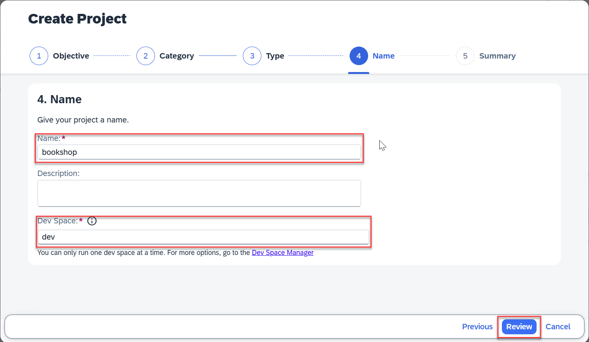

6. Review the inputs under the **Summary** tab. If everything looks correct, click **Create** to proceed with creating your project.

7. Your project is created in the Project table of the lobby. The creation of the project may take a few moments. After the project has been created successfully, click the project to open it.

    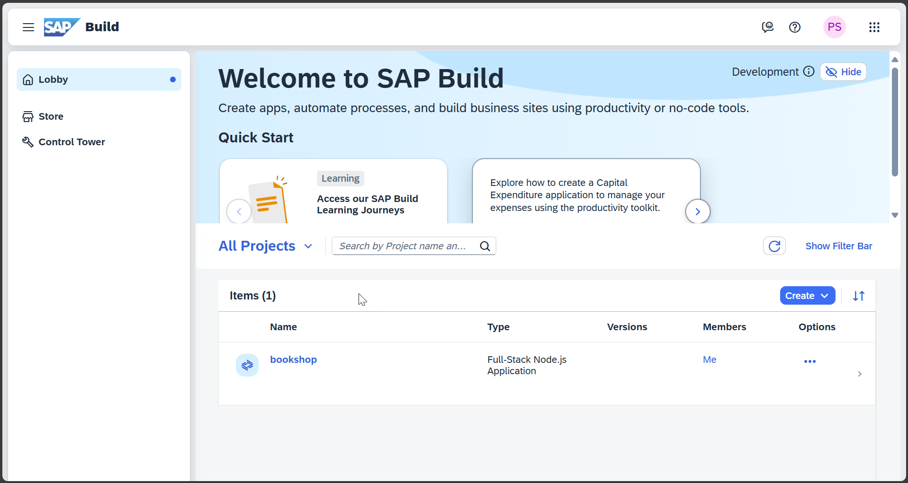

8. The project opens in SAP Business Application Studio.

    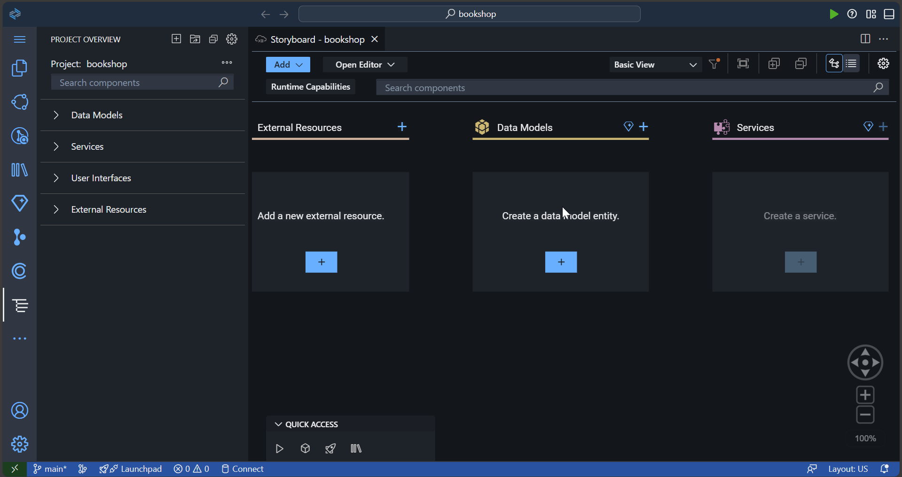

### Start your project in SAP Business Application Studio

The bookshop application is initiated. You will now add sample files. 

1. Find the hamburger icon in the menu on the left side of the screen. Select **Terminal**, and then select **New Terminal**.

    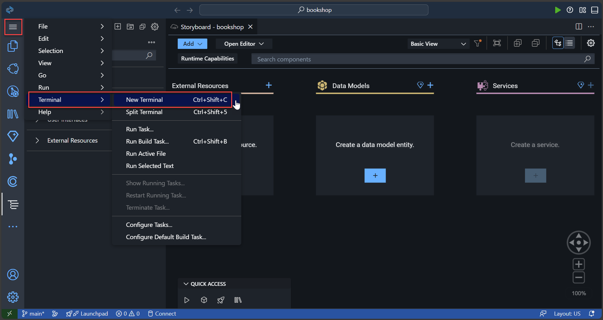

2. In the **Terminal**, enter `cds add sample`.

    This adds the sample Node.js application.

    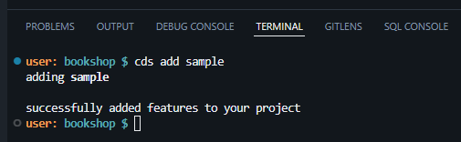

### Add the SCI configuration to your project

You have to add the **package.json** file and its relevant dependencies. 

1. Enter `cds add ams --for production`

    The `dependencies` and `devDependencies` are added and the authorization type is set to `ias`.

    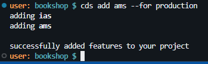

    Note that it is good practice to test the policies and integration before deploying the application.

    You can directly assign policies to CAP mock users in the **cds** environment. See [policies test](https://github.com/SAP-samples/ams-samples-node/blob/main/ams-cap-nodejs-bookshop/.cdsrc.json#L7-L12) for more information.

    Then, write a standard unit test against the CAP service to verify that the role assignment by the policy works as expected. See [admin test](https://github.com/SAP-samples/ams-samples-node/blob/main/ams-cap-nodejs-bookshop/test/admin-service.test.js#L24-L60) for more information. 
    
2. Enter `npm i` to install the dependencies defined in the **package.json** file. This adds the **node_modules** folder.

3. Enter `cds build --for ams` to create the **ams** folder, with all the required roles.

    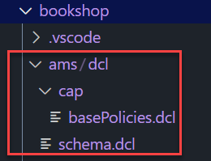

    See [Configuring Authorization Policies](https://help.sap.com/docs/cloud-identity-services/cloud-identity-services/configuring-authorization-policies) for more information about authorization policies.

### Prepare for deployment

1. Enter `cds add approuter` to add the approuter, which will enable you to create a secure route to your application.

2. Enter `npm i` again to have the right dependencies defined and fixed for the build.

### Update the package.json file

To enable SAP Fiori preview, add the following configuration in the package.json file of your bookshop project in VS Code:

```JSON
    "cds": {
      "fiori": {
        "preview": true
      },
      "server": {
        "index": true
      },
    }
```
    
This updates the file with the Fiori and server parameters.

### Deploy the application

Before you can deploy, you have to log in with your credentials and also ensure that you have an SAP HANA Cloud database running in your subaccount.

1. Log on to your subaccount with its appropriate API Endpoint; you can find that here:

    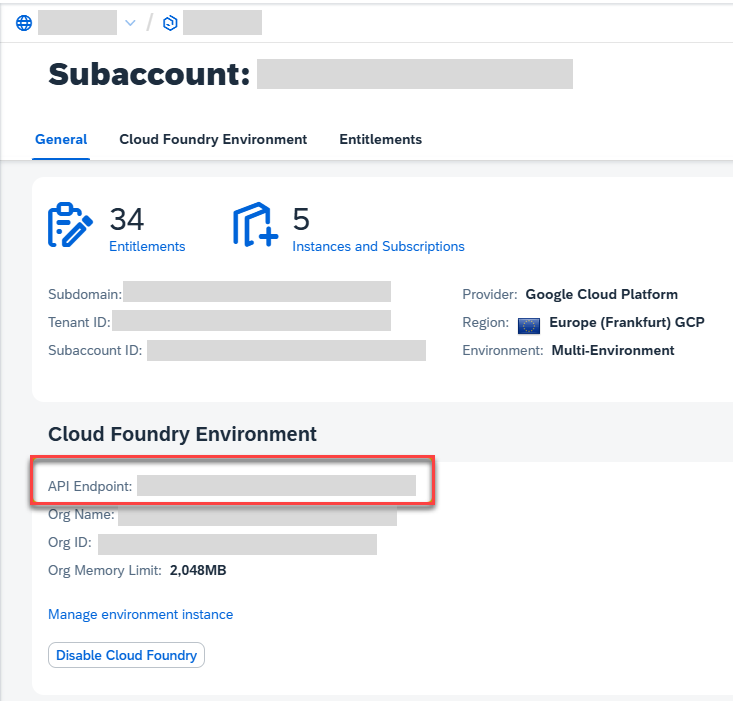

    `cf l -a api.cf.us10-001.hana.ondemand.com --sso`

2. Learn more about starting the SAP HANA database in [this tutorial](https://developers.sap.com/mission.hana-cloud-database-get-started.html).

3. Enter `cds up` to deploy the application.

### Test the application

To test your application and make sure it's reachable, open your application from your subaccount's space in SAP BTP cockpit.

1. Go to **Subaccount > Cloud Foundry > Spaces**.

    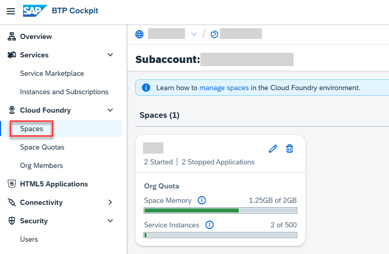

2. Choose your **Space** and click on **bookshop**.

    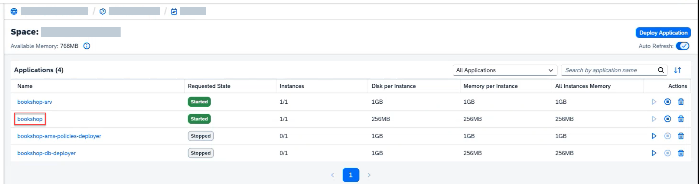

3. Choose the displayed application router link.

    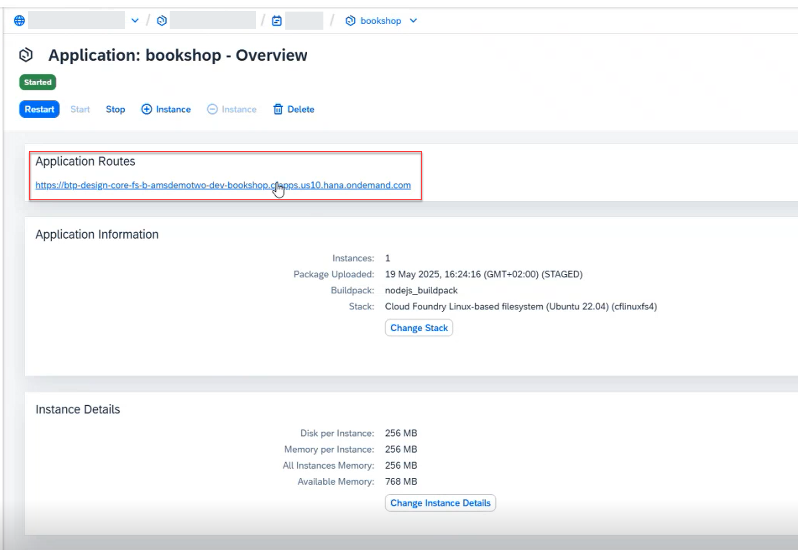

4. The **bookshop** application is displayed. Under **/odata/v4/catalog**, choose **ListOfBooks**.

    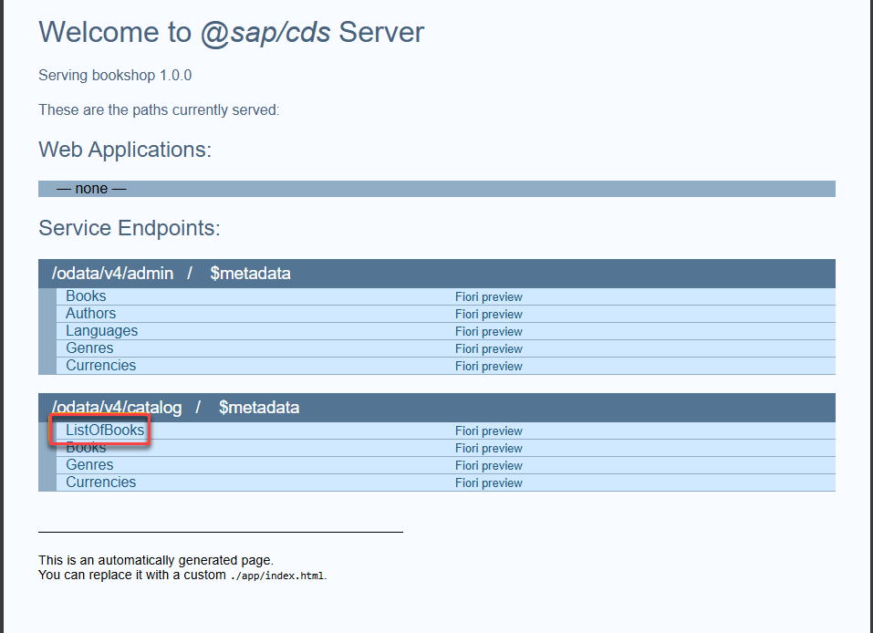

    The following list is displayed.

    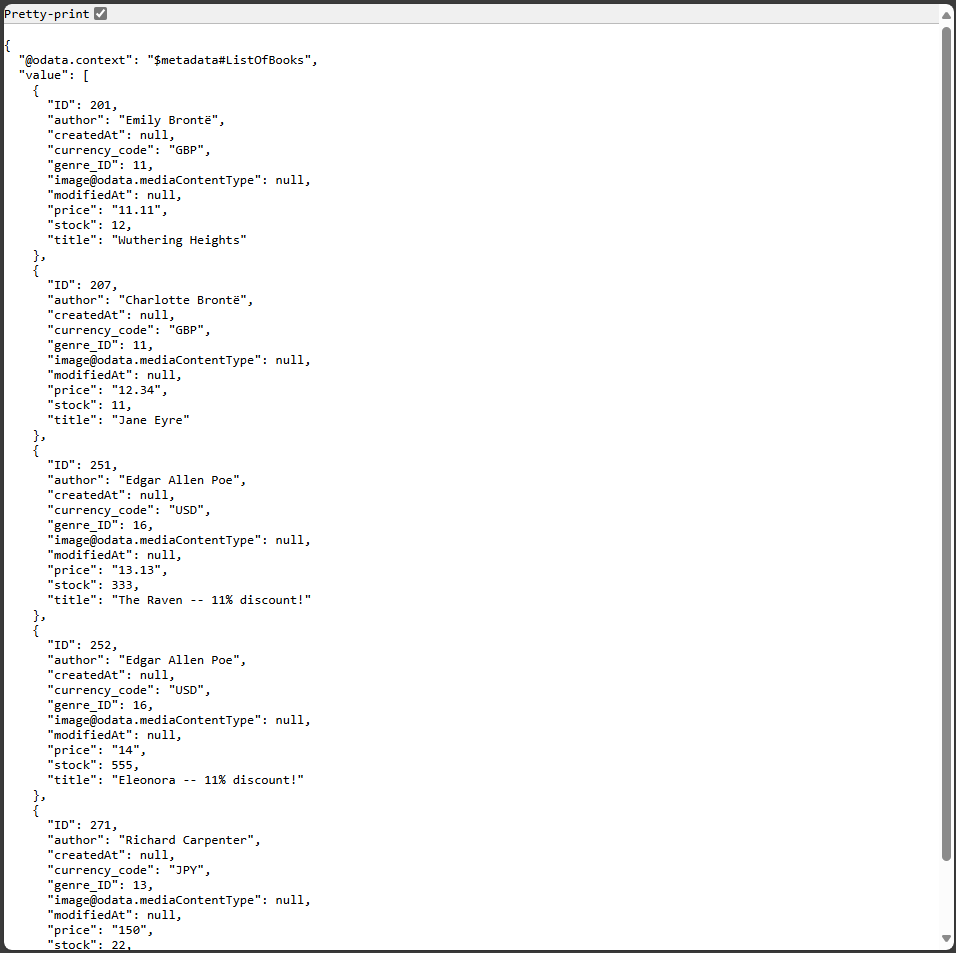

5. Go back to the application by using the back button on the browser. Now, under **/odata/v4/admin**, choose **Books** to see some information about each book.

    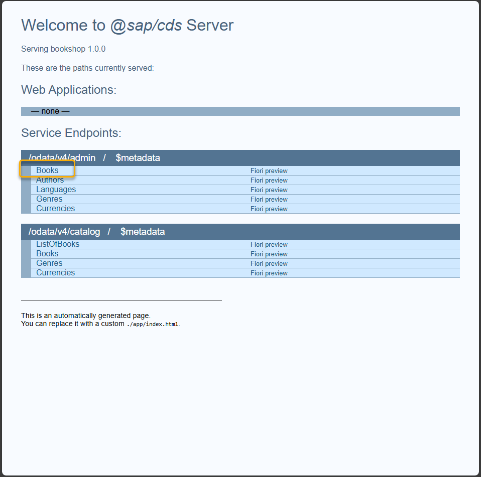

    You see the following error message. This is because of missing authorizations.

    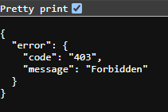

### Assign the required authorization policy in SAP Cloud Identity Services    

1. As the admin of your **SAP Cloud Identity Services** tenant, open the admin console.

2. Under **Applications & Resources > Applications**, find the **bookshop** application.

3. Then, under the **Authorization Policies** tab, open the **admin** policy.

    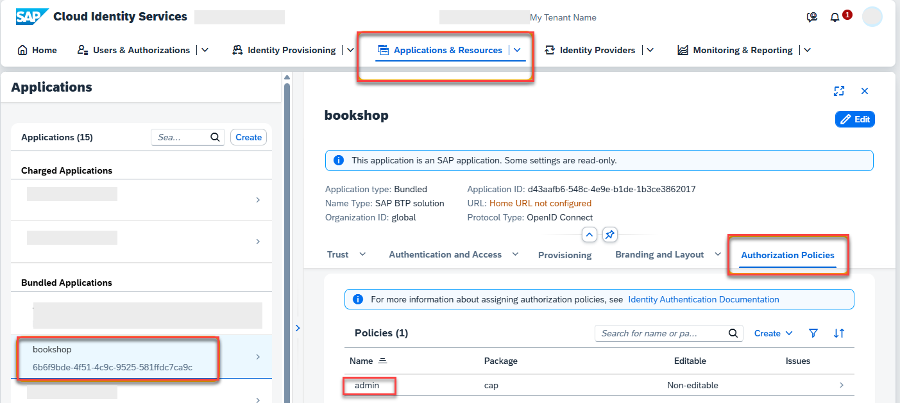

4. Add your user to the **admin** policy.

    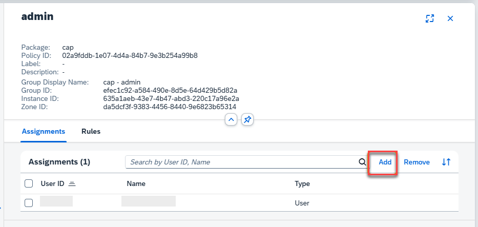

    Note that it takes a few minutes for the policy to apply.

### Test the application again    

Choose the link again to log on to the **bookshop** application once more and under **/odata/v4/admin**, choose **Books** again. This time, you see the information about each book.

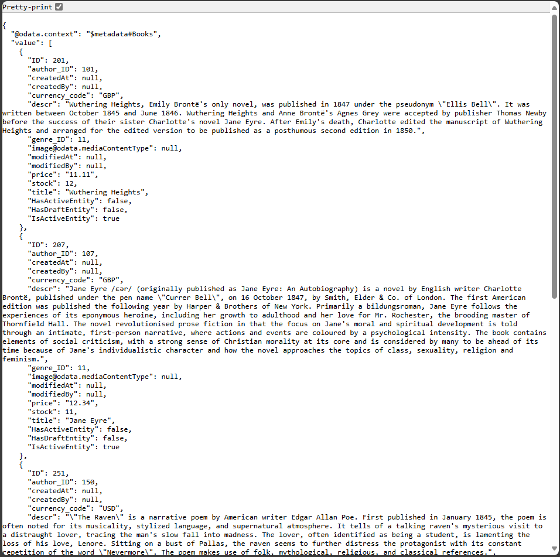


