# Register SAP BTP, Cloud Foundry Subaccount in SAP Cloud Identity Services
<!-- description --> Establish trust between a SAML 2.0 identity provider in SAP Cloud Identity Services and an SAP BTP, Cloud Foundry subaccount.

## Prerequisites
 - You have a Free Trial Account on SAP Business Technology Platform. See [Get an Account on SAP BTP Trial](hcp-create-trial-account).
 - You have a tenant of Cloud Identity Services. See [Tenants](https://help.sap.com/viewer/6d6d63354d1242d185ab4830fc04feb1/Cloud/en-US/93160ebd2dcb40e98aadcbb9a970f2b9.html).
 - You have an Azure account. See [Get Started with Azure](https://azure.microsoft.com/en-us/pricing/purchase-options/azure-account)

## You will learn
  - How to establish trust between your SAP BTP, Cloud Foundry subaccount and the Cloud Identity Services
  - How to configure users for single sign-on  usage
 
---

### Log into Cloud Identity Services

> This step is optional if you have already downloaded the metadata file in the previous tutorial.

Log into the administration console of Cloud Identity Services through your particular URL.

The URL therefore is: **`https://[TENANT_ID].accounts.ondemand.com/admin`** or **`https://[TENANT_ID].accounts.cloud.sap/admin`**

>Tenant ID is an automatically generated ID by the system. The first administrator created for the tenant receives an activation email with a URL in it. This URL contains the tenant ID. For more information about your tenants, see [View Assigned Tenants and Admins](https://help.sap.com/docs/IDENTITY_AUTHENTICATION/6d6d63354d1242d185ab4830fc04feb1/f56e6f24e373404087d6a1a9a13515a2.html?locale=en-US&state=PRODUCTION&version=Cloud).

If you have a configured custom domain, the URL has the **`<your custom domain>/admin`** pattern.

### Download Cloud Identity Services tenant metadata

> This step is optional if you have already downloaded the metadata file in the previous tutorial.

Go to the **Tenant Settings** in the administration console for Cloud Identity Services and navigate to the **SAML 2.0 Configuration** list item.

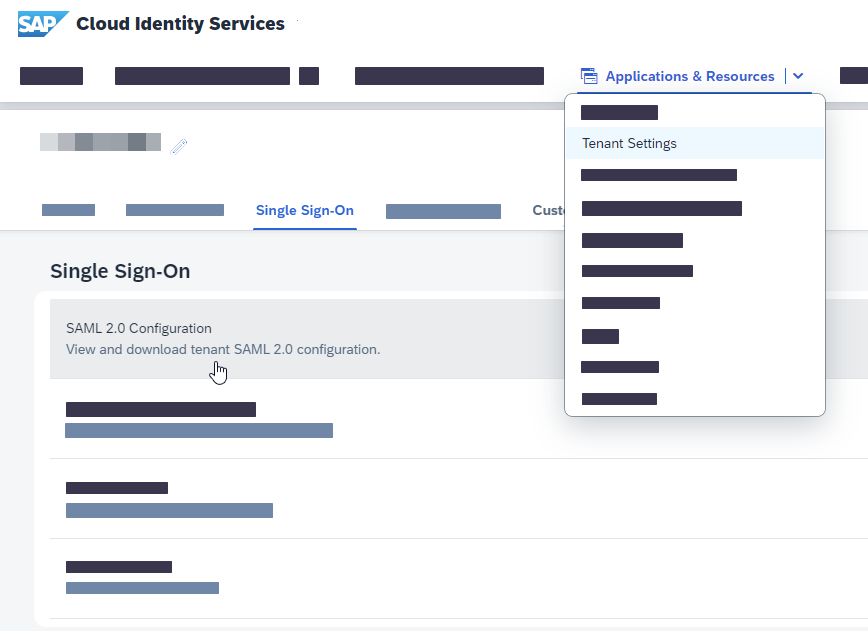

**Download** the metadata file from the button at the top of the page.

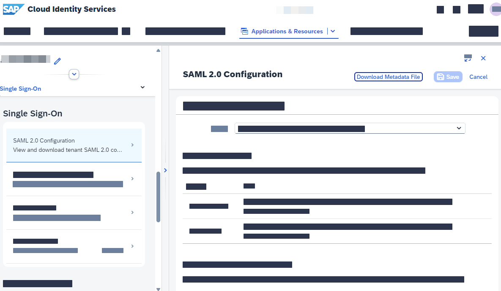

### Add trust configuration

1. Navigate to your SAP BTP, Cloud Foundry subaccount. Therefore, go to the [SAP BTP cockpit](https://hanatrial.ondemand.com/) and click **Go to Your Trial Account**.

2. Click the tile of your subaccount where you want to establish trust with the Cloud Identity Services.

    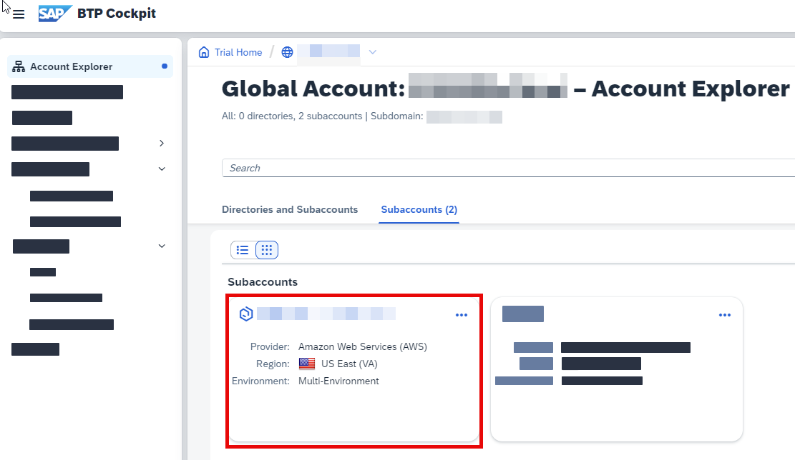

3. Note down the subdomain (in this case **demos**) and the region (in this case **eu20**) for later use (in Step 8).

4. Open the submenu **Trust Configuration** in the **Security** section, and click **New SAML Trust Configuration**.

    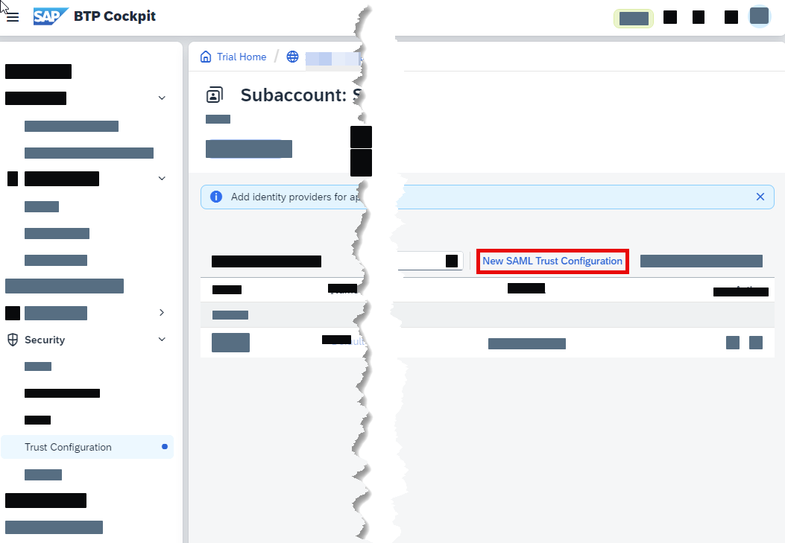

5. Upload the metadata file of the Cloud Identity Services tenant, which you downloaded in the previous step (or previous tutorial).

    A message *Trust configuration created* should appear.

    Enter **Cloud Identity Services tenant** as the name for the trust configuration.

    

6. Set **`Azure Tutorial`** as **Link Text for User Logon**. This will appear on the login screen once a user tries to log in.

7. Continue with **Save**.

You should now see an additional trust configuration.

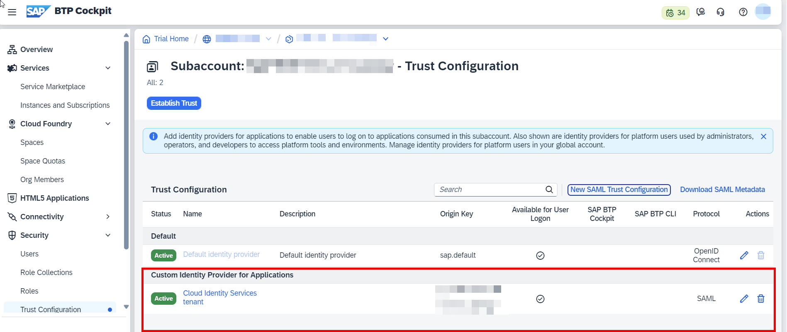

### Download SAP BTP SAML metadata

Download the **SAML Metadata** file of your subaccount.

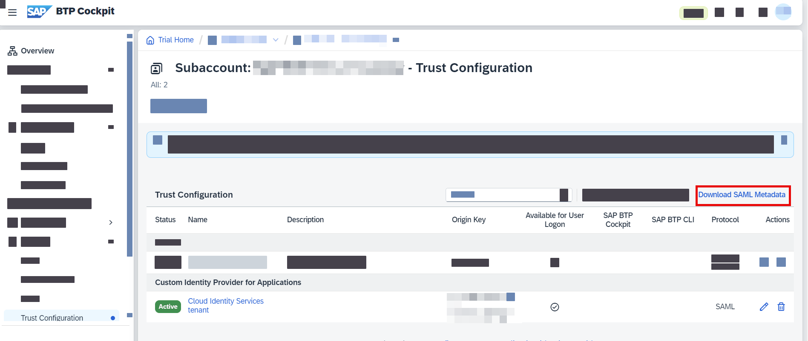

### Create new SAML service provider

1. Go back to the administration console for Cloud Identity Services through your particular URL.

    > The URL is the same as the one in Step 1 of this tutorial: **`https://[TENANT_ID].accounts.ondemand.com/admin`** or **`https://[TENANT_ID].accounts.cloud.sap/admin`**

2. Choose **Applications** in the **Applications & Resources** menu section to go to the service provider configuration.

3. Create a new application by using the **Create** button to add a new SAML service provider.

    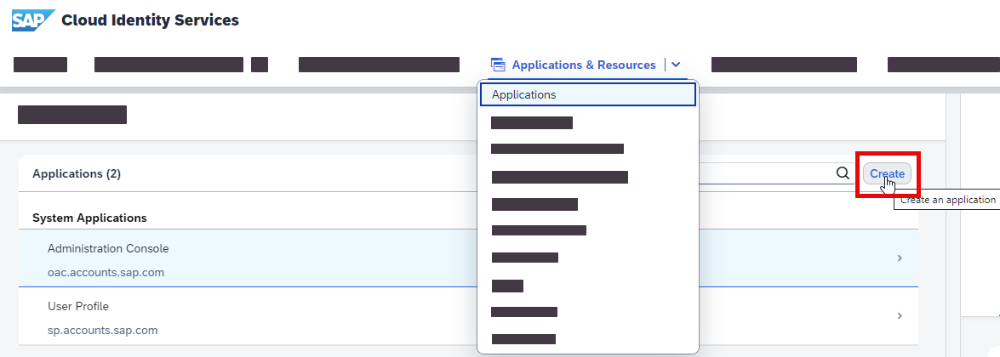

4. Enter **SAP BTP CF subaccount** as the name for the application that clearly identifies it as your new service provider and choose **+ Create** to save your changes.

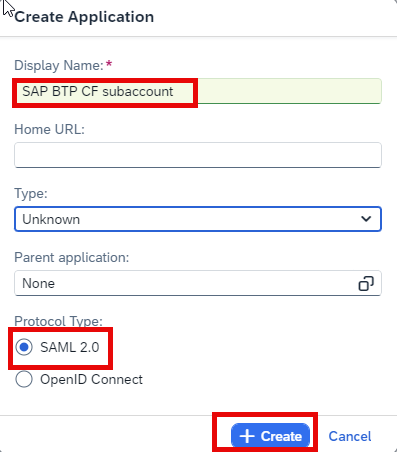

> Users see this name in the login screen when the authentication is requested by the UAA service. Seeing the name, they know which application they currently access after authentication.

### Upload subaccount metadata file

1. Choose **SAML 2.0 Configuration** in the recently created application.

2. Browse the relevant metadata XML file of the SAP BTP CF subaccount and import it.

3. Click **Save**.

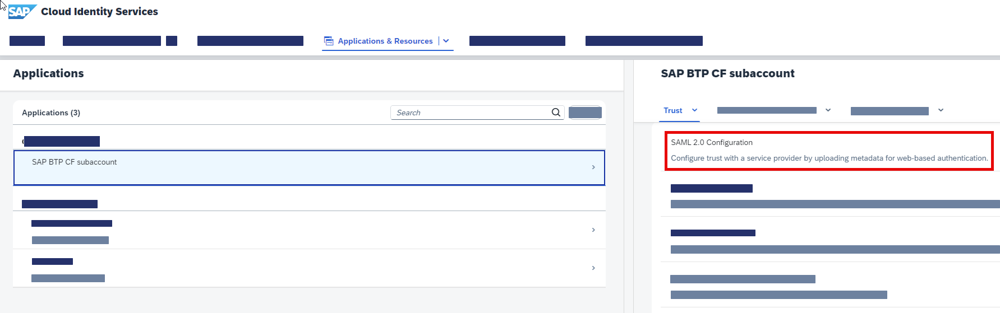

### Configure default name ID format

1. Choose **Default Name ID Format** in the list of configurations.

2. Select **Email** as a unique attribute.

3. Save the changes.

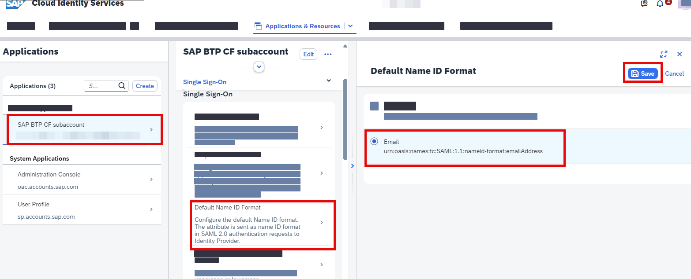

### Configure Attributes

1. Choose **Attributes** in the list of configurations.

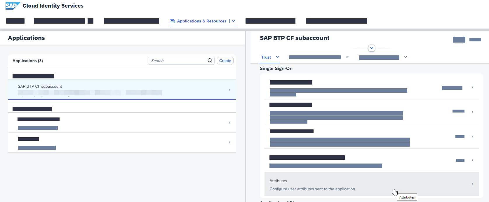

2. Choose **Add**, enter **Groups** (case-sensitive) as attribute name, use **Identity Directory** as source, select **Groups** from the drop-down for value, and save your changes.

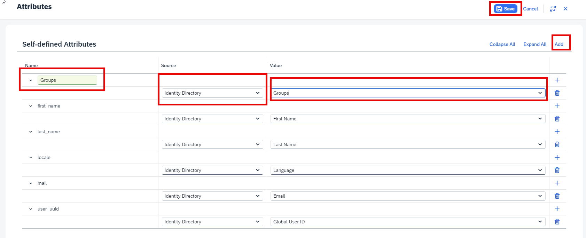

### Log into subaccount with Azure user

1. Open a new browser window and replace the **subdomain** and **region** placeholder with the information you have noted down in Step 3.

    `https://<subdomain>.authentication.<region>.hana.ondemand.com`

    You will still be able to log in with your S-User/P-User email and password. You will see a link to Azure below the form. In **Trust Configuration**, you can enable/disable the Available for User Logon for the Default identity provider or any other trust configuration you have configured.

    If you disable the Default identity provider, you will only see the links to the external identity providers. If there is only one identity provider configured, you will be automatically redirected to it.

2. Log in via the Azure ID link `Azure Tutorial` and enter your Azure user.

    One of the following error messages should appear:

    *AADSTS50105: The signed in user '`xyz`' is not assigned to a role for the application '`abc`'(`MyAzureTutorial`).*

    or:

    *AADSTS700016: Application with identifier 'https://<subdomain>.authentication.<region>.hana.ondemand.com' was not found in the directory '`xyz`'.*

    Until now, you don't have any users assigned to this enterprise application in Azure. Only your Azure is known as an Identity Provider in your Cloud Identity Services, but so far no users are allowed to log in with it.

3. Go back to your [overview of enterprise applications](https://portal.azure.com/#blade/Microsoft_AAD_IAM/StartboardApplicationsMenuBlade/AllApps/menuId/) in Microsoft Azure AD and click your application.

    Add a new user by clicking **Add user/group** in the **Users and groups** submenu, as shown on the screenshot.

    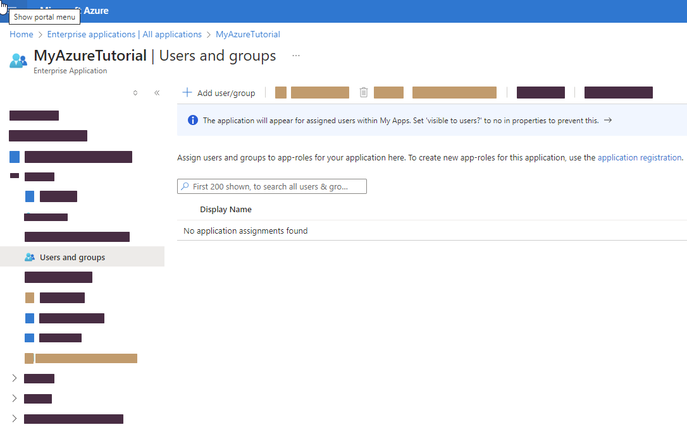

4. For this tutorial, you only want to add a single user (instead of, for example, whole groups).

    Continue by clicking **Users** (so far the application has no users assigned, accordingly **None Selected** should appear). Search for either your name or the email address you want to continue working with.

    <!-- border -->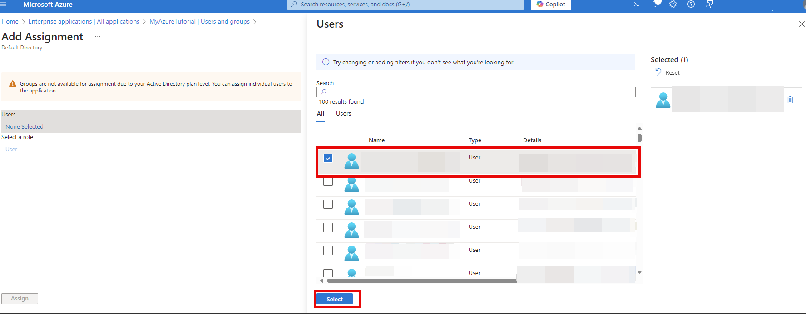

    By hitting the result tile, you select the user, which should appear under `Selected members` panel. Finish your user assignment with clicks on **Select** and **Assign**.

    <!-- border -->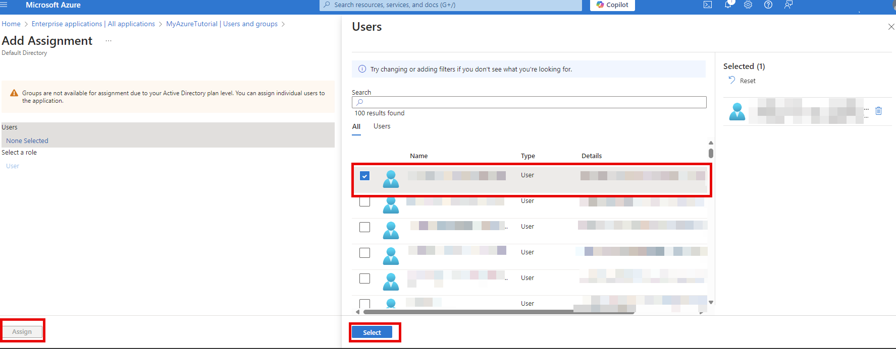

### Test your configuration

Check if your user assignment was successful. Open a new browser window again and enter the UAA tenant URL again:

`https://<subdomain>.authentication.<region>.hana.ondemand.com`

Log in via the Azure Link `Azure Tutorial` and enter your Azure user you previously assigned to the enterprise application in Azure. You will be redirected back to UAA afterwards.

You should not see any particular application, because you did not access a CF application, only the UAA tenant page.

>You can check the users details, including the groups mapped, by accessing the following URL:

>`https://<subdomain>.authentication.<region>.hana.ondemand.com/config?action=who&details=true`

Congratulations!

You have successfully connected Azure with your Cloud Identity Services tenant. Furthermore, the SAP BTP, Cloud Foundry subaccount can now: leverage all the capabilities of Cloud Identity Services, for instance users can login with their mail address of Azure (as long as their account is part of the Azure and the enterprise application).

Good Job!

---
