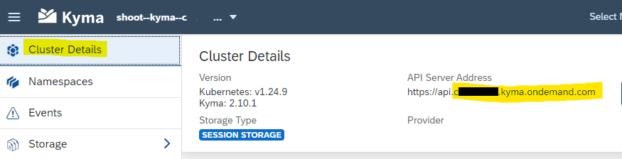

# Create Kyma Function and a Microservice via CLI

<!-- description -->In this tutorial, you will use Kyma CLI to create a Kyma Function and a microservice. 

## You will learn

  - How to install and use Kyma CLI
  - How to create a Kyma Function
  - How to create a Kyma microservice

## Prerequisites

- You have created and set up your "SAP BTP, Kyma Environment" either manually or by Quick Account Setup.
- You have added the Serverless module to your Kyma environment.

### Required Command Line Tools

You will need 3 command line tools in order to run this tutorial:

1. [Kubectl](https://kubernetes.io/docs/tasks/tools/) 
2. [`Kubelogin`](https://github.com/int128/Kubelogin) (a Kubectl plug-in)
3. [Kyma CLI](https://kyma-project.io/docs/kyma/latest/04-operation-guides/operations/01-install-kyma-CLI)

**kubectl** is a Kubernetes command line tool for communicating with a Kubernetes cluster's control plane, using the Kubernetes API. <br>

**`Kubelogin`** is a kubectl plugin for [`Kubernetes OpenID Connect (OIDC) authentication`](https://kubernetes.io/docs/reference/access-authn-authz/authentication/#openid-connect-tokens), also known as kubectl oidc-login. <br>
It calls a browser window for your authentication. <br>
It is required to access Kyma runtime in an interactive training environment, like you use here. <br>
It is not needed if you use a different Kubernetes authentication method (not part of this tutorial).  <br>
**Note:** It has to be renamed to **`kubectl-oidc_login`** as shown later in this tutorial. <br>

**Kyma CLI** is the command line interface of Kyma. <br>

And you will need a **`kubeconfig.yaml`** file. The kubectl command-line tool uses `kubeconfig` files to find the information it needs to choose a cluster and communicate with the API server of a cluster. You will create one later.

**Hint:** The "Get Started"-guide [Deploy and expose a Function](https://kyma-project.io/docs/kyma/latest/02-get-started/02-deploy-expose-function/) on `Kyma-project.io` describes the steps in more detail.

<br>

### Install the Command Line Tools

**Option 1:**
Follow the installation instructions, linked under "Required Command Line Tools".

**Option 2:**
For a training setup, you may also setup the required tools manually:

1. Download [kubectl latest release binary](https://kubernetes.io/docs/tasks/tools/install-kubectl-windows/).
2. Download [`Kubelogin latest release`](https://github.com/int128/Kubelogin/releases).
3. Download [kyma CLI latest release](https://github.com/kyma-project/cli/releases).
4. Rename `kublogin.exe` to `kubectl-oidc_login.exe`.
5. Copy the 3 files in a windows folder of your choice. E.g. `C:/tools`.
6. Add your tools folder path to your Windows environment variable `Path`  
   (either in user variables Path or system variables Path). <br>
   Hint: You can access the System Properties by searching for `environment variables` in your windows search.   <br>
7. Test your "installation". <br>
   Open a CMD or `Powershell` window. <br>
   Type `kubectl` and enter. The result should list the available commands for kubectl. <br>
   Type `kubectl version` to see the version. <br>
   Type `kyma` and enter. The result should list the available commands fro kyma CLI. <br>
   Type `kyma version` to see the version. <br>
   
8. Before you can test `Kubelogin`, you have to provide additional configuration first.

<br>

### Download the Kyma runtime kubeconfig

The kubectl tool relies on a configuration file called the **`kubeconfig`**, to configure access to the cluster. <br>
It can be obtained from both the BTP Cockpit and the Console UI. <br>
<br>

#### Option 1: obtain the kubeconfig from the SAP BTP Cockpit

1. Within your BTP account, navigate to the sub-account which has the Kyma runtime  enabled.

2. In the subaccount choose **Overview** in the navigation pane.

3. Scroll down to the Kyma Environment details

4. Choose the link next to **`KubeconfigURL`** to download the `kubeconfig`


<br>

#### Option 2: obtain the kubeconfig from the Console UI

1. Enter the to dashboard of your Kyma runtime.

2. Log onto the Kyma runtime if required.

3. At the top-left of the Kyma runtime window you will find a drop down which displays the name of the currently connected runtime.

4. Select the drop down and choose the option Clusters Overview


5. Choose the Download Kubeconfig icon to download the file.


<br>

### Set the KUBECONFIG environment variable

Last but not least, set the KUBECONFIG environment variable.

**Procedure**

1. Open either a Command Prompt CMD or `Powershell` on Windows (for other operating systems, see this [blog](https://developers.sap.com/tutorials/cp-kyma-download-cli.html#75772670-a4dd-4e30-9b78-0ad810b9e28e))

2. in DOS, type set `KUBECONFIG="<KUBECONFIG_FILE_PATH>"` and Enter. <br>
   for example: **`set KUBECONFIG="C:\tools\kubeconfig.yaml"`**  <br>
   Tip: Shift+right-click the kubeconfig.yaml file to copy the path <br>

   in `Powershell` type `$ENV:KUBECONFIG="<KUBECONFIG_FILE_PATH>"` and Enter. <br>

3. Test your configuration by running this command

   **`kubectl config get-contexts`**
   
   The result shows what you just configured and should look like this:

   ```
     CURRENT   NAME                     CLUSTER                  AUTHINFO                 NAMESPACE
     *         shoot--kyma--c-2d6af59   shoot--kyma--c-2d6af59   shoot--kyma--c-2d6af59
   ```


<br>

### Verify Kubelogin and your connection

Now let's verify that the installation of `Kubelogin` was successful. 

1. Rename `Kubelogin` to **`kubectl-oidc_login`** if not done so already.

2. Run:

   `kubectl get deployments -n kyma-system` .

   > A browser window will open, and you have to authenticate yourself, if you do not have active sessions. <br>
   > If this step fails, something went wrong with your `Kubelogin` installation.
   > **Remember:** The authentication token is only valid for a limited time.


   The installation succeeded if all the Deployments returned are in status READY. The result could look like this:

   ```
   NAME                                         READY   UP-TO-DATE   AVAILABLE   AGE
   api-gateway                                  1/1     1            1           6d22h
   central-application-connectivity-validator   2/2     2            2           6d22h
   central-application-gateway                  2/2     2            2           6d22h
   cluster-essentials-pod-preset-webhook        2/2     2            2           6d22h
   ....
   ````

Congratulations!

<br>

### Further Information

[Access a Kyma Instance Using kubectl](https://help.sap.com/docs/btp/sap-business-technology-platform/access-kyma-instance-using-kubectl?locale=en-US)

[Kyma Environment](https://help.sap.com/docs/btp/sap-business-technology-platform/kyma-environment?locale=en-US)

[Download Kyma CLI](https://developers.sap.com/tutorials/cp-kyma-download-cli.html)


## Create a Kyma Function with Kubectl

After you have setup your Command Line Tools for Kyma, you can now access your Kyma environment and create a Function.

Before you start, you might have to establish your connection to Kyma again.
Open CMD and run <br>
`set KUBECONFIG="C:\tools\kubeconfig.yaml"`  <br>
`kubectl get deployments -n kyma-system`   <br>
again. This requires authentication in your Kyma service and gives you a valid session.


### Create a function

1. Open CMD.

2. Choose a working folder. You will create files. For example: C:\tools .

3. Create Function <br>
   In order to create a function, run:
   ```
   kyma init function --name hello-function
   ```
   command line result: <br>
   \- Project generated in C:\tools
   
   <br>

4. Apply the function to your Kyma runtime, run:
   ```
   kyma apply function
   ```
   command line result:  
   \- Configuration loaded  <br>
   \- Function - hello-function created `
   
   
   **Note:** You have now created 3 files in your working folder:
   > config.yaml <br>
   > handler.js <br>
   > package.json <br>
   
   you may check the content of the files with your editor (e.g. Visual Studio Code). It is the same as you have seen in the Kyma Dashboard UI.
  
  <br>
  
3. To verify the function deployment, run: 
   ```
   kubectl get functions hello-function
   ```
   
   the result should be: 
   ```
       NAME             CONFIGURED   BUILT   RUNNING   RUNTIME    VERSION   AGE
       hello-function   True         True    True      nodejs14   1         4m9s
   ```
<br>
   
   
### Expose the Function   

1. Note down your cluster domain name. <br>
   To expose the function for external access, you need to create an **API Rule**, as you did with the Dashboard UI. <br>
   First, note down your cluster domain.  <br>
   Unfortunately kubectl does not know his domain. But you can find it in the **Cluster Details** of your Kyma Dashboard. <br>
   Note: `https://api.` is not part of the cluster domain name!
   
   

2. Create a yaml file, which contains your API rule definition. <br>
   For example, name it `myapirule.yaml`, place it in tools folder and add the following configuration. <br>
   Replace the following values with your values: <br>
   * **name:** hello-rule2 (will be the name of the new rule. Keep it or replace it, must be unique in your cluster)
   * **host:** hello-host2 (will be the name of the new host. Keep it or replace it, must be unique in your cluster)
   * **host:** 123456789.kyma.ondemand.com (**replace it** with your cluster domain)
   * service **name:** hello-function (the name of the function you just created, you can also use another deployed function)

<br>

Example code for the `myapirule.yaml` configuration file:
```
apiVersion: gateway.kyma-project.io/v1beta1
kind: APIRule
metadata:
  name: hello-rule2
  namespace: default
spec:
  gateway: kyma-system/kyma-gateway
  host: hello-host2.123456789.kyma.ondemand.com
  rules:
    - accessStrategies:
      - config: {}
        handler: allow
      methods:
        - GET
        - POST
        - PUT
        - PATCH
        - DELETE
        - HEAD
      path: /.*
  service:
    name: hello-function
    port: 80
```

Now deploy you API Rule. Run: kubectl apply -f "<path to your config file>". <br>
for example:   

```
kubectl apply -f "C:\tools\myapirule.yaml"
```
The command line result is: <br>
apirule.gateway.kyma-project.io/hello-rule2 created

<br>   
   
### Verify the Function exposure

If you have [curl](https://curl.se/download.html) installed, run curl https://hello-world.$CLUSTER_DOMAIN  <br>
for example: `curl https://hello-host2.12345678.kyma.ondemand.com/`

If the deployment was successful, the command line result is: <br>
`Hello Serverless`
   
You can also execute the function from your Kyma Dashboard as described in the previous steps of this tutorial.   

