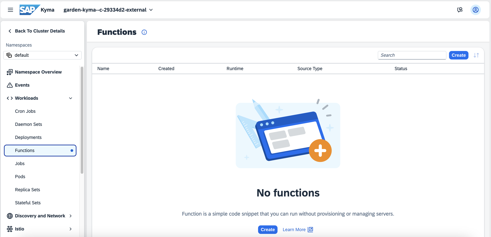

# Create Kyma Function and a Microservice via UI

<!-- description -->In this tutorial, you will use Kyma UI to create a Kyma Function and a microservice.

## You will learn

  - How to enter Kyma dashboard
  - How to create a Kyma Function
  - How to create a Kyma microservice

## Prerequisites

- You have created and set up your "SAP BTP, Kyma Environment" either manually or by Quick Account Setup.
- You have added the Serverless module to your Kyma environment.

### Enter Kyma dashboard

1. In your subaccount go to **Services > Instances and Subscriptions**.

2. Scroll down to **Environments** and choose the three dots **...** in the Kyma Environment line. Then, choose **Go to Dashboard**.

3. If you use the pre-configured shared SAP Cloud Identity Services tenant, SAP ID service, as an identity provider in your enterprise or trial account, the Two-Factor Authentication is enabled and will be enforced.

    Go to your authenticator application on your mobile device and add a new account. Once you scan the QR Code, a password to access Kyma will be created. Enter the password in the **Passcode** field.

    

Now you should be in your Kyma dashboard.


### Create a "Hello-World" Kyma Function

1. In Kyma dashboard go to **Namespaces** and choose the **default** namespace.

    

2. Within the namespace, go to **Workloads > Functions** and choose **Create**

    


3. Fill in the form in the **Create Function** view using the following details and choose **Create**.

    - **Template**: `default`
    - **Name**: for example, `hello-world`
    - **Language**: `JavaScript`
    - **Runtime**: `node.js 20`
    - **Function Profile**: `XS`

   
  
4. Creating a Function takes a few seconds. Select the newly created **hello-world** Function and switch to the **Configuration** tab. As it does not have any `APIRules` yet, you need to create one to define the rules of accessing the Function using APIs.

    

5. Go to **Discovery and Network > API Rules** and choose **Create**.

    

6. Fill in the form in the **Create API Rule** view using the following details and choose **Create**

    - **Name**: for example, `hello-rule`
    - **Service Name**: the `hello-world` Function
    - **Port**: `80`
    - Leave the pre-defined details in the **Gateway** section
    - **Host**, for example, `hello-host`
    - Leave the pre-defined details in the **Rules** section

    

7. The "hello-rule" `APIRule` is created. Click on the **Host** URL to execute your Function in a browser window.

    

    A browser window will open showing the following result:

     **`Hello World from the Kyma Function hello-world running on nodejs20!`**

### Deploy a microservice on Kyma

You already know how to deploy and expose a Function. You can do the same with a container microservice.

To deploy a microservice, you will use the **orders-service** from Kyma examples. It is available:

    - in [GitHub](https://github.com/kyma-project/examples/blob/main/orders-service/README.md), or
    - as a Docker image on Google Container Registry `eu.gcr.io/kyma-project/develop/orders-service:68a58069`.

This tutorial shows how to deploy a microservice using the Docker image.

1. Open Kyma dashboard, and go to a **Namespace**, for example, **default**.

2. Go to **Workloads > Deployments** and choose **Create**.

3. Fill in the form in the **Create Deployments** view using the following details and then choose **Create**.

   - **Name**: `orders-deployment`
   - **Docker Image**: `eu.gcr.io/kyma-project/develop/orders-service:68a58069`
   - Optionally, provide the following parameters to save resources:

    | Profile | Value | Profile | Value |
    | :--- | ---: | :--- | ---: |
    | Memory requests | 10Mi | Memory limits   | 32Mi |
    | CPU requests (m) | 16m | CPU limits (m)  | 20m  |

You created the **orders-deployment** Deployment. To confirm that the operation was successful, check the **Status** field is showing **1/1** Pods running.

### Create a Service

Once you have the Deployment ready, you can create a Kubernetes Service to allow other Kubernetes resources to communicate with your microservice.

1. Go to **Discovery and Network > Services** and choose **Create**.

2. Fill in the form in the **Create Service** view using the following details and then choose **Create**.

    - **Name**: `orders-service`
    - **app**: `orders-deployment`
    - Add a port using the following parameters:
        - **Name**: `orders-port`
        - **Protocol**: `TCP`
        - **Port**: `80`
        - **Target Port**: `8080` (or other)
        - **Application Protocol**: `http`

You created a new service, called **orders-service**.

### Expose the microservice

You cannot access and test your new `orders-service` yet from outside of the cluster. To expose the microservice, first, you must create an **API Rule** for it, just like you did to expose your Function.

1. Go to **Discovery and Network > API Rules** and choose **Create**.

2. Fill in the form in the **Create API Rule** view using the following details and choose **Create**

    - **Name**: `orders-apirule`
    - **HTTP Request Timeout**: `30` (or any up to `3900`)
    - **Service Name**: `orders-service`
    - **Port**: `80`
    - Leave the pre-defined details in the **Gateway** section
    - **Host**: choose your host from the dropdown menu and replace the wildcard (*) with a name, for example, `orders-host`
    - Leave the pre-defined details in the **Rules** section
    - **Methods**: choose `GET` and `POST`

3. The `orders-apirule` is created. Wait for the **Status** to be `OK`.

4. Click on the **Host** URL to execute the Service in a browser window. A browser will open, but the link will be empty because the underlying Docker image has no homepage. Extend the URL by adding the **/orders** string.

    For example:
    URL: `https://orders-host.c-123456.kyma.ondemand.com/` has to become
    URL: `https://orders-host.c-123456.kyma.ondemand.com/orders`

5. If you extend the URL correctly, you can see your orders: **`[]`**. It is empty, as you have not created orders in this tutorial so far.

### Create sample content for your Service

1. In the terminal call your service using curl. Replace `${APP_URL}` with your `orders-host` URL, for example, `https://orders-host.b1234567.kyma.ondemand.com/`.

    ```bash
    curl -X GET ${APP_URL}/orders -k`
    ```

    The result should be still **`[]`**.

2. Place an order using curl replacing the `${APP_URL}` with your `orders-host` URL:

    > **NOTE:** Windows users should use a Linux-like bash, for example, Git Bash to be able to copy and paste the sample code.

    ```bash
    curl -X POST ${APP_URL}/orders -k \
      -H "Content-Type: application/json" -d \
      '{
          "consignmentCode": "76272727",
          "orderCode": "76272725",
          "consignmentStatus": "PICKUP_COMPLETE"
      }'
    ```

3. Call your `orders-service` in your browser again. The `orders-service` will return the order:

    `[{"orderCode":"76272725","consignmentCode":"76272727","consignmentStatus":"PICKUP_COMPLETE"}]`

    For a complete guide on how to run the `orders-service`, see [the example repository in GitHub](https://github.com/kyma-project/examples/blob/main/orders-service/README.md)

Congratulations, you created and exposed your first microservice!
