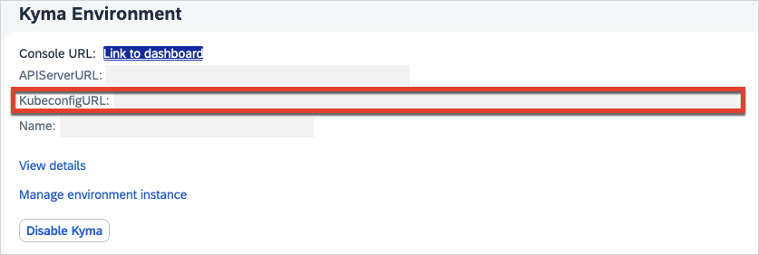

# Install the Kubernetes Command Line Tool
<!-- description --> Download and install kubectl - the Kubernetes command line tool that allows access to SAP BTP, Kyma runtime.

## Prerequisites
 - **Tutorials:** [Enable SAP BTP, Kyma Runtime](https://developers.sap.com/tutorials/cp-kyma-getting-started.html)

## You will learn  
  - How to download kubectl - the Kubernetes command line tool
  - How to install the plugin kubectl oidc-login and use it to connect to a SAP BTP, Kyma runtime instance
  - How to use a few basic kubectl commands

## Intro
SAP BTP, Kyma runtime provides a managed Kubernetes cluster in which you can install the Kyma modules. To manage resources and configurations from the command line, you can use the kubectl tool. This tutorial provides the steps necessary to configure the tool to access SAP BTP, Kyma runtime. In subsequent tutorials, you will learn various commands provided by kubectl.

---

### Download and install kubectl

1. Download the latest kubectl version from the Kubernetes website. Use the following URL:  

    <https://kubernetes.io/docs/tasks/tools/install-kubectl>

2. On the Kubernetes website, follow the instructions listed for your operating system, for example: [Install kubectl on macOS](https://kubernetes.io/docs/tasks/tools/install-kubectl-macos/).

### Download and install kubectl oidc-login

The use of the kubectl command line tool requires an authenticated user to perform any tasks on SAP BTP, Kyma runtime. SAP BTP, Kyma runtime is configured to use OpenID Connect (OIDC) authentication and requires the installation of the plugin kubectl oidc-login to perform the authentication.    

1. To install [kubectl oidc-login](https://github.com/int128/kubelogin), follow the instructions detailed in the project repository. Use the relevant commands for macOS, Linux, or Windows users.

    > The kubectl oidc-login runs on port `8000`. In case of issues, make sure the port is not occupied.

### Test the kubectl installation

1. Open a command prompt on your computer.

    > On Windows, you can search for the `cmd` or `command prompt` applications in the Start menu.  
    >
    > On macOS, use Spotlight to find the `Terminal` application.
    >
    > On Linux/Unix, you know how this works - just open your favorite command shell.

2. To verify that kubectl is installed correctly, run the following command in your CLI:

    ```Shell/Bash
    kubectl version --client
    ```

    The command should return a list of version properties, for example:

    ```Shell/Bash
    Client Version: version.Info{Major:"1", Minor:"22", GitVersion:"v1.22.2",GitCommit:"8b5a19147530eaac9476b0ab82980b4088bbc1b2", GitTreeState:"clean",BuildDate:"2021-09-15T21:31:32Z", GoVersion:"go1.16.8", Compiler:"gc", Platform:"darwin/amd64"}
    ```

### Download the SAP BTP, Kyma runtime kubeconfig

The kubectl tool relies on a configuration file called kubeconfig to configure access to the cluster. Follow the instructions to learn how to obtain it from both SAP BTP cockpit and Kyma dashboard.

To obtain kubeconfig from SAP BTP cockpit:

1. Within your SAP BTP account, navigate to the sub-account with SAP BTP, Kyma runtime enabled.

2. In the **Overview** section, scroll down to the **Kyma Environment** details.

3. Choose the link next to **KubeconfigURL** to download the kubeconfig file.

    

To obtain kubeconfig from Kyma dashboard:   

1. Click on **Link to dashboard** under the **Kyma Environment** section.

2. Select the dropdown at the top of the Kyma dashboard window, and choose **Clusters Overview**.

3. Choose the download icon to download the file.

### Set the KUBECONFIG environment variable

[OPTION BEGIN [Mac and Linux]]

1. Open a command line prompt on your computer. In the command line screen, type in the following:

    ```Shell/Bash
    export KUBECONFIG=<KUBECONFIG_FILE_PATH>
    ```
   Replace the `<KUBECONFIG_FILE_PATH>` placeholder with the file path, including the file name and extension, of the kubeconfig you downloaded in the previous step.

2. Test the configuration by running the following command:  

    ```Shell/Bash
    kubectl config get-contexts
    ```

    The command should return a response similar to this example:

    |CURRENT|NAME|CLUSTER|AUTHINFO|NAMESPACE|
    |-------|----|-------|--------|---------|
    |*      | `shoot--kyma-stage--c-#######`|`shoot--kyma-stage--c-#######`|`shoot--kyma-stage--c-#######`| |

3. You are now set up to use SAP BTP, Kyma runtime.

[OPTION END]

[OPTION BEGIN [Windows]]

1. Open a command line prompt on your computer. In the command line screen, type in the following:

    ```PowerShell
    $ENV:KUBECONFIG="<KUBECONFIG_FILE_PATH>"
    ```

    ```DOS
    set KUBECONFIG="<KUBECONFIG_FILE_PATH>"
    ```
   Replace the `<KUBECONFIG_FILE_PATH>` placeholder with the file path, including the file name and extension, of the kubeconfig you downloaded in the previous step.

2. Test the configuration by running the following command:  

    ```Shell/Bash
    kubectl config get-contexts
    ```

    The command should return a response similar to this example:

    |CURRENT|NAME|CLUSTER|AUTHINFO|NAMESPACE|
    |-------|----|-------|--------|---------|
    |*      | `shoot--kyma-stage--c-#######`|`shoot--kyma-stage--c-#######`|`shoot--kyma-stage--c-#######`| |

3. You are now set up to use SAP BTP, Kyma runtime.

[OPTION END]

For more information on `kubectl`, visit the Kubernetes [command line tool overview](https://kubernetes.io/docs/reference/kubectl/overview/) and [kubectl commands](https://kubernetes.io/docs/reference/generated/kubectl/kubectl-commands) websites.

---