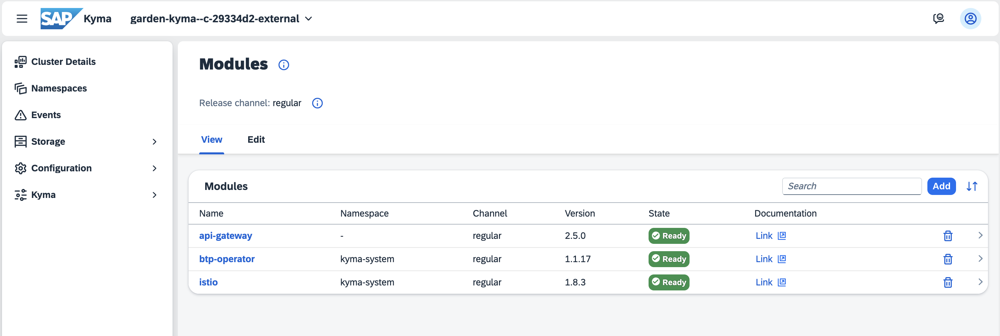
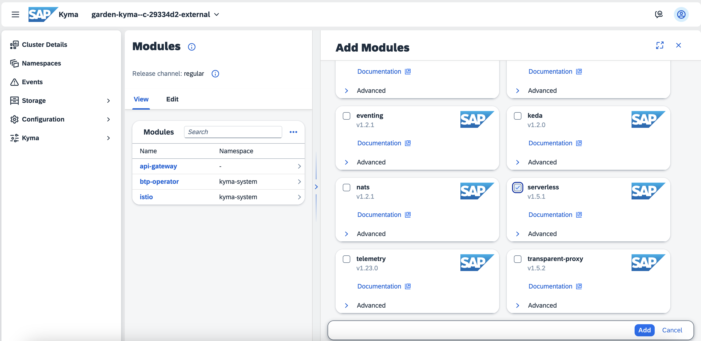
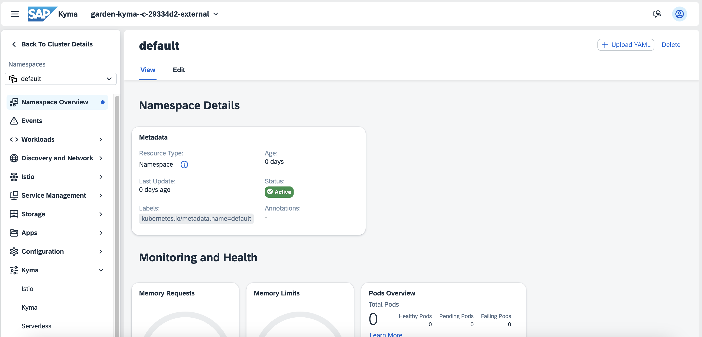
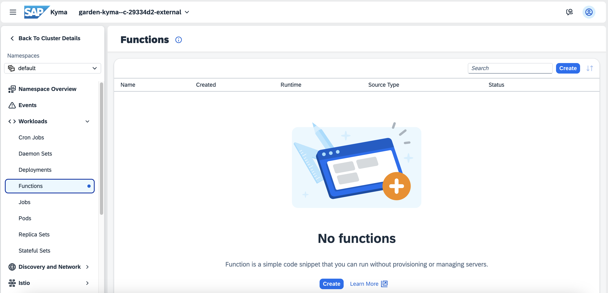

# Add a module to Kyma environment

<!-- description -->In this tutorial, you will learn how to add a Kyma module, e.g. the Serverless module, to your Kyma environment via the Kyma dashboard. 

## You will learn

  - How to enter Kyma dashboard
  - How to add the Serverless Kyma module

## Prerequisites

You have created and set up your "SAP BTP, Kyma Environment" either manually or by Quick Account Setup.

### Enter Kyma dashboard

1. In your subaccount go to **Services > Instances and Subscriptions**.

2. Scroll down to **Environments** and choose the three dots **...** in the Kyma Environment line. Then, choose **Go to Dashboard**.

3. If you use the pre-configured shared SAP Cloud Identity Services tenant, SAP ID service, as an identity provider in your enterprise or trial account, the Two-Factor Authentication is enabled and will be enforced.

    Go to your authenticator application on your mobile device and add a new account. Once you scan the QR Code, a password to access Kyma will be created. Enter the password in the **Passcode** field.

    

Congratulations, you are in Kyma dashboard!

### Enable the Serverless module

1. In Kyma dashboard choose **Modify Modules**. This view lists your Kyma module.

    

    > **Note:** When you enable Kyma, it is provisioned with the default modules added: 
    > - The **Istio** module is a service mesh with Kyma-specific configuration. 
    > - The **API Gateway** module provides functionalities that allow you to expose and secure APIs. 
    > - Within the **SAP BTP Operator** module, BTP Manager installs the SAP BTP service operator that allows you to consume SAP BTP services from your Kubernetes cluster using Kubernetes-native tools.

2. Choose **Add** to open the **Add Modules** view. Select **serverless** and choose **Add**.

   

    > **NOTE:** In this tutorial you use the Serverless module from the default release channel, namely the regular channel. You can also choose the fast channel. For more information, see [Kyma Release Channels](https://help.sap.com/docs/btp/sap-business-technology-platform/kyma-s-modular-approach?locale=en-US).

3. Once the module's state is `Ready`, go to **Namespaces** and choose the **default** namespace.

    

4. Within the namespace, you may see new menu entries added by the module you just added, in this case go to **Workloads > Functions**, the newly created option that comes with the Serverless module.

    

Congratulations! You added the Serverless module to your Kyma environment. Now you can create serverless Functions in Kyma.

