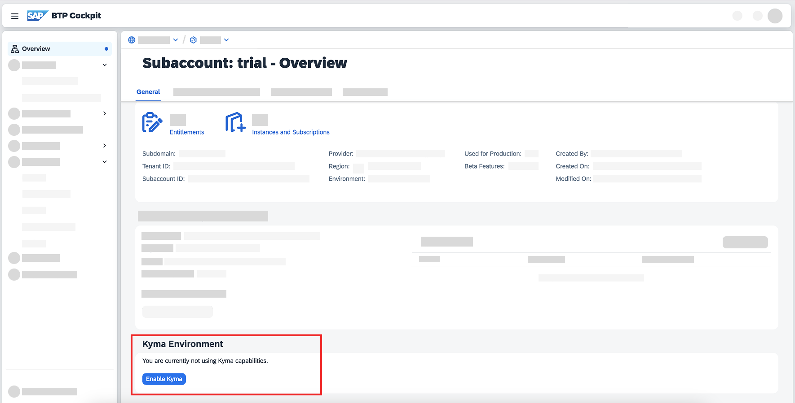
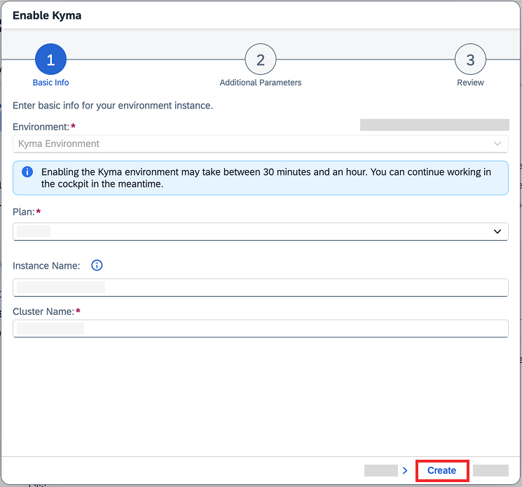
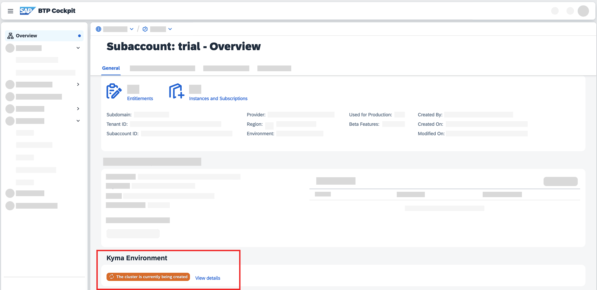
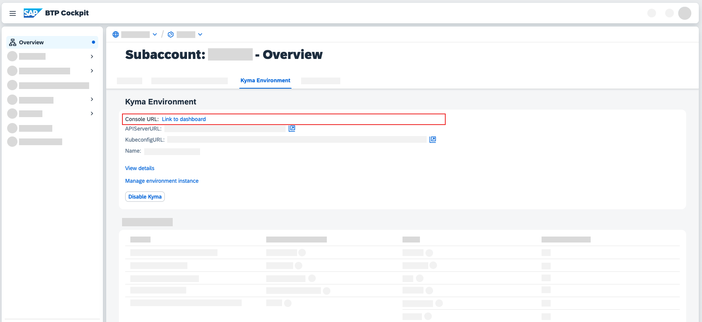
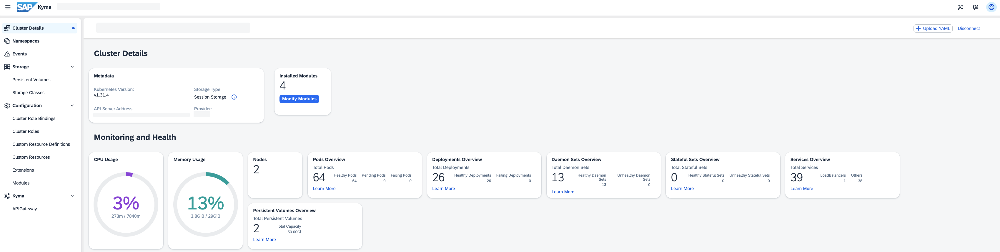

# Enable SAP BTP, Kyma Runtime
<!-- description --> SAP BTP, Kyma runtime is a Kubernetes cluster which is comprised of a collection of projects united together to simplify the extension, and integration of software.

## Prerequisites
 - **Tutorials:** [Get an Account on SAP BTP to Try Out Free Tier Service Plans](btp-free-tier-account)

## You will learn
  - How to enable the SAP BTP, Kyma runtime using the SAP BTP cockpit (see [Set up a Kyma Cluster using the Command Line](btp-cli-setup-kyma-cluster) for the same procedure using the CLI)

---

### Enable Kyma environment

To enable SAP BTP, Kyma runtime on your cluster you must make sure that your subaccount has the right entitlements. Follow this procedure to learn how to set up your Kyma entitlement and enable SAP BTP, Kyma runtime in your subaccount.

> If you can see **Kyma Environment** in the subaccount’s Overview section, it means that the Kyma entitlement is already set up. In such a case, go straight to Step 5.   

1. In your Free Tier subaccount, go to **Entitlements**.

2. Choose **Edit** and **Add Service Plans**.

3. Find **Kyma Runtime**, select one of the available plans, and choose **Add Service Plan**.
   
4. Choose **Save**, and go back to the subaccount's Overview.

5. Choose **Enable Kyma** to trigger the enablement of the Kyma environment.

    <!-- border -->

6. In the popup, enter your cluster name of choice and click **Create**.

    <!-- border -->

    In the background, a new Kubernetes cluster is being set up where SAP BTP, Kyma runtime will run. This might take between 15-25 minutes.

    To continue with this tutorial, you must wait until the enablement is finished. You can still use the SAP BTP Free Tier or close the window as the setup process will continue automatically.

    <!-- border -->

### Open Kyma dashboard

To open Kyma dashboard, select **Dashboard URL** under the **Kyma Environment** section of the subaccount's Overview page.

<!-- border -->

Kyma dashboard opens in a new browser tab.

Kyma dashboard is your graphical user interface for managing modules, applications or services on SAP BTP, Kyma runtime. You can use Kyma dashboard to add or delete Kyma modules, manage Deployments by creating, deleting, or scaling them, define APIRules to expose your workloads, and much more.

<!-- border -->

To learn more about the capabilities and features of SAP BTP, Kyma runtime, follow the Kyma tutorials and blog posts, read the documentation, or check out the YouTube videos. See:

- [SAP BTP, Kyma runtime](https://discovery-center.cloud.sap/serviceCatalog/kyma-runtime)
- [SAP Help Portal - Kyma Environment](https://help.sap.com/viewer/3504ec5ef16548778610c7e89cc0eac3/Cloud/en-US/468c2f3c3ca24c2c8497ef9f83154c44.html)
- [kyma-project](https://kyma-project.io/#/)
- [Kyma - YouTube](https://www.youtube.com/channel/UC8Q8bBtYe9gQN-dQ-_L8JvQ)
- [Cloud Native for Beginners - YouTube](https://youtube.com/playlist?list=PL6RpkC85SLQCwaJ54TAAHMvSl5wpVPrai)

If you aren't aware, there is also a [Kyma slack channel](https://kyma-community.slack.com/) where you can ask questions to the active community.

