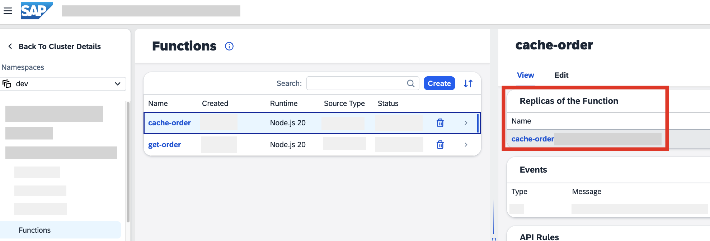
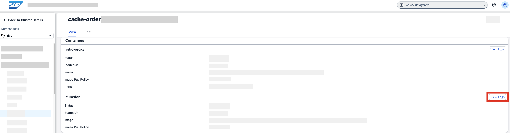
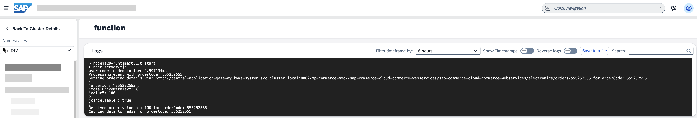

# Use Redis in SAP BTP, Kyma Runtime to Store and Retrieve Data

<!-- description --> Deploy Redis and configure two Serverless Functions to cache and retrieve data from the Redis instance within SAP BTP, Kyma runtime.

## Prerequisites

- [Kyma provisioned](https://developers.sap.com/tutorials/cp-kyma-getting-started.html)
- [Deploy Commerce Mock Application in SAP BTP, Kyma Runtime](cp-kyma-mocks) tutorial completed

## You will learn

- How to deploy a microservice using Kyma dashboard
- How to deploy Functions using Kyma dashboard
- How to create APIRules
- How APIs and Events are used.

## Intro

This sample provides a Redis deployment and two Serverless Functions that interact with it. The `cache-order` Function is set to subscribe to the **order.created** event provided by the commerce mock application. Once triggered, the Function performs an API call to the commerce mock to obtain additional details regarding the order and then cache the information into Redis. The `get-order` Function, exposed as an API, is used to retrieve the order details from the Redis cache.

---

### Clone the Git repository

1. Go to the [kyma-runtime-extension-samples](https://github.com/SAP-samples/kyma-runtime-extension-samples) repository. This repository contains a collection of Kyma sample applications which will be used during the tutorial.

2. Use the green **Code** button to choose one of the options to download the code locally, or simply run the following command using your CLI at your desired folder location:

    ```Shell/Bash
    git clone https://github.com/SAP-samples/kyma-runtime-extension-samples
    ```

### Add the Serverless, Eventing and NATS modules in SAP BTP, Kyma runtime

1. Open Kyma dashboard using the **Dashboard URL** link in SAP BTP cockpit.

2. Choose **Modify Modules**, and select **Add**.

3. In the **Add Modules** section, check `eventing`, `nats`, and `serverless`, and select **Add**.

> You can find more info in [Add and Delete a Kyma Module](https://help.sap.com/docs/btp/sap-business-technology-platform/enable-and-disable-kyma-module).

### Choose a backend for Kyma Eventing

When you add the Eventing module, you must configure a backened for it. Follow these steps:

1. In your **Modules** section, go to **eventing**, and choose **Edit**.

2. In **Backend Type**, choose **NATS** from the dropdown, and select **Save**.

> You can find more info in [Choose a Backend for Kyma Eventing](https://help.sap.com/docs/btp/sap-business-technology-platform/choose-backend-for-kyma-eventing?locale=en-US&version=Cloud).

### Deploy Redis

In this step, you will deploy the Redis resources, obtained in [Step 1](#clone-the-git-repository), into SAP BTP, Kyma runtime. These resources include:

- `redis.yaml`: The deployment defining the Redis cache configuration.
- `redis-service.yaml`: The Kubernetes Service which exposes the Redis instance to the two Serverless Functions.
- `redis-secret.yaml`: The Kubernetes Secret which defines the Redis password.

1. In the `dev` namespace, choose **Upload YAML** and upload or copy the contents of the `redis-function/k8s/redis.yaml` file, and click **Upload**.

2. Perform the same procedure to upload the contents of the `redis-function/k8s/redis-service.yaml` file.

3. Go to **Configuration > Secrets**, and choose **Create**. 

4. Switch to the **YAML** tab, and copy the contents of the `redis-function/k8s/redis-secret.yaml` file over-writing the preexisting content found within the pane, and then choose **Create**.

### Deploy Functions

In this step, you will deploy two Functions into SAP BTP, Kyma runtime that were obtained in [Step 1](#clone-the-git-repository). These resources include:

- `cache-order-function.yaml`: This Function subscribes to an event published by the commerce mock application. Once triggered, it calls back to the commerce mock application to obtain the `totalPriceWithTax` and then cache the information into Redis.
- `get-order-function.yaml`: This Function is exposed as an API allowing retrieval of data stored within the Redis cache.

1. In the `dev` namespace, choose **Upload YAML**, and upload or copy the contents of the `redis-function/k8s/cache-order-function.yaml` file.
   
2. Change the Node.js version to `nodejs20` by adjusting the value of `spec.runtime`, and click **Upload**.

3. Repeat the steps to create the `get-order` Function using the file `redis-function/k8s/get-order-function.yaml`.

### Expose a Function

1. To expose the `get-order` Function as an API, choose the menu option **Discovery and Network > API Rules**, and click **Create**.
2. Provide the value `get-order` for **Name**, **Service Name** and **Host**.
3. Select `No Auth` for **Access Strategy**, and choose **Create**.

### Add event subscription to the Function

In this step, you will configure the `cache-order` Function, deployed in the previous step, to run when the **order.created** event is fired from the commerce mock application.

1. In the `dev` namespace, choose **Configuration > Subscriptions**.

2. Choose **Create**, and use the following values:

    * **Name:** order-created
    * **Types:** order.created.v1
    * **Service**: cache-order
    * **Source:** mp-commerce-mock

### Obtain the API URL for the Function

In this step, you will copy the URL to the commerce web services API which will be used by the `cache-order` Function.

1. Choose the menu option **Back to Cluster Details** to go back to the Kyma home workspace.

2. In the Kyma home workspace, choose **Integration > Applications**.

3. Choose the **mp-commerce-mock** application.

4. Choose **SAP Commerce Cloud - Commerce Webservices**.

5. Choose the **Copy to Clipboard** option to get the Central Gateway URL of the **SAP Commerce Cloud - Commerce Webservices**. This will be used in the `cache-order` Function.

### Adjust Function variable

In this step, the URL copied in the previous step will be assigned to an environment variable of the `cache-order` Function. This allows the Function to call the **SAP Commerce Cloud - Commerce Webservices** of the commerce mock application.

1. Go to the `dev` namespace, and choose **Workloads > Functions**.

2. Choose the **cache-order** Function to open it.

3. Choose **Edit**, scroll down to **Environment Variables** and find the **Environment Variable** with the **Variable Name** `CENTRAL_GATEWAY_URL`.

4. Paste the value copied in the previous step into the **Value** field. Make sure that the value begins with `http://central-application...` and choose **Save**.

5. Choosing **Save** will cause the Function to be rebuilt and deployed. The **Status** field will indicate that the Function is **Deploying** and will change to **Running** once this process completes.

### Test event consumption

With the configuration steps completed, you can now test the scenario to validate that it is working as intended.

1. Open the mock application in the browser by choosing **Discovery and Network > API Rules** from the menu.

2. Paste the **Hosts** entry for the **commerce-mock** APIRule to your browser and press Enter. This URL should be similar to:
   `https://commerce.*******.kyma.ondemand.com`

3. Choose the **Remote APIs** tab.

    

4. Choose the **SAP Commerce Cloud - Events** option.

5. For the **Event Topics**, choose **order.created.v1**.

6. Modify the `orderCode` value as desired and choose **Send Event**. Make sure to remember the `orderCode` value, it will be used in a later step.

    <!-- border -->

### Review output in the Function logs

In this step, we will view the logs outputted by the Function to verify that the scenario is working.

1. In the `dev` namespace, choose **Workload > Functions**.

2. Choose the **cache-order** Function.

3. Scroll to the bottom of the pane to find the option **Replicas of the Function** and choose the value found in the table.

    <!-- border -->

4. Under **Containers**, choose **View Logs** for the **function** container.

    <!-- border -->

5. The output should be similar to:

    <!-- border -->

### Get output from the Function APIRule

In this step, we use the `get-order` Function to perform a read request of the data cached in the Redis database.

1. Choose **Discovery and Network > API Rules** from the menu.

2. Paste the **Hosts** entry for the `get-order` APIRule to your browser and press Enter. When opened for the first time, you will receive the message:

    `{"error":"No orderCode received!"}`

3. Append the value `?orderCode={YOUR_ORDER_CODE}` to the URL where the value is the same as used when sending the event, for example:

    `https://get-order.*********.kyma.ondemand.com/?orderCode=1231231`

This should output the value saved when the event was submitted.

    `{"orderCode":"1231231","Date":"Tue Nov 17 2020 19:28:42 GMT+0000 (Coordinated Universal Time)","Value":"100"}`

**Congratulations!** You have successfully completed the mission.

---